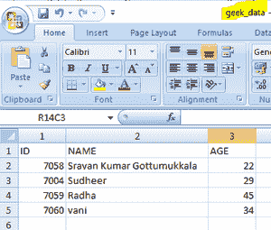
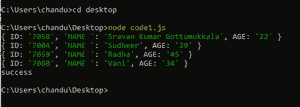
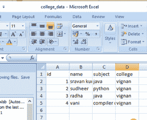

# 将 JSON 文件转换成 CSV 文件，使用 Node.js

显示数据

> 原文:[https://www . geesforgeks . org/convert-JSON-file-to-CSV-file-and-display-the-data-use-node-js/](https://www.geeksforgeeks.org/convert-json-file-into-csv-file-and-displaying-the-data-using-node-js/)

为了更好地理解个人目的，存储数据的方式有很多，在很少的情况下，JSON 文件会在很少的情况下更适合，CSV 文件，还有很多其他类型，比如 XML 等。在本文中，我们将把 JSON 文件数据转换成 CSV 文件数据，并通过 Node.js 显示出来

[JSON](https://www.geeksforgeeks.org/json-full-form/) 代表 JavaScript 对象符号。它是一种基于文本的数据交换格式，用于维护数据的结构。JSON 是 JSON 中 XML 数据交换格式的替代。与 XML 相比，结构化数据很容易。它支持数组和对象等数据结构，以及在服务器上快速执行的 JSON 文档。它也是一种独立于语言的格式，是从 JavaScript 派生出来的。

CSV(逗号分隔值)是一种简单的文件格式，用于存储表格数据，如电子表格或数据库。CSV 文件以纯文本形式存储表格数据(数字和文本)。文件的每一行都是数据记录。每条记录由一个或多个字段组成，用逗号分隔。使用逗号作为字段分隔符是这种文件格式的名称来源。

**将数据存入 CSV:** 有一个 *csv-writer* 是一个用于将数据存入 CSV 的模块。

**语法:**

```js
csv-writer(path,header);
```

*   **路径:**下载 CSV 文件的文件路径。
*   **表头:**CSV 文件中的列名就像字典一样。

**进场:**

*   安装后导入 csv-writer。
*   为它创建一个对象。
*   在常量变量中提及每一列的值
*   通过`csv_writer_object.writeRecords(constant variable)`使用 csvWriter.writeRecords(结果)将数据写入 CSV

**按照以下步骤将 JSON 文件转换为 CSV 文件:**

*   **安装依赖项:**

    ```js
    npm install csv-writer
    ```

*   **例**

    ## code1.js

    ```js
    // Import csv-writer
    import csvwriter from 'csv-writer'

    var createCsvWriter = csvwriter.createObjectCsvWriter

    // Passing the column names intp the module
    const csvWriter = createCsvWriter({

      // Output csv file name is geek_data
      path: 'geek_data.csv',
      header: [

        // Title of the columns (column_names)
        {id: 'id', title: 'ID'},
        {id: 'name', title: 'NAME'},
        {id: 'age', title: 'AGE'},
      ]
    });

    // Values for each column through an array
    const results = [
      {
        id: '7058',
        name: 'Sravan Kumar Gottumukkala',
        age: 22
      }, {
        id: '7004',
        name: 'Sudheer',
        age: 29
      }, {
        id: '7059',
        name: 'Radha',
        age: 45
      },{
        id: '7060',
        name: 'vani',
        age: 34
      }

    ];
    // Writerecords function to add records
    csvWriter
      .writeRecords(results)
      .then(()=> console.log('Data uploaded into csv successfully'));
    ```

*   要开始转换，请运行以下命令。

    ```js
    node code1.js
    ```

*   **输出:**

    

**在 CSV 中显示数据:**有时候我们需要先在服务器上显示 JSON 文件，然后再将 JSON 转换成 CSV 文件来检查数据。

**进场:**

1.  导入文件系统和 csv 解析器模块。
2.  为这两个对象(fsdata 和 csvdata)创建对象。
3.  通过传递 *csv 解析器*对象，使用名为*的方法创建数据流，使用管道方法创建读流*。

**语法:**

```js
fs_object.createReadStream('file_name.csv'),pipe(csv_parser_object())
```

*   **示例:**

    ## Code1.js

    ```js
    // Importing csv-parser into csvdata
    import csvdata from 'csv-parser'

    // Importing csv-parser into fsdata
    const fsdata = require('fs');

    // Reading csv data row wise from geek_data csv file
    fsdata.createReadStream('geek_data.csv')
      .pipe(csvdata())
      .on('data', (row) => {

        // Display data row by row
        console.log(row);
      })
      .on('end', () => {
        console.log('success');
      });
    ```

*   要显示 JSON 数据，请运行以下命令。

    ```js
    node code1.js
    ```

*   **输出:**

    

**将 JSON 转换为 CSV:** 在第一种方法中，我们在脚本内部传递 JSON 数据，但是我们也可以附加已经创建的 JSON 文件。

1.  它用于以较少的时间处理数据。
2.  它类似于数组结构。
3.  JSON 是人类可读和可写的，是轻量级的基于文本的数据交换格式
4.  虽然它是从 JavaScript 的一个子集派生出来的，但是它是独立于语言的。
5.  因此，生成和解析 JSON 数据的代码可以用任何其他编程语言编写。

**语法:**

```js
csvjson_object.toCSV(fileContent);
```

**进场:**

1.  在 Node.js 中定义模块
2.  使用文件系统包读取文件
3.  使用 toCSV 方法将 JSON 转换为 CSV
4.  使用 fs 包将此数据写入 CSV 文件

**按照以下步骤将 JSON 文件转换为 CSV 文件:**

*   **安装依赖项:**

    ```js
    npm install csvjson fs
    ```

*   **示例:**

    ## code1.js

    ```js
    // Import package csvjson
    import csvjson from 'csvjson'

    // Import fs package(file system) 
    // for read and write files
    import fs from 'fs'
    const readFile = fs.readFile;
    const writeFile = fs.writeFile;

    // Reading json file(filename -data.json)
    readFile('./data.json', 'utf-8', (err, fileContent) => {
        if (err) {
            // Doing something to handle the error or just throw it
            console.log(err); 
            throw new Error(err);
        }

        // Convert json to csv function
        const csvData = csvjson.toCSV(fileContent, {
            headers: 'key'
        });

        // Write data into csv file named college_data.csv
        writeFile('./college_data.csv', csvData, (err) => {
            if(err) {
                // Do something to handle the error or just throw it
                console.log(err); 
                throw new Error(err);
            }
            console.log('Data stored into csv file successfully');
        });
    });
    ```

*   要开始转换，请运行以下命令。

    ```js
    node code1.js
    ```

*   **输出:**
    