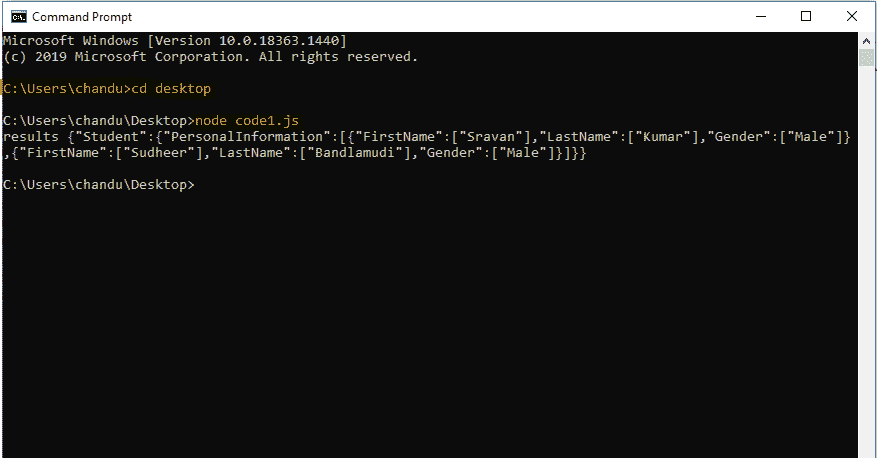

# 使用 Node.js

将 xml 数据转换为 json

> 原文:[https://www . geesforgeks . org/convert-XML-data-in-JSON-using-node-js/](https://www.geeksforgeeks.org/convert-xml-data-into-json-using-node-js/)

**[XML:](https://www.geeksforgeeks.org/xml-basics/)** 可扩展标记语言(XML)是一种标记语言，它定义了一组规则，用于以人类可读和机器可读的格式对文档进行编码。XML 的设计目标集中在互联网上的简单性、通用性和可用性。这是一种文本数据格式，通过 Unicode 为不同的人类语言提供了强大的支持。虽然 XML 的设计侧重于文档，但是该语言被广泛用于表示任意数据结构，例如 web 服务中使用的数据结构。

**示例:**

```
<student>
    <details>
        <name> sravan</name>
        <id>1</id>
    </details>
    <details>
        <name> sudheer</name>
        <id>2</id>
    </details>
</student>
```

**[JSON:](https://www.geeksforgeeks.org/json-full-form/)** JSON 代表 JavaScript 对象符号。它是一种基于文本的数据交换格式，用于维护数据的结构。JSON 是 JSON 中 XML 数据交换格式的替代。与 XML 相比，结构化数据很容易。它支持数组和对象等数据结构，以及在服务器上快速执行的 JSON 文档。它也是一种独立于语言的格式，是从 JavaScript 派生出来的。JSON 的官方媒体类型是 application/json，用于保存这些文件。json 扩展。

**示例:**

```
{"student":[
 { "Name":"sravan", "id":1 },
  { "Name":"sudheer", "id":2}
]}
```

**相似之处:**

*   JSON 和 XML 本质上是“自描述的”
*   JSON 和 XML 是分层的
*   我们可以解析 JSON 和 XML
*   我们可以把 XAML 和 JSON 包括在内，反之亦然。

**差异:**

*   JSON 不使用结束标记，而 xml 使用结束标记
*   JSON 比 xml 短
*   JSON 读写速度更快
*   JSON 可以使用数组，但是 xml 不能使用数组。

**进场:**

*   我们需要导入 ***xml2js*** 和 ***fs*** 模块。
    1.  **xml2js** 用于将 xml 转换为 JSON
    2.  **fs** 代表文件系统，用于定位我们的本地文件系统
*   String the results using JSON.stringify() method.

    **语法:**

    ```
    JSON.stringify(results)
    ```

*   **安装模块:**

    ```
    npm install fs xml2js
    ```

## code1.js

```
// import File System Module
import fs from "fs"; 

// import xml2js Module
import { parseString } from "xml2js"; 

//xml data
var xmldata = '<?xml version=”1.0" encoding=”UTF-8"?>' +
'<Student>' +
    '<PersonalInformation>' +
        '<FirstName>Sravan</FirstName>' +
        '<LastName>Kumar</LastName>' +
        '<Gender>Male</Gender>' +
    '</PersonalInformation>' +
    '<PersonalInformation>' +
        '<FirstName>Sudheer</FirstName>' +
        '<LastName>Bandlamudi</LastName>' +
        '<Gender>Male</Gender>' +
    '</PersonalInformation>' +
'</Student>';

// parsing xml data
parseString(xmldata, function (err, results) {

// parsing to json
let data = JSON.stringify(results)

// display the json data
console.log("results",data);
});
```

```
node code1.js
```

**输出:**

