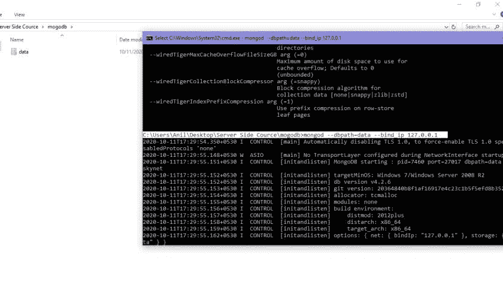
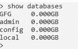
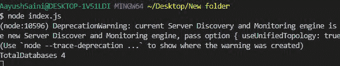

# 使用 Node.js

统计 MongoDB 中存在的数据库总数

> 原文:[https://www . geesforgeks . org/count-数据库总数-在 mongodb 中存在-使用节点-js/](https://www.geeksforgeeks.org/count-total-number-of-databases-present-in-mongodb-using-node-js/)

**MongoDB** ，最受欢迎的 NoSQL 数据库，是一个开源的面向文档的数据库。术语“NoSQL”的意思是“非关系的”。这意味着 MongoDB 不是基于类似表的关系数据库结构，而是提供了一种完全不同的数据存储和检索机制。这种存储格式称为 BSON(类似于 JSON 格式)。

**MongoDB 模块**:node . js 的这个模块用于连接 MongoDB 数据库，也用于操作 MongoDB 中的集合和数据库。 *mongodb.connect()* 方法用于连接您机器上特定服务器上运行的 mongodb 数据库。(参考[这篇](https://www.geeksforgeeks.org/how-to-connect-mongodb-server-with-node-js/)文章)。

**安装模块:**

```js
npm install mongodb
```

**项目结构:**


**在本地 IP 上运行服务器:**数据是 MongoDB 服务器所在的目录。

```js
mongod --dbpath=data --bind_ip 127.0.0.1
```



**蒙古数据库:**



**文件名- index.js:**

## java 描述语言

```js
// Requiring module
const MongoClient = require("mongodb");

// Connection URL
const url = 'mongodb://localhost:27017/';

// Database name
const databasename = "GFG";

MongoClient.connect(url).then((client) => {

    // Use admin request
    const connect = client.db(databasename).admin();

    connect.listDatabases((err, db) => {
        if (!err) {
            var count = 0;
            db.databases.forEach(element => {
                ++count;
            });

            // Printing total count
            console.log("TotalDatabases " + count);
        }
    })
}).catch((err) => {

    // Printing the error message
    console.log(err.Message);
})
```

使用以下命令运行 **index.js** 文件:

```js
node index.js
```

**输出:**

