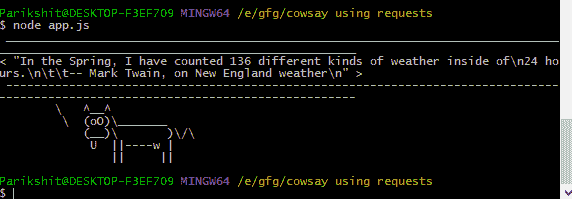
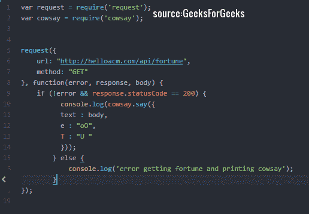

# 使用请求库在 Nodejs 中进行 cow say

> 原文:[https://www . geesforgeks . org/cow say-nodejs-using-requests-library/](https://www.geeksforgeeks.org/cowsay-nodejs-using-requests-library/)

**先决条件:**

*   NodeJS 和 JavaScript 的基础知识。另外，你应该在你的机器上安装[节点。](https://nodejs.org/en/)
*   使用 npm。一个[好资源](https://www.sitepoint.com/beginners-guide-node-package-manager/)。npm 将与 NodeJS 本身一起安装。
*   命令行或终端的基本知识。

本质上，我们将使用请求库进行 API 调用，从外部源获取数据，并按照我们的意愿使用这些数据。最终的应用有如下输出:



应用程序进行一个应用编程接口调用，并将数据传输到 cowsay npm 模块

**我们将要使用的 npm 模块有:**

*   牛说
*   [请求](https://www.npmjs.com/package/request)

**项目设置:**要实现上面的应用程序演示，创建一个演示文件夹，并在其中创建一个. js 文件。您可以使用下面的方法创建一个文件夹。js 文件

```
// inside your terminal or command-line
mkdir gfg_folder  //make a folder called 'gfg_folder'
cd gfg_folder     //navigate your terminal into the folder
touch gfg.js      // make a javascript file called gfg.js
Note :I have used different folder name in this article's images.
```

**npm 安装所需的模块:**在您的终端中，运行以下命令:

```
npm install cowsay request --save
```

上面的命令将安装实现应用程序所需的模块。

*   express 模块是一个 web 框架
*   cowsay 模块为奶牛提供了一个空腔，我们将用从 API 中获取的数据填充这个空腔

**代码和说明:**
gfg . js 看起来是这样的:



gfg.js snip 组织

请求模块被设计成进行 HTTP 调用的最简单的方式。几乎所有的编程语言都有一个请求模块，分别用于从服务器获取数据和向服务器发送数据。

**gfg . js 中代码的解释:**

*   **第 1 步**:我们‘需要’请求并测试我们之前使用安装的模块

```
npm install request cowsay --save
```

*   请求模块将帮助我们进行 HTTP 调用来获取数据。
*   考赛将提供我们将要填充的牛腔
*   **第二步**:我们调用请求方法，把 **url** 传递给 hit，**方法(GET)** 作为第一个参数。这被称为“进行应用编程接口调用”。这个方法返回下面讨论的三个对象。
*   **第三步**:URL 被 GET 后，回调函数运行，参数**错误，响应，正文**。
    三个都是**型物体**。在这个函数中，我们将编写要执行的代码(用 API 调用返回的数据填充牛腔)，并在终端中显示给用户。
*   **第四步**:我们在回调函数里面放一个 if-else 条件。如果检查并运行代码，如果没有错误(！错误)，返回的响应是 OK ( response.statusCode = 200)。
    否则将执行**否则**代码。

*   **第五步**:我们使用 console.log()方法在终端打印奶牛。在 console.log()方法内部，我们使用**cow say()**方法。
    我们把**正文:正文**放在了 cowsay()方法里面。这将把获取的数据(返回的响应体)放入牛腔。

*   **第六步**:我们已经写好了整个代码。现在，去终端写下下面的命令，瞧！您的应用程序正在运行。指挥:

```
node gfg.js
```

本文的全部代码可在[这里](https://github.com/Parikshit-Hooda/cowsay-requests-gfg)获得