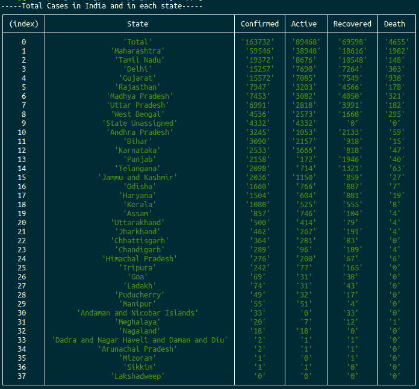

# 使用 Node.js

创建一个新冠肺炎跟踪器 CLI

> 原文:[https://www . geesforgeks . org/create-a-新冠肺炎-tracker-CLI-use-node-js/](https://www.geeksforgeeks.org/create-a-covid-19-tracker-cli-using-node-js/)

在本文中，我们将看到如何使用 Node.js 创建命令行 Corona 病毒跟踪器。我们将跟踪印度各州的总病例、活动病例、完全康复病例和总死亡病例。

**方法:**我们使用名为“request”的 npm 包从公开可用的新冠肺炎 API*https://api.covid19india.org/data.json*T4 获取数据。我们将清理获取的数据，并使用“console.table()”命令打印数据，该命令将数据格式化为表格。我们还可以通过使用 setInterval()方法调度流程来自动化跟踪器。

**[请求包:](https://www.npmjs.com/package/request)** 请求被设计成最简单的 http 调用方式。默认情况下，它支持 HTTPS 并遵循重定向。

**安装请求包:**

```
$ npm install request
```

**注意:**在当前文件夹中运行此命令，当前文件夹是' app.js '文件所在的位置。

**请求语法:**

```
request(url, (error, response, body) => {
    if(!error && response.statusCode == 200) {
        statements to be executed.
    }
}
```

哪里，

*   **url:** 向其发出请求的 API 端点。
*   **响应:** HTTP 响应状态代码表示特定的 HTTP 请求是否已经成功完成。
*   **身体:**反应数据。

**eexaple:**

```
// Importing the request package
const request = require("request");

// API endpoint to which the http
// request will be made
const url = "https://api.covid19india.org/data.json";

// HTTP request
request(url, (error, response, body) => {

    // Error - Any possible error when
    // request is made.

    // Eesponse - HTTP response status codes
    // indicate whether a specific HTTP 
    // request has been successfully completed

    // body - response data

    // 200 - successful response
    if (!error && response.statusCode == 200) {

        // The response data will be in string
        // Convert it to Object.
        body = JSON.parse(body);

        // The data have lot of extra properties
        // We will filter it
        var data = [];
        for (let i = 0; i < body.statewise.length; i++) {
            data.push({
                "State": body.statewise[i].state,

                "Confirmed": body.statewise[i].confirmed,

                "Active": body.statewise[i].active,

                "Recovered": body.statewise[i].recovered,

                "Death": body.statewise[i].deaths
            });
        }

        console.log("-----Total Cases in India "
            + "and in each state-----");

        // Format to table
        console.table(data);
    }
})
```

**输出:**
