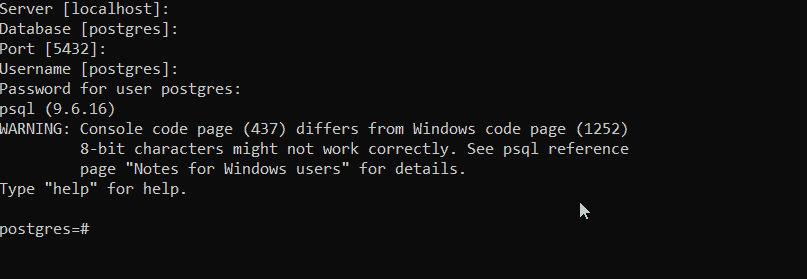
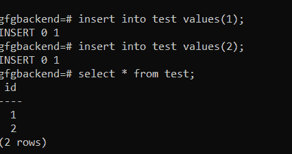
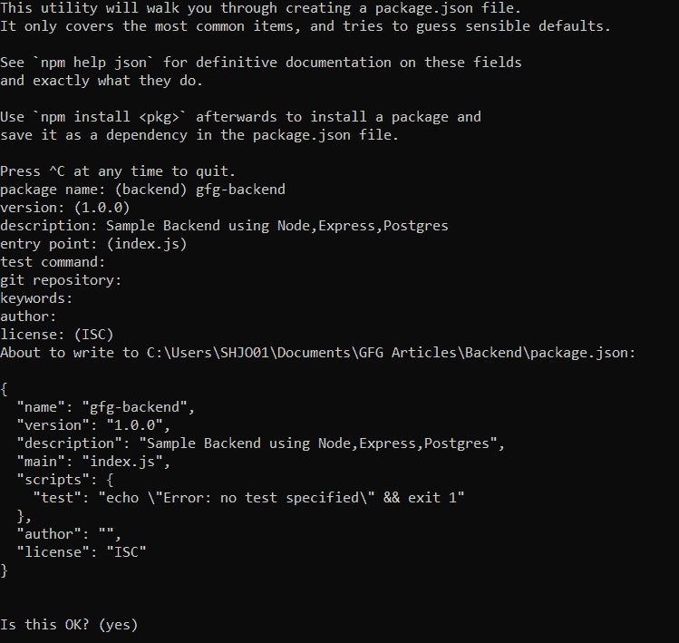
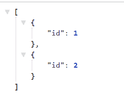

# 使用 Node.js、Express 和 Postgres 创建 REST API 后端

> 原文:[https://www . geesforgeks . org/creating-a-rest-API-后端-使用-node-js-express-and-postgres/](https://www.geeksforgeeks.org/creating-a-rest-api-backend-using-node-js-express-and-postgres/)

可以使用 Node.js、Express 和 Postgres 开发 JavaScript 后端。这个后端可以对 PostgreSQL 数据库进行查询操作，并在 REST 应用编程接口上提供状态或数据。

**安装要求:**

1.  **Node.js:**
    *   [在 Windows 上安装 node . js](https://www.geeksforgeeks.org/installation-of-node-js-on-windows/)
    *   [在 Linux 上安装 node . js](https://www.geeksforgeeks.org/installation-of-node-js-on-linux/)
2.  **PostgreSQL:**

*   [在 Windows 上安装 Postgres](https://www.geeksforgeeks.org/install-postgresql-on-windows/)
*   [在 Linux 上安装 Postgres](https://www.geeksforgeeks.org/install-postgresql-on-linux/)
*   [在 Mac 上安装 Postgres](https://geeksforgeeks.org/install-postgresql-on-mac/)

**成功安装测试:**

1.  **Node.js:**
    *   Open Command Prompt or Terminal and type:

        ```
        node -v 
        ```

        输出必须显示一些版本号示例:

        ```
        v12.14.0 
        ```

        **注意:**如果显示命令未找到，则 node.js 安装不成功。

2.  **Postgres:**
    *   Windows:搜索 SQL Shell，如果找到安装成功。
    *   Linux or Mac: Type the command below:

        ```
         which psq 
        ```

        **注意:**如果有输出，则安装成功。

**设置数据库的步骤:**

*   打开 postgresql 外壳
*   键入本地设置的数据库凭据，或者如果您想使用默认值，请按回车键，如下所示:
    
*   使用以下方法创建数据库:

```
create database gfgbackend;     
```

*   使用

    ```
    \c gfgbackend;
    ```

    切换到该数据库*   使用

    ```
    create table test(id int not null); 
    ```

    创建测试表*   使用

    ```
    insert into test values(1);  
    insert into test values(2);
    ```

    将值插入测试表*   Now try to validate whether the data is inserted into table using:

    ```
    select * from test;
    ```

    

    **创建后端的步骤:**

    *   转到要创建项目的目录
    *   使用

        ```
        npm init
        ```

        初始化节点项目
    *   键入项目名称和其他详细信息，如果您想使用默认设置
        ，请按回车键
    *   使用 npm 安装 express】
    *   使用 npm 安装节点后置客户端

        ```
        npm install --save pg
        ```

    *   安装 postgres 模块，使用 npm 将 JSON 数据序列化和反序列化为 hstore 格式。

        ```
         npm install --save pg-hstore    
        ```

    *   创建一个文件 index.js 作为后端的入口点。
    *   现在使用 npm 安装主体解析器

        ```
        npm install --save body-parser
        ```

    *   现在将下面的代码添加到 index.js 文件中，该文件启动 express 服务器，创建一个池连接，并且还创建一个 REST API '/testdata '。**在下面的代码中创建池时，不要忘记添加您的密码。**

        ```
        // Entry Point of the API Server 

        const express = require('express');

        /* Creates an Express application. 
           The express() function is a top-level 
           function exported by the express module.
        */
        const app = express();
        const Pool = require('pg').Pool;

        const pool = new Pool({
            user: 'postgres',
            host: 'localhost',
            database: 'gfgbackend',
            password: 'postgres',
            dialect: 'postgres',
            port: 5432
        });

        /* To handle the HTTP Methods Body Parser 
           is used, Generally used to extract the 
           entire body portion of an incoming 
           request stream and exposes it on req.body 
        */
        const bodyParser = require('body-parser');
        app.use(bodyParser.json())
        app.use(bodyParser.urlencoded({ extended: false }));

        pool.connect((err, client, release) => {
            if (err) {
                return console.error(
                    'Error acquiring client', err.stack)
            }
            client.query('SELECT NOW()', (err, result) => {
                release()
                if (err) {
                    return console.error(
                        'Error executing query', err.stack)
                }
                console.log("Connected to Database !")
            })
        })

        app.get('/testdata', (req, res, next) => {
            console.log("TEST DATA :");
            pool.query('Select * from test')
                .then(testData => {
                    console.log(testData);
                    res.send(testData.rows);
                })
        })

        // Require the Routes API  
        // Create a Server and run it on the port 3000
        const server = app.listen(3000, function () {
            let host = server.address().address
            let port = server.address().port
            // Starting the Server at the port 3000
        })
        ```

    *   现在，使用

        ```
        node index.js
        ```

        启动后端服务器
    *   Open Browser and try to router to:

        ```
        http://localhost:3000/testdata
        ```

        现在可以看到测试表中的数据如下:
        