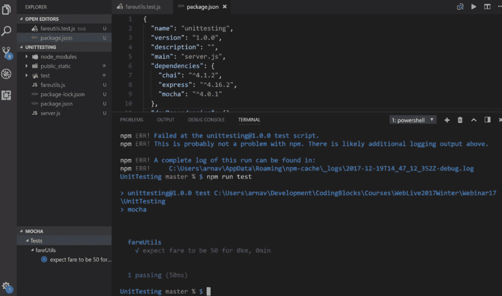
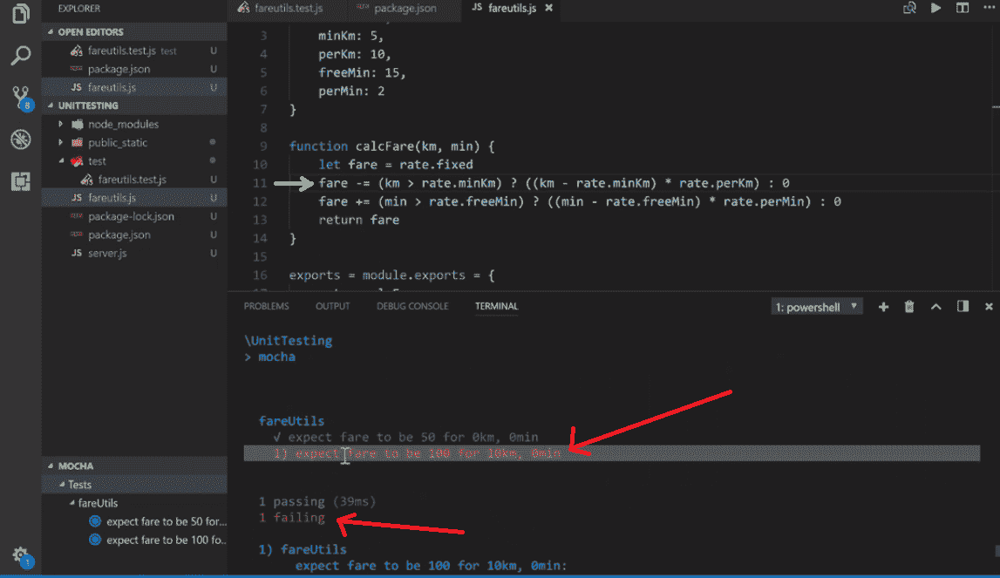

# node . js 应用程序的调试和测试

> 原文:[https://www . geesforgeks . org/节点调试和测试-js-application/](https://www.geeksforgeeks.org/debugging-and-testing-of-a-node-js-application/)

当在一个团队中构建一个大项目时，代码库的持续变化将获得最佳结果。因此，如果有人编写代码，由于这个原因，一个已经存在的特性被破坏了，为此我们使用软件测试。

让你的项目自动测试我们有测试，每次我们运行项目，我们可以检查哪些测试继续通过，哪些没有通过。那些没有通过的测试表明在代码的那个部分正在进行一些改变。

**为实现测试和调试开发一个简单的网络应用程序:**在这个网络应用程序中，我们根据各种参数设置票价，如果有人更改票价，我们必须对其进行测试，以便团队的每个成员都知道票价发生了变化。

**第一步:创建一个项目文件夹**
下载所有依赖项并设置节点服务器

```js
npm init
npm install express

```

**第二步:在根文件夹**
的一个单独的文件中添加你要测试的逻辑在这个文件(fareutils.js)中，我们存储了我们想要测试的代码，并将函数导入到我们的服务器文件中。

```js
// Shows the user rate chart
rate =  {
    fixed: 50,
    minKm: 5,
    perKm: 10,
    freeMin: 15,
    perMin: 2
}

// Logic for calculating fare according to ride details
function calcFare(km, min) {
    let fare = rate.fixed
    fare += (km > rate.minKm) ? ((km - rate.minKm) * rate.perKm) : 0
    fare += (min > rate.freeMin) ? ((min - rate.freeMin) * rate.perMin) : 0
    return fare
}

// Exports the two functions to server.js
exports = module.exports = {
    rate, calcFare
}
```

**第三步:现在实现上述逻辑的测试，我们使用 MOCHA 和 CHAI:**

*   **摩卡**是一个 JS 测试框架。它使用**描述**方法对我们的测试进行分组，使用**描述**方法运行我们的测试。
*   **Chai** 是一个断言库，它确保我们的值是相似的，因为 Chai 可以将对象和数组等同起来，这在普通 javascript 中是不容易做到的。它执行深度相等检查，检查并等同对象的内容。

    ```js
    npm install mocha chai

    ```

**第四步:在根目录下创建一个名为 test 的新文件夹:**
我们将制作一个文件(fareutils.test.js)，在其中编写我们的 mocha 和 chai 测试用例。

```js
// Importing mocha and chai
const mocha = require('mocha')
const chai = require('chai')

// Importing fareutils.js where our code is written
const fareUtils = require('../fareutils')

const expect = chai.expect

// Group of tests using describe
describe('fareUtils', function () {

    // We will describe each single test using it
    it('expect fare to be 50 for 0km, 0min', () => {
        let fare = fareUtils.calcFare(0, 0)
        expect(fare).to.equal(50)
    })

    it('expect fare to be 100 for 10km, 0min', () => {
        let fare = fareUtils.calcFare(10, 0)
        expect(fare).to.equal(100)
    })

    it('expect fare to be 56 for 2km, 18min', () => {
        let fare = fareUtils.calcFare(2, 18)
        expect(fare).to.equal(56)
    })
})
```

**第五步:设置节点服务器**

```js
const express = require('express');
const path = require('path')
const fareUtils = require('./fareutils')

const app = express();

app.use(express.json())
app.use(express.urlencoded({extended: true}))

app.use('/', express.static(path.join(__dirname,
                    'public_static')))

app.post('/calcfare', (req, res) => {
    let km = parseFloat(req.body.km)
    let min = parseInt(req.body.min)

    let fare = fareUtils.calcFare(km, min)

    res.send({fare: fare})
})

app.get('/rate', (req, res) => {
    res.send(fareUtils.rate)
})

app.listen(2222, () => console.log(
    'Server started on http://localhost:2222'))
```

**第六步:如何运行摩卡测试**
如果所有的测试都在 test 文件夹中，并且你已经正确要求了摩卡和 chai。在这里，您可以通过将您的 package.json 文件描述为

```js
"scripts": {
    "test": "mocha",
    "start": "node app.js",
} 

```

现在，我们将按照终端中的命令或 promopt 命令开始测试:

```js
npm run test

```

**一切正常，代码不变时的测试结果:**

测试通过，终端显示绿色勾号。

**现在如果有人在 fareutils.js 中做了更改，那么让我们看看终端:**
这里我们在 **fareutils.js**
的第 11 行做了更改