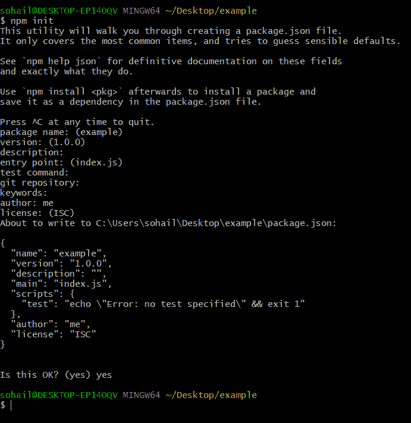

# 部署 Node.js 应用程序

> 原文:[https://www . geesforgeks . org/deployment-node-js-applications/](https://www.geeksforgeeks.org/deploying-node-js-applications/)

为了展示如何部署 nodejs 应用程序，我们首先要创建一个示例应用程序，以便更好地理解这个过程。
我已经为我的示例项目创建了一个目录/文件夹“示例”。
处理前， ***确保您的系统上已经安装了 nodejs 和 git***。
现在，打开示例(或项目文件夹的任何名称)目录
中的命令行和 cd，按照以下步骤创建本教程的示例应用程序
**STEP 1:** 使用以下命令
创建一个**【package . JSON】**文件

```
npm init
```



**第二步:**在你的项目文件夹
里面创建一个名为**【app . js】**的文件**第三步:**创建一个 html 文件**【head . html】**
用以下内容填充文件
这将是我们的应用的主页，通过超链接连接到另一个页面。

## 超文本标记语言

```
<!DOCTYPE html>
<html>
<head>
    <title>Hello World</title>
</head>
<body>

    <h1>This is the Homepage</h1>

<p><a href="/tailPage">Go to Next Page</a></p>

</body>
```