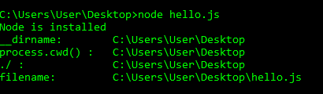
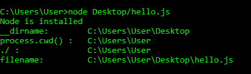

# 【_ _ dirname 与的区别。/ in Node.js

> 原文:[https://www . geesforgeks . org/difference-in-_ _ dirname-in-node-js/](https://www.geeksforgeeks.org/difference-between-__dirname-and-in-node-js/)

使用任何技术都需要与文件和目录交互。文件和目录保持树形结构以便于访问。使用 Node.js 还需要使用文件路径访问文件，该路径可以使用不同的命令获得。在 Node.js 中有两种获取当前目录的方法。然而，它们彼此之间有很大的不同。

*   __dirname
*   。/

节点脚本中的 __dirname 返回当前 JavaScript 文件所在文件夹的路径。__filename 和 __dirname 用于获取当前正在执行的文件的文件名和目录名。

那个。/给出当前工作目录。它的工作原理类似于 process.cwd()方法。当前工作目录是执行节点命令的文件夹的路径。但是，在脚本执行过程中，当前工作目录可能会因使用 process.chdir() API 而发生变化。
唯一的情况当。/在与 require()命令一起使用时给出当前正在执行的文件的路径，该命令相对于当前工作目录有效。那个。/允许我们基于文件结构导入模块。

__dirname 和。/当节点与当前执行的文件运行在同一个目录中时，会产生类似的结果，但当节点从其他目录运行时，会产生不同的结果。

| __dirname | 。/ |
| 给出包含当前执行文件的目录的绝对路径。 | 用于显示终端打开的路径，即当前工作目录。 |
| 返回一个指向字符串的指针，即当前正在执行的文件的父目录。 | 返回一个指向字符串(即当前工作目录)的指针。 |
| 工作方式与 process.cwd()类似，直到节点从不同于存储 JavaScript 文件的目录中运行。 | 工作方式与 process.cwd()类似，直到与 require()命令一起使用。 |

**示例:**以下示例演示了 __dirname 和的工作方式。/当节点从存储 JavaScript 文件的同一目录运行时

**例 1:**

```
// Node.js program to demonstrate the
// methods to display directory

// Include path module
var path = require("path");

// Methods to display directory
console.log("__dirname:    ", __dirname);
console.log("process.cwd() : ", process.cwd());
console.log("./ : ", path.resolve("./"));
console.log("filename: ", __filename);
```

**运行步骤:**

*   打开记事本编辑器，粘贴下面的代码并保存。js 扩展。例如:`index.js`
*   现在打开一个命令提示符，移动到代码所在的目录。
*   键入`node index.js`命令运行代码。

**输出:**


**例 2:**

```
// Node.js program to demonstrate the
// methods to display directory

// Include path module
var path = require("path");

// Methods to display directory
console.log("__dirname:    ", __dirname);
console.log("process.cwd() : ", process.cwd());
console.log("./ : ", path.resolve("./"));
console.log("filename: ", __filename);
```

**运行步骤:**

*   打开记事本编辑器，粘贴下面的代码并保存。js 扩展。例如:`index.js`
*   现在打开一个命令提示符，如果您的路径是桌面，然后键入 cd..移动其父目录。
*   键入`node Desktop/index.js`命令运行代码。

**输出:**
