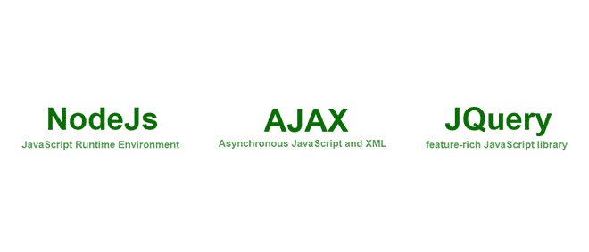

# node . js AJAX 和 jQuery 的区别

> 原文:[https://www . geesforgeks . org/difference-nodejs-Ajax-and-jquery/](https://www.geeksforgeeks.org/difference-between-nodejs-ajax-and-jquery/)

在本文中，我们将讨论 NodeJs、AJAX 和 JQuery 之间的区别。首先，让我们讨论一下 JavaScript，JavaScript 是技术领域发展最快的编程语言之一。因为它是一种非常灵活的编程语言，具有一些非常有用的优势，比如托管、动态原型等等。由于它的一些重要框架和库，所有这些都是可能的。

如果你想了解更多关于 [JavaScript 教程](https://www.geeksforgeeks.org/javascript-tutorial/)的内容，请查看这篇文章

[**NodeJs**](https://www.geeksforgeeks.org/nodejs-tutorials/)**:**NodeJs 是一个 JavaScript 的运行时环境，工作在非常强大的 v8 引擎上，所以 NodeJs 就利用了这一点，允许 JavaScript 在 NodeJs 的帮助下作为服务器端语言运行。

[**AJAX:**](https://www.geeksforgeeks.org/ajax-introduction/)**AJAX 代表异步 javascript 和 XML 用户向服务器请求数据而无需任何重载和阻塞，任何其他请求也因此提供了一种将数据提取到服务器并显示到页面的流畅性能。**

**[**JQuery:**](https://www.geeksforgeeks.org/jquery-tutorials/) 这个 javascript 库让一切变得简单，为在前端做一些事情提供了一个非常有效的方法，并提供了许多基本的功能，如浏览器事件处理、DOM 动画、Ajax 交互和跨浏览器 JavaScript 开发。**

****Nodejs、AJAX 和 jQuery 的区别:****

<figure class="table">**Nodejs 是一个基于 JavaScript v8 引擎的开源框架。**

| **Nodejs** | **AJAX** | **jQuery** |
| --- | --- | --- |
| AJAX is a web development technology that makes asynchronous calls to servers. | JQuery is a JavaScript library used to design and simplify some web development tasks. |
| It makes it possible to run javascript outside the browser. | Work in the browser or work outside the browser. | It makes it easy to use AJAX in your project. |
| It uses a non-blocking i/o mode. | It handles a non-blocking asynchronous request. | If the current event is running, block other events. |
| It only works for JavaScript. Because it is the runtime environment of JavaScript. | It is used in conjunction with various technologies. | It is also applicable to different technologies. |
| 它是用 C、C++、JavaScript 和咖啡脚本写的 | This is written in JavaScript. | This is also written in JavaScript. |
| They support dependency injection in terms of packages. | No dependency injection is supported. | It supports but is very limited to front-end dependent injection. |
| It works on the server side. | Work only on the client. | It also works on the client. |
| Used to create servers or provide static or dynamic files on the Internet. | Get data from API endpoint. | Works only build rich front-end user interface. |

</figure>