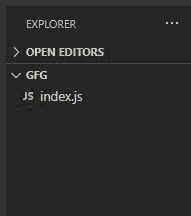
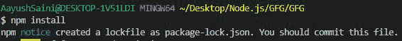
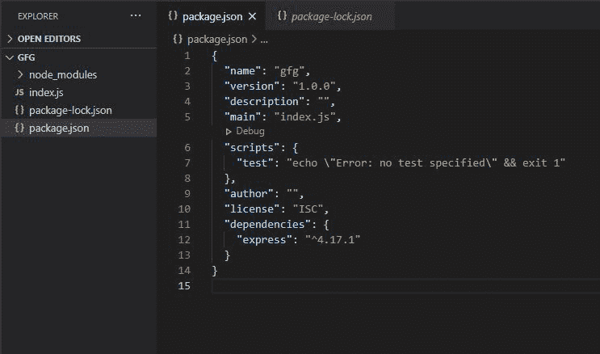
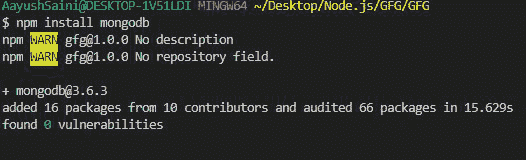
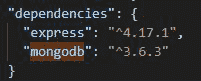
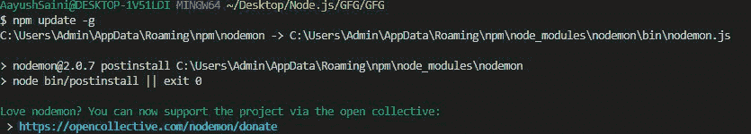

# 在 Node.js 中安装 npm 和更新 npm 的区别

> 原文:[https://www . geesforgeks . org/NPM-install-and-NPM-update-in-node-js/](https://www.geeksforgeeks.org/difference-between-npm-install-and-npm-update-in-node-js/)的区别

[NPM](https://www.geeksforgeeks.org/node-js-npm-node-package-manager/#:~:text=NPM%20(Node%20Package%20Manager)%20is,is%20written%20entirely%20in%20Javascript.&text=NPM%20can%20install%20all%20the%20dependencies%20of%20a%20project%20through%20the%20package.) 就像 Node.js 的发电站，包含了 node.js 应用程序顺利运行的所有必要模块。当我们在 Windows、Linux 或 MAC 操作系统上安装 Node.js 时，它就会安装在我们的机器上。

如何在机器上安装 Node？参考 [<u>本</u>](https://www.geeksforgeeks.org/installation-of-node-js-on-windows/) 篇。

NPM 有 580096 个注册包裹。这个数字的平均增长率是 291/天，这意味着不同种类的包的增长急剧增加，所以我们必须每次都在我们的机器上更新我们的节点？答案是否定的！NPM 允许我们根据工作需要在机器上安装第三方模块。

另一个原因是预定义的模块无法满足大项目的需求例如[【HTTP】](https://www.geeksforgeeks.org/node-js-http-module/#:~:text=The%20HTTP%20module%20creates%20an,with%20the%20help%20of%20http.)模块无法区分多种请求，所以我们不得不在外部安装另一个流行的模块。即 [表达](https://www.geeksforgeeks.org/working-of-express-js-middleware-and-its-benefits/) 模块。

我们可以使用节点包管理器提供的一些预定义命令访问第三方模块，如下所示:

**初始项目结构**:



***npm 安装*** **命令:**该 npm 命令用于安装我们当前目录下的第三方模块。使用此命令有两种不同的方式:

1.  无参数
2.  带参数

*   **不带参数:**当我们使用不带参数的 npm 命令时，该命令会自动下载我们目录中 package.json 文件中写入的所有依赖项。

**Package.json:** 在目录中创建一个 [package.json](https://www.geeksforgeeks.org/node-js-package-json/) 文件，并在这个文件中提到 express dependencies。

```
{
  "name": "gfg",
  "version": "1.0.0",
  "description": "",
  "main": "index.js",
  "scripts": {
    "test": "echo \"Error: no test specified\" && exit 1"
  },
  "author": "",
  "license": "ISC",
  "dependencies": {
    "express": "^4.17.1"
  }
}
```

**运行** ***npm 安装*** **命令:**

```
npm i 
or
npm install
```



**更新项目结构:**

**package-lock.json** 文件和 **node_modules** 创建的 package-lock.json 文件包含下载的额外依赖项的所有必要信息，node_modules 文件夹包含与我们在 package.json 中指定的模块一起安装的所有不同类型的包。



*   **With Parameter:** 我们可以通过指定我们要为特定工作安装的第三方模块的名称来使用 npm 安装命令。例如，让我们为 Node.js 下载 MongoDB 模块

**参数:**参数可以是我们要安装的模块**的**名称，也可以是我们要安装目录中所有第三方模块的**文件夹名称**。默认情况下，文件夹是 node_modules，其中包含所有已安装的模块。这个文件夹是在我们第一次安装任何外部模块时自动生成的。****

****语法:****

```
npm install [-g] [<package>..]
```

> ***   **Syntax of installing module:** The module will be installed in the node_modules folder of the current directory.**
> 
>  **```
> npm install <module-name>
> ```
> 
> *   **Syntax of installing any module globally** ****:** Global installation means that we can access the module without installing it in a specific directory. For example, [node module](https://www.geeksforgeeks.org/node-js-nodemon-module/#:~:text=The%20nodemon%20Module%20is%20a,code%20and%20method%20of%20development.) and so on.**
> 
>  **```
> npm install -g <module-name>
> ```
> 
> *   **Change the syntax of module directory path:** This command changes the installation path of external modules from node_modules to the < dirname > folder in the working directory.
> 
> ```
> npm install <dirname>
> ```****

******说明:**安装任何新模块后，新的包被添加到 node_modules 文件夹中，依赖项被更新到 package.json 文件中。****

1.  ******使用 npm 命令安装模块:******

```
**npm install mongodb**
```

********

******package.json 文件:******

********

*******npm 更新*** **命令:**该 npm 命令用于更新 package.json 文件中提到的依赖项以及安装目录中所有缺失的包，还用于更新机器上的当前节点版本。该命令有两种不同的用法:****

1.  ****无参数****
2.  ****带参数****

*   ******无参数**:无参数 npm 更新适用于所有全局安装的软件包，并更新我们机器上可用的全局软件包的所有版本。****

******语法:******

```
**npm update -g**
```

******更新全球安装的** ***nodemon*** **模块:******

********

*   ******With 参数:** npm update 命令将第二个参数作为我们要更新下一个版本或最新版本的依赖项名称。我们还可以借助一些保留符号将依赖关系的更新限制到最新版本。如果我们仅仅通过提及依赖项的名称来安装依赖项，那么依赖项的最新补丁将会被安装，但是它可能会产生一些问题，因为当我们在处理一个项目并且想要几乎等于它的当前版本依赖时。我们无法安装特定的依赖项，我们将使用保留符号来转换依赖项的更新轨迹****

******node . js 中主要使用的依赖类型有:******

******1。脱字符号依赖项:**当^的 package.json 或 package.lock.json 文件中存在依赖项时，称为脱字符号，称为脱字依赖项。这些依赖项被更新到与该版本兼容的最新版本。****

```
**"dependencies": {
  "dep11": "^2.2.2"
}**
```

****此 npm 更新命令将更新到 2.3.3(考虑此版本的存在)和 2.3.3 满足以前的版本****

******2。tilde Dependencies:***NPM update*命令将这些依赖项更新到最高排序版本。这些依赖项使用~符号。****

```
**"dependencies": {
  "dep11": "^2.2.2"
}**
```

****如果我们更新这个依赖项，在这种情况下，它将更新到 2.2.3 版本。****

******差异:******

*   ******npm 安装程序**安装在 **package.json** 文件中列出的所有模块及其依赖项。****
*   ******npm 更新**更新**节点 _ 模块目录**中的所有包及其依赖项。****