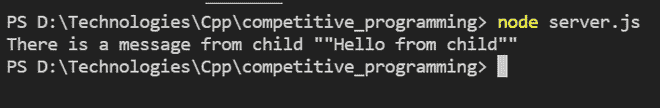

# node . js 中产卵()和分叉()方法的区别

> 原文:[https://www . geesforgeks . org/difference-fork-methods-in-node-js/](https://www.geeksforgeeks.org/difference-between-spawn-and-fork-methods-in-node-js/)

在本文中，我们将讨论 Node.js 中的产卵()和分叉()方法之间的区别。这两种方法都是在 Node.js 中创建子进程的方法，以便处理不断增加的工作负载。

**产卵()方法:**产卵过程在新的进程中发起命令。我们可以将命令作为参数传递给它。派生函数的结果是一个实现 EventEmitterAPI 的子进程实例。事件处理程序可以附加或注册到创建的子实例。可以在该子实例上附加或注册的一些事件是断开连接、错误、关闭和消息等。

**参数:**该方法接受以下参数。

*   **命令:**它接受以字符串形式运行的命令。
*   **参数:**是字符串参数的列表。默认值为空数组。
*   **选项:**这个选项对象可以有各种属性，比如 stdio、uid、gid、shell 等。
    *   **shell:** 接受布尔值。如果为真，则在外壳内部运行命令。不同的外壳可以指定为字符串。默认值为 false，这意味着没有外壳。

**返回值:**返回子进程的一个实例。

**示例:**这是一个非常简单且通用的使用产卵的示例。我们首先需要通过析构来生成，然后通过传递参数来创建一个子进程。然后在该子进程上注册一个 stdout 事件。

## java 描述语言

```
const { spawn } = require('child_process');
const child = spawn('dir', ['D:\\empty'], { shell: true });

child.stdout.on('data', (data) => {
  console.log(`stdout ${data}`);
});
```

**输出:**



由于使用了 fork 子进程，从 child.js 发送的消息正在文件服务器. js 中打印。

**Spawn 和 Fork 子进程的区别:**

<figure class="table">

| 

Spawn

 | 

Fork

 |
| --- | --- |
| Once the child process starts executing, it starts sending data from the child process to the parent process. | This does not automatically send data, but we can use a global module name process to send data from the child process and in the parent module, send the process to the child process with the name of the child process. |
| It creates a new process by command instead of running on the same node process. | It allows several separate processes (child processes) but all processes run on the same node process as the parent process. |
| In this case, no new V8 instance will be created. | In this case, a new V8 instance will be created. |
| Used when we want the child process to return a large amount of data to the parent process. | Used to separate computation-intensive tasks from the main event loop. |

</figure>