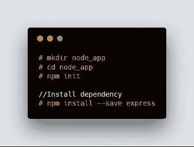
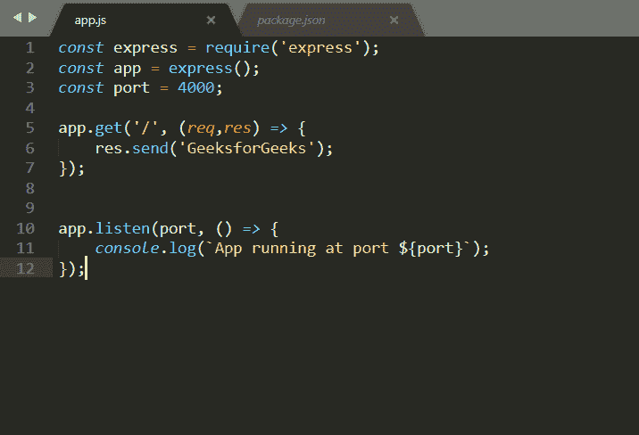
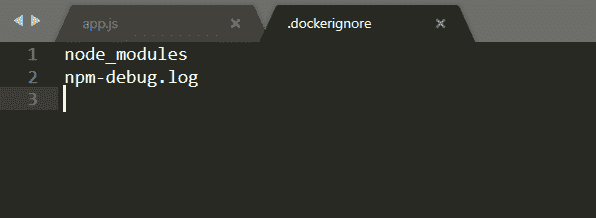
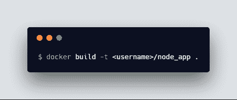
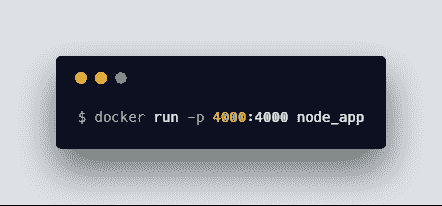

# 记录一个简单的 Node.js 应用程序

> 原文:[https://www . geesforgeks . org/dockerzing-a-simple-node-js-app/](https://www.geeksforgeeks.org/dockerizing-a-simple-node-js-app/)

本文的目标是展示如何将 Node.js 应用程序放入 Docker 容器中。

*   首先，我们将创建一个示例节点应用程序，*   Build a Docker image of that application and run it

    **设置节点应用程序**
    创建一个目录并运行命令 **npm init** 来初始化应用程序并安装初始依赖项

    

    创建一个文件 **app.js** 并在里面写下这段代码。

    

    下一步是向其中添加 Docker。因此，创建一个名为 **Dockerfile** 的空文件，并将这段代码放入其中

    

    现在添加**。Docker nore**文件，防止本地模块和日志被复制到 Docker 映像上，并添加这两个文件
    

    现在我们需要建立我们的 Docker 映像并运行它。这可以通过以下命令完成:
    
    