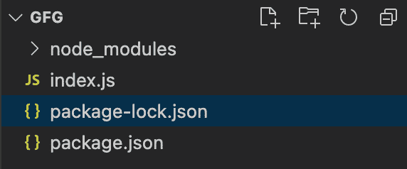
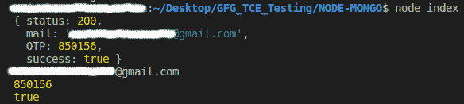
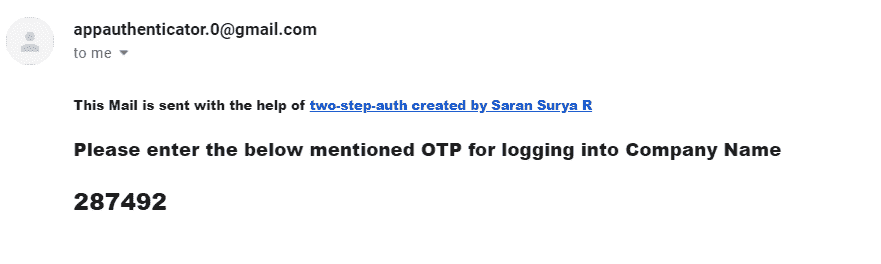

# 在 NodeJS 中使用 OTP 进行邮件验证

> 原文:[https://www . geesforgeks . org/email-verification-use-OTP-in-nodejs/](https://www.geeksforgeeks.org/email-verification-using-otp-in-nodejs/)

本文讲述了如何通过 **OTP 设置您的 node.js 服务器来验证电子邮件。**

**项目设置:**包名为**两步授权**

**安装:**

```
npm i --save two-step-auth
```

**默认用法:**

*   请提供公司名称，以便邮件被视为重要邮件。(这是可选的)
*   从包中导入 Auth 对象，并按照下面提到的方式使用它们。

**文件夹结构:**


**代码模板:**

```
const { Auth } = require("two-step-auth");

async function login(emailId) {
  const res = await Auth(emailId);
  // You can follow this approach,
  // but the second approach is suggested,
  // as the mails will be treated as important
  const res = await Auth(emailId, "Company Name");
  console.log(res);
  console.log(res.mail);
  console.log(res.OTP);
  console.log(res.success);
}

login("verificationEmail@anyDomain.com");
```

*   一旦操作成功，我们将拥有 OTP，并且将向特定用户的邮件 ID 发送电子邮件
*   自定义电子邮件标识用法:
    *   从包装中拉出**逻辑重新定义**对象，并按下述方式使用它们
    *   使用自定义电子邮件标识的先决条件:
        *   在执行该功能之前，请确保您已经为该特定帐户启用了 ***允许不太安全的应用程序*** 。
        *   不使用时将其关闭。

**示例:**

## index.js

```
const { Auth, LoginCredentials } = require("two-step-auth");

async function login(emailId) {
  try {
    const res = await Auth(emailId, "Company Name");
    console.log(res);
    console.log(res.mail);
    console.log(res.OTP);
    console.log(res.success);
  } catch (error) {
    console.log(error);
  }
}

// This should have less secure apps enabled
LoginCredentials.mailID = "yourmailId@anydomain.com"; 

// You can store them in your env variables and
// access them, it will work fine
LoginCredentials.password = "Your password"; 
LoginCredentials.use = true;

// Pass in the mail ID you need to verify
login("verificationEmail@anyDomain.com"); 
```

我们创建了一个动态口令验证服务。<

**输出**



**邮件示例:**这将在您给定的邮件 Id 中收到。



邮件中看到的图像