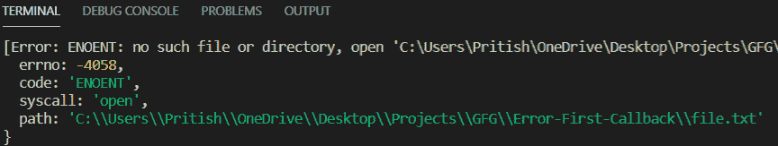
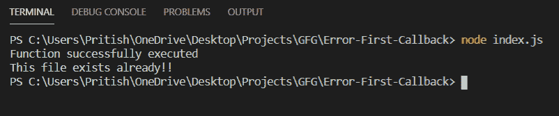

# 错误 Node.js 中的第一次回调

> 原文:[https://www . geesforgeks . org/error-first-callback-in-node-js/](https://www.geeksforgeeks.org/error-first-callback-in-node-js/)

Node.js 中的 **Error-First Callback** 是一个函数，它要么返回一个错误对象，要么返回该函数返回的任何成功数据。

1.  函数中的第一个参数是为错误对象保留的。如果在函数执行过程中出现任何错误，它将由第一个参数返回。
2.  回调函数的第二个参数是为该函数返回的任何成功数据保留的。如果没有发生错误，那么错误对象将被设置为空。

**下面是错误优先回调的实现:**

创建一个名为 index.js 的文件。该文件需要一个 fs 模块。我们将在 fs 模块的方法上实现一个错误优先回调函数。可以使用以下命令在程序中使用 fs 模块:

```
const fs = require("fs");
```

可以使用以下命令执行该文件:

```
node index.js
```

我们将使用 [fs.readFile()](https://www.geeksforgeeks.org/node-js-fs-readfile-method/) 来显示错误优先回调函数。

**例 1:**

## java 描述语言

```
const fs = require("fs");

// This file does not exists
const file = "file.txt";

// Error first callback
// function with two
// arguments err and data
const ErrorFirstCallback = (err, data) => {
  if (err) {
    return console.log(err);
  }
  console.log("Function successfully executed");
};

// function execution
// This will return
// error because file do
// not exist
fs.readFile(file, ErrorFirstCallback);
```

**输出:**



**例 2:**

## java 描述语言

```
const fs = require("fs");

// This file exists
const file = "file.txt";

// Error first callback
// function with two
// arguments err and data
const ErrorFirstCallback = (err, data) => {
  if (err) {
    return console.log(err);
  }
  console.log("Function successfully executed");
  console.log(data.toString());
};

// function execution
// This will return
// data object
fs.readFile(file, ErrorFirstCallback);
```

**输出:**

