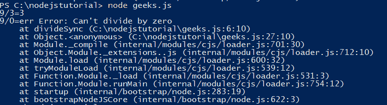
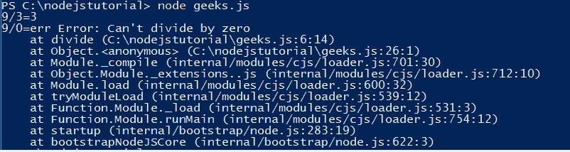
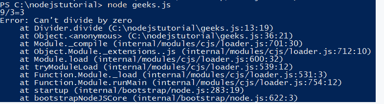

# 节点 js 中的异常处理

> 原文:[https://www . geeksforgeeks . org/异常处理-in-node-js/](https://www.geeksforgeeks.org/exception-handling-in-node-js/)

异常处理是指在应用程序运行时处理代码中发生的异常的机制。Node.js 支持几种传播和处理错误的机制。
这是 Node.js 中可以用于异常处理的不同方法:

*   **Exception handling in synchronous code:**If an error occurs in a synchronous code, return the error.
    **Example:**

    ```
    // Write Javascript code here
    // Define divider as a syncrhonous function
    var divideSync = function(x, y) {
        // if error condition?
        if ( y === 0 ) {
            // "throw" the error safely by returning it
            return new Error("Can't divide by zero")
        }
        else {
            // no error occurred, continue on
            return x/y
        }
    }

    // Divide 9/3
    var result = divideSync(9, 3)
    // did an error occur?
    if ( result instanceof Error ) {
        // handle the error safely
        console.log("9/3=err", result)
    }
    else {
        // no error occurred, continue on
        console.log("9/3="+result)
    }

    // Divide 9/0
    result = divideSync(9, 0)
    // did an error occur?
    if ( result instanceof Error ) {
        // handle the error safely
        console.log("9/0=err", result)
    }
    else {
        // no error occurred, continue on
        console.log("9/0="+result)
    }
    ```

    **输出:**
    

*   **Exception handling in callback-based( asynchronous) code:** In callback-based code, the one of the argument of the callback is err. If an error happens err is the error, if an error doesn’t happen then err is null. The err argument can be followed any number of other arguments.
    **Example:**

    ```
    // Write Javascript code here
    var divide = function(x, y, next) {
        // if error condition?
        if ( y === 0 ) {
            // "throw" the error safely by calling the completion callback
            // with the first argument being the error
            next(new Error("Can't divide by zero"))
        }
        else {
            // no error occurred, continue on
            next(null, x/y)
        }
    }

    divide(9, 3, function(err, result){
        // did an error occur?
        if ( err ) {
            // handle the error safely
            console.log("9/3=err", err)
        }
        else {
            // no error occurred, continue on
            console.log("9/3="+result)
        }
    })

    divide(9, 0, function(err, result){
        // did an error occur?
        if ( err ) {
            // handle the error safely
            console.log("9/0=err", err)
        }
        else {
            // no error occurred, continue on
            console.log("9/0="+result)
        }
    })
    ```

    **输出:**
    

*   **多事代码中的异常处理:**在多事代码中，错误可能发生在任何地方。因此，与其抛出错误，不如激发错误事件。
    **例:**

    ```
    // Write Javascript code here
    // Definite our Divider Event Emitter
    var events = require("events")
    var Divider = function(){
        events.EventEmitter.call(this)
    }
    require('util').inherits(Divider, events.EventEmitter)

    // Add the divide function
    Divider.prototype.divide = function(x, y){
        // if error condition?
        if ( y === 0 ) {
            // "throw" the error safely by emitting it
            var err = new Error("Can't divide by zero")
            this.emit("error", err)
        }
        else {
            // no error occurred, continue on
            this.emit("divided", x, y, x/y)
        }

        // Chain
        return this;
    }

    // Create our divider and listen for errors
    var divider = new Divider()
    divider.on('error', function(err){
        // handle the error safely
        console.log(err)
    })
    divider.on('divided', function(x, y, result){
        console.log(x+"/"+y+"="+result)
    })

    // Divide
    divider.divide(9, 3).divide(9, 0)
    ```

    **输出:**
    