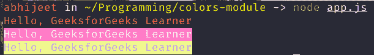
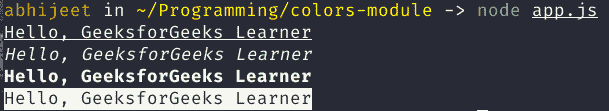
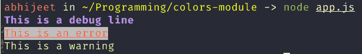
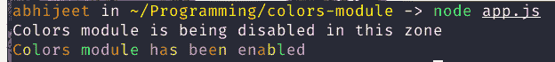
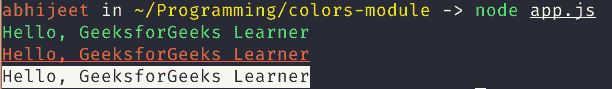

# 解释 Node.js 中的颜色模块

> 原文:[https://www . geesforgeks . org/explain-colors-module-in-node-js/](https://www.geeksforgeeks.org/explain-colors-module-in-node-js/)

**模块用于为节点控制台设置样式和颜色。这是一个很好的库，可以更好地与 node.js 项目进行交互。一般来说，我们看到的是终端上的简单文本，但是有了这个模块，我们可以根据我们的需要和惯例自定义样式，即我们可以将警告文本的颜色更改为红色，或者我们可以在重要的关键字下划线等。**

**在本文中，我们将讨论使用该模块的分步方法。**

****步骤 1:安装和初始化:**打开终端并创建一个节点应用程序，因为最后我们将在 NodeJS 应用程序内部工作**

```js
npm init 
```

**这个命令会要求项目的一些配置，您可以很容易地填充它们，否则使用-y 标志来设置默认配置。**

**现在安装颜色模块**

```js
npm install colors
```

**创建一个 javascript 文件(让我们将其命名为 app.js)来编写其中的整个代码。**

```js
touch app.js
```

****第二步:导入应用中的模块:**导入带有 require 关键字的模块，这样就可以使用*颜色*模块了。**

```js
const colors = require('colors');
```

****步骤 3:开始使用模块:****

*   **我们可以更改文本的颜色，即黑色、红色、绿色、黄色等，以及文本区域的背景，即绿色、黄色、蓝色、洋红色等。**

## **java 描述语言**

```js
const colors = require('colors');

console.log('Hello, GeeksforGeeks Learner'.red); 
console.log('Hello, GeeksforGeeks Learner'.bgMagenta); 
console.log('Hello, GeeksforGeeks Learner'.bgYellow.blue);
```

****输出:****

****

*   **我们可以更改文本的样式，如下划线、粗体、删除线、暗淡、反转、斜体等。**

## **java 描述语言**

```js
const colors = require('colors');

console.log('Hello, GeeksforGeeks Learner'.underline); 
console.log('Hello, GeeksforGeeks Learner'.italic); 
console.log('Hello, GeeksforGeeks Learner'.bold); 
console.log('Hello, GeeksforGeeks Learner'.inverse);
```

****输出:****

****

*   **我们可以用*setheme*方法创建自定义样式，它接受一个对象，稍后我们可以在代码中使用这些属性。
    我们可以通过使用数组来组合两个或多个属性。**

## **java 描述语言**

```js
const colors = require('colors');
colors.setTheme({
    info: 'green',
    data: 'grey',
    help: 'cyan',
    warn: 'yellow',
    debug: ['blue','bold'],
    error: ['red', 'underline', 'bgWhite']
});

console.log("This is a debug line".debug);
console.log("This is an error".error);
console.log("This is a warning".warn);
```

****输出:****

****

****附加点:****

*   **我们可以根据需要在代码中启用和禁用这个模块。**

## **java 描述语言**

```js
const colors = require('colors');

colors.disable();
console.log('Colors module is being disabled in this zone'.red); 
colors.enable();

console.log('Colors module has been enabled'.rainbow);
```

****输出:****

****

*   **您可能已经注意到，之前我们使用了扩展字符串原型的 colors 模块，但是该模块也提供了另一种使用方式。**
*   **将模块导入为**颜色/安全**，然后使用类似这样的方式传递字符串，**

```js
colors.someProperties("Any String")
```

## **java 描述语言**

```js
var colors = require('colors/safe');

console.log(colors.green('Hello, GeeksforGeeks Learner'));
console.log(colors.red.underline('Hello, GeeksforGeeks Learner'));
console.log(colors.inverse('Hello, GeeksforGeeks Learner'));
```

****输出:****

****

****结论:**这是色彩模块的大致介绍，你可以用自己的方式进行更多的探索，也可以查看模块的官方[文档和资源库](https://github.com/Marak/colors.js)。**