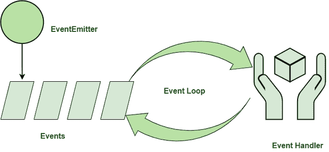

# 解释 Node.js 中的事件驱动编程

> 原文:[https://www . geesforgeks . org/explain-event-driven-programming-in-node-js/](https://www.geeksforgeeks.org/explain-event-driven-programming-in-node-js/)

**node . js 中的事件驱动编程:** Node.js 大量使用事件，这也是与其他类似技术相比其速度慢的原因之一。一旦我们启动了 Node.js 服务器，它就会初始化变量和函数，然后监听事件的发生。

事件驱动编程用于同步多个事件的发生，并使程序尽可能简单。事件驱动程序的基本组成部分是:

*   当事件被触发时，回调函数(称为事件处理程序)被调用。
*   一个事件循环，它侦听事件触发器并为该事件调用相应的事件处理程序。



监听事件触发的函数被称为“观察者”。它在事件发生时被触发。Node.js 提供了一系列已经内置的事件。这些“事件”可以通过“事件”模块和事件发射器类来访问。Node.js 的大多数内置模块都继承自 EventEmitter 类

**事件发射器:**事件发射器是一个节点模块，允许对象相互通信。节点的异步事件驱动架构的核心是事件发射器。许多节点的内置模块继承自事件发射器。

这个想法很简单——发射器对象发出命名事件，触发已经注册的监听器。因此，发射器对象有两个关键特征:

*   **发出名称事件:**发生了某件事的信号称为发出事件。发射物体的状态变化通常是这种情况的原因。
*   **注册和注销监听器函数:**是指回调函数与其对应事件的绑定和解除绑定。

**事件驱动编程原理:**

*   处理事件的一套功能。这些可以是阻塞的，也可以是非阻塞的，这取决于实现方式。
*   将注册的函数绑定到事件。
*   收到注册的事件时，事件循环轮询新事件并调用匹配的事件处理程序。

**实现:文件名:app.js**

## java 描述语言

```js
// Import the 'events' module
const events = require('events');

// Instantiate an EventEmitter object
const eventEmitter = new events.EventEmitter();

// Handler associated with the event
const connectHandler = function connected() {
    console.log('Connection established.');

    // Trigger the corresponding event
    eventEmitter.emit('data_received');
}

// Binds the event with handler
eventEmitter.on('connection', connectHandler);

// Binds the data received
eventEmitter.on(
    'data_received', function () {
        console.log('Data Transfer Successful.');
    });

// Trigger the connection event
eventEmitter.emit('connection');

console.log("Finish");
```

上面的代码片段将名为“connectHandler”的处理程序与事件“connection”绑定在一起。事件发出时会触发回调函数。

使用以下命令运行 *app.js* 文件:

```js
node app.js
```

**输出:**

```js
Connection established.
Data Transfer Successful.
Finish
```

**事件驱动编程的优势:**

*   **灵活性:**在需要时更容易更改代码部分。
*   **图形界面的适用性:**允许用户选择工具(如单选按钮等)。)直接从工具栏
*   **编程简单性:**支持预测编码，提高了程序员的编码体验。
*   **容易找到自然分割线:**单元测试基础设施的自然分割线很容易得到。
*   **对系统建模的好方法:**对必须异步和反应的系统建模的有用方法。
*   **允许更多的交互程序:**允许更多的交互程序。几乎所有最近的图形用户界面应用程序都使用了事件驱动编程。
*   **使用硬件中断:**可以通过硬件中断来完成，降低了计算机的功耗。
*   **允许传感器和其他硬件:**它使传感器和其他硬件与软件通信变得简单。

**事件驱动编程的缺点:**

*   **复杂:**简单的程序变得不必要的复杂。
*   **不太符合逻辑和明显:**程序的流程通常不太符合逻辑和更明显
*   **难发现错误:**调试一个事件驱动的程序很难
*   **混乱:**程序中太多的表单可能会让程序员感到混乱和/或沮丧。
*   **紧密耦合:**事件模式将与模式的消费者紧密耦合。
*   **阻塞:**操作的复杂阻塞。

**事件驱动编程和面向对象编程的关系:**我们可以将面向对象编程(OOP)和事件驱动编程(EDP)结合起来，在同一个代码片段中一起使用。

**当面向对象程序与电子数据处理一起使用时:**

*   所有的 OOP 基础(封装、继承和多态)都被保留了下来。
*   对象能够发布事件后通知并订阅来自其他对象的事件通知。

**如何区分有无 EDP 的 OOP:**对象之间的控制流就是有无 EDP 的 OOP 的区分。在没有电子数据处理的面向对象程序中的方法调用中，控制从一个对象流向另一个对象。对象的主要功能是调用其他对象的方法。

然而，在事件通知上，面向对象程序中的控制从一个对象转移到另一个对象。对象订阅来自其他对象的通知，等待来自这些对象的通知，根据通知执行工作，然后发布自己的通知。