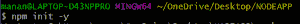
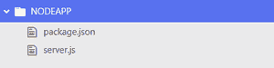
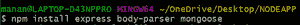
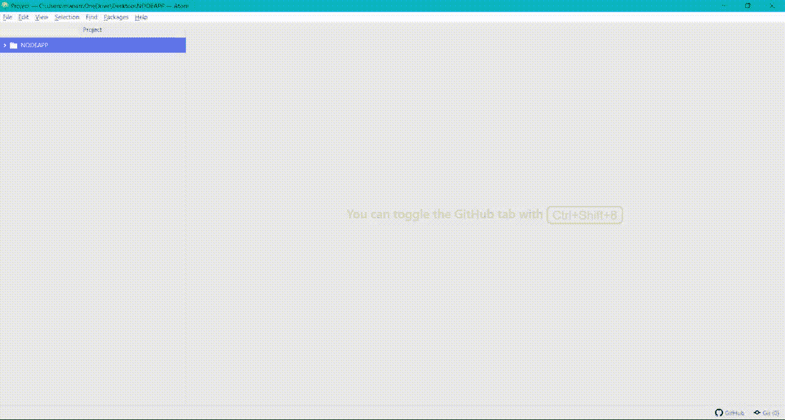
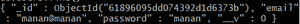
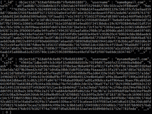
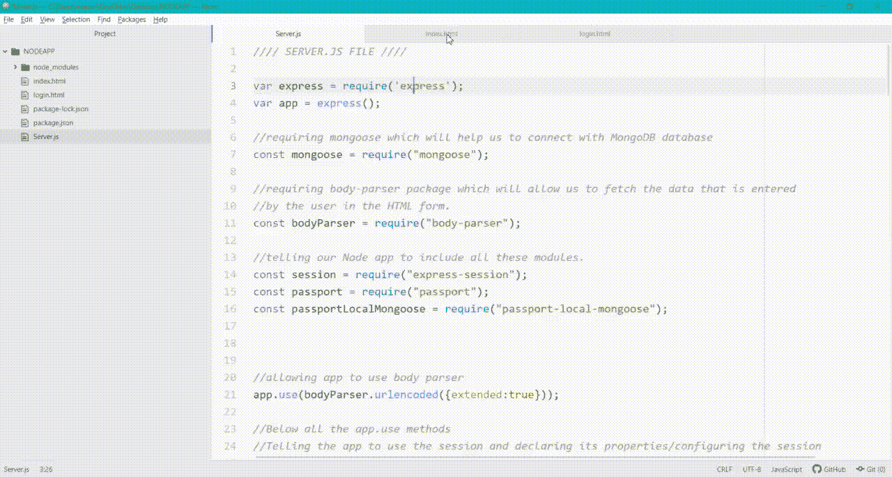

# 在 Node.js

解释护照

> 原文:[https://www.geeksforgeeks.org/explain-passport-in-node-js/](https://www.geeksforgeeks.org/explain-passport-in-node-js/)

Passport 非常容易集成 NodeJs 包，用来给我们的网站或者 web app 增加**认证**功能。

为了展示 Passport 在 Nodejs 中的使用，我们从创建一个非常简单的 Node 应用程序开始。

**使用 express 创建一个简单的节点应用程序:**

**第一步:**新建一个文件夹(我已经把文件夹命名为“NODEAPP”)，在里面新建一个名为“Server.js”的文件。

**步骤 2:** 使用命令“npm init -y”初始化 npm。Package.json 文件将被添加到项目文件夹中。

> npm 初始 y



用于初始化 npm 的命令



运行命令“npm init -y”后的项目结构

**步骤 3:** 安装所有必需的包，即 **express** 、 **body-parser** (稍后将用于获取 HTML 表单数据)、**mongous**(用于连接到我们的 MongoDB 数据库)，使用命令:

> npm 安装快速正文解析器猫鼬



要执行上述命令来安装所需的软件包。

执行上述命令后，一个名为“ **package-lock.json** 的文件将被添加到您的项目结构中，一个名为“ **node_modules** 的文件夹将被添加到您的项目结构中。

**项目结构:**最终的项目结构应该是这样的:


最终项目结构

**第四步:**给我们的 **Server.js** 文件添加基础代码。

## Server.js

```
// Telling node to include the following
// external modules
var express = require('express');
var app = express();

// Mongoose for connecting to our database
const mongoose = require("mongoose");

// Body parser to fetch HTML form data later on
const bodyParser = require("body-parser");

// Connecting mongoose to our database
// named "userDatabase"
mongoose.connect(
'mongodb://localhost:27017/userDatabase', {
  useNewUrlParser: true,
  useUnifiedTopology: true
});

// Handling get request on home route.
app.get("/", function (req, res) {
    res.send("This is the home route");
});

// Allowing app to listen on port 3000
app.listen(3000, function () {
    console.log("server started succesfully");
})
```

**第五步:**也可以打开浏览器，输入 **http://localhost:3000** 进行查看。您应该会看到一个带有以下响应的白页。


在浏览器中键入“http://localhost:3000”后，您应该会得到响应。



创建基本的节点应用程序，检查是否一切都很好，直到现在。

**第六步:**给我们的网站添加认证。向我们的网站添加身份验证功能的一个简单方法是从用户那里获取电子邮件和密码输入，并直接将其保存在数据库中。同样，当用户想要登录时，询问他/她的电子邮件和密码，如果有任何记录与输入的电子邮件和密码匹配，则用户是可信的，登录成功。

## Server.js

```
/*We are going to add simple authentication to our website
We are going to collect data(email and password) entered by
user in the HTML form, created in the INDEX.HTML file, and
we are going to store that data in our database
this is how we can simply register any new user */

/* if we want to log in our already registered user, 
then we collect email and password from HTML 
form created in LOGIN.HTML file, and
we can find data(if any) associated with this 
email, and return it to user */

var express = require('express');
var app = express();
const bodyParser = require("body-parser");

// Allowing app to use body parser
app.use(bodyParser.urlencoded({extended:true}));

// Connecting mongoose to our database
// named "userDatabase"
mongoose.connect(
'mongodb://localhost:27017/userDatabase' { 
  useNewUrlParser: true,
  useUnifiedTopology: true
});

const userSchema = new mongoose.Schema({
  email: String,
  password: String
});

// Creating the User model.
const User = new mongoose.model("User", userSchema);

/* setting a simple get request on the home route, 
and sending our index.html file containing a form 
which will allow user to enter his details and 
register. */
app.get("/", function (req, res) {
  res.sendFile(__dirname + "/index.html");
})
app.get("/login", function(req, res) {
  res.sendFile(__dirname + "/login.html");
})

// Handling the post request on /register route.
app.post("/register", function(req, res){
  console.log(req.body);

  // Getting the email and password entered
  // by the user
  var email = req.body.username;
  var password = req.body.password;

  // Creating a new user with entered credentials.
  var newuser = new User({
    email : email,
    password : password
  })

  // Saving the newuser.
  newuser.save();
  console.log("saved succesfully");

  // Sending the response that user
  // is saved succesfully
  res.send("saved succesfully");
})

APP.post("/login", function(req, res) {
    console.log(req.body);

    // Getting the email and password entered
    // by the user
    var emailEntered = req.body.username;
    var passwordEntered = req.body.password;

    // Checking if the email entered exists
    // in database or not.
    User.findOne({email : emailEntered}, 
                 function(err, data){
       if(data) {

           // The email exists in the database.
           console.log(data);

           /* checking if the password entered 
           is matching the original password */
           if(data.password == passwordEntered){
               res.send("login successful!");
           }
           else {

               // Password is incorrect.
               res.send("Incorrect Password");
            }
       }
       else {

           // The email does not exist in the database
           console.log(err);
       }
    });
})

// Allowing app to listen on port 3000
app.listen(3000, function () {
  console.log("server started successfully");
})
```

## Index.html

```
<!DOCTYPE html>
<html>

<head>
    <title>Page Title</title>
</head>

<body>
    <form class="" action="/register" 
          method="post">
        <input type="email" name="username" 
               placeholder="Name" value="">
        <input type="password" name="password" 
               placeholder="Password" value="">
        <button type="submit" name="button">
            Submit
        </button>
    </form>
</body>

</html>
```

## Login.html

```
<!DOCTYPE html>
<html lang="en" dir="ltr">

<head>
    <meta charset="utf-8">
    <title></title>
</head>

<body>
    <form class="" action="/login" method="post">
        <input type="email" name="username" 
               placeholder="Name" value="">
        <input type="password" name="password" 
               placeholder="Password" value="">
        <button type="submit" name="button">
            Submit
        </button>
    </form>
</body>

</html>
```

但是使用这种简单的认证方法有一些限制。

*   用户在注册过程中输入的密码被**暴露给数据库**中的每个人，即组织中有权访问数据库的任何人都可以看到任何用户的密码。但是，密码不能暴露，我们需要强加密，这样我们就可以将密码安全地存储在数据库中。



密码会暴露给所有查看数据库的人。

*   每次(可能每天 20-25 次，甚至更多)我们想使用这个网络应用或网站，我们必须重新输入我们的电子邮件和密码，这变得非常耗时。
*   我们无法使用这个简单的身份验证代码添加社交网络登录功能。

Passport 为我们消除了所有这些限制。如果我们使用护照，那么:

*   我们不必暴露我们的密码。整个加密和解密过程由 Passport 完成，包括密码的散列和加密。
*   Passport 允许我们创建和维护会话。例如，当你访问任何社交媒体网站或手机应用程序时，你不必一次又一次地登录，每次你想使用 Instagram 或脸书。相反，信息是保存的，这意味着**你不必在每次**想使用网站**时都登录。**用技术的话来说，已经创建了一个会话，它将在接下来的几天，或者几周，或者几个月内保持。
*   Passport 还允许我们使用谷歌、脸书、领英和各种其他社交网络服务轻松集成身份验证。

**第七步:**使用 passport，我们要安装 4 个 npm 包，分别是“ **passport** ”、“ **passport-local** ”、“**passport-local-mongose**”和“ **express-session** ”(确保你下载的是“express-session”而不是“express-session”)。

在命令行中，编写以下命令来安装所有四个软件包:

> npm 安装 passport passport-本地 passport-本地-猫鼬快递-会话


以下命令将安装所需的软件包。

安装完成后，需要在 **Server.js** 文件顶部添加以下代码，以包含 passport 模块。

## Server.js

```
const session = require("express-session");
const passport = require("passport");
const passportLocalMongoose = require("passport-local-mongoose");

app.use(express.static("public"));
app.use(bodyParser.urlencoded({extended:true}));

// Below all the app.use methods
app.use(session({
    secret : "any long secret key",
    resave : false,
    saveUninitialized : false
}));
```

**步骤 8:** 初始化护照并开始会话。要初始化 Passport 并启动会话，请在会话声明代码的正下方编写以下代码。

## Server.js

```
app.use(session({
  secret: "any long secret key",
  resave: false,
  saveUninitialized: false
}));

// Initializing Passport
app.use(passport.initialize());

// Starting the session
app.use(passport.session());

// Creating user schema and adding a plugin to it

const userSchema = new mongoose.Schema({
  email: String,
  password: String
});
userSchema.plugin(passportLocalMongoose);
```

**第 9 步:**现在，我们希望即使关闭浏览器窗口也能保持登录一段时间，即**我们希望建立会话**。会话使用 **Cookie** 来存储数据和消息，并允许服务器向用户提供正确的会话数据。创建 cookie 并将消息存储到其中的过程:序列化粉碎 cookie 并从 cookie 中提取消息的过程，以便将正确的数据提供给用户:

## Server.js

```
const User = new mongoose.model("User", userSchema);
passport.use(User.createStrategy());

// Serializing and deserializing
passport.serializeUser(User.serializeUser());
passport.deserializeUser(User.deserializeUser());
```

**第 10 步:**现在，我们都设置好给自己的网站添加认证了。我们已经安装了所需的软件包，配置了会话，初始化了 passport 和会话，并告诉 Passport 使用和管理 cookies。

#### 处理获取请求:

## Server.js

```
// Handling get request on the home and login route
app.get("/", function (req, res) {

  /* req.isAuthentcated() returns true or 
  false depending upon whether a session 
  is already running or not.*/
  if(req.isAuthenticated()) {

    /* if the request is already authenticated, 
    i.e. the user has already logged in and 
    there is no need to login again. Or we 
    can say, the session is running. */  
    res.send("
     You have already logged in. No need to login again");
  }

  else{

    // If the user is new and no session
    // is Running already 
    res.sendFile(__dirname + "/index.html");
  }
})

// Handling get request on login route
app.get("/login", function(req, res) {
    if(req.isAuthenticated()){
        /* if request is already authenticated, 
        i.e. user has already logged in and 
        there is no need to login again. */ 
        res.send("
You have already logged in. No need to login again");
     }
     else{
       res.sendFile(__dirname + "/login.html");
   }
})
```

#### **步骤 11:** 现在，在注册路由中，我们必须添加简单的代码，允许我们注册任何新用户。

## Server.js

```
/* The index.html file will be same as that
used in the earlier method of authentication*/ 
app.post("/register", function(req, res){
  console.log(req.body);

  // Getting Email and PAssword Entered by user
  var email = req.body.username;
  var password = req.body.password;

  /* Registering the user with email and
  password in our database  
  and the model used is "User" */
  User.register({ username : email }, 
  req.body.password, function (err, user) {      
    if (err) {

      // if some error is occurring, log that error
      console.log(err);
    }
    else {
      passport.authenticate("local")
      (req, res, function() {
        res.send("successfully saved!"); 
      })
    }
  })
})
```

类似的代码是处理登录请求。下面是处理/login 路由上的 post 请求的代码。(login.html 文件将与早期身份验证方法中使用的文件相同)

## Server.js

```
// All handling related to login is done below.
// Here we are handling the post request on
// /login route
app.post("/login", function (req, res) {
  console.log(req.body);

  const userToBeChecked = new User({
    username: req.body.username,
    password: req.body.password,
  });

  // Checking if user if correct or not
  req.login(userToBeChecked, function (err) {
    if (err) {

      console.log(err);

      // If authentication fails, then coming
      // back to login.html page
      res.redirect("/login");
    } else {
      passport.authenticate("local")(
        req, res, function () {
        User.find({ email: req.user.username }, 
          function (err, docs) {
          if (err) {
            console.log(err);
          } else {
            //login is successful
            console.log("credentials are correct");
            res.send("login successful");
          }
        });
      });
    }
  });
});
```

您只需安装所有的软件包，编写以下代码，启动服务器(使用“node server.js/node app . js”命令)，就可以使用 Passport 验证您的用户了。

## Index.html

```
<!DOCTYPE html>
<html>

<head>
    <title>Page Title</title>
</head>

<body>
    <h1>REGISTER</h1>
    <form class="" action="/register" method="post">
        <input type="email" name="username" 
               placeholder="Name" value="">
        <input type="password" name="password" 
               placeholder="Password" value="">
        <button type="submit" name="button">
            Submit
        </button>
    </form>
</body>

</html>
```

## Login.html

```
<!DOCTYPE html>
<html lang="en" dir="ltr">

<head>
    <meta charset="utf-8">
    <title></title>
</head>

<body>
    <h1>LOGIN</h1>
    <form class="" action="/login" method="post">
        <input type="email" name="username" 
               placeholder="Name" value="">
        <input type="password" name="password"
               placeholder="Password" value="">
        <button type="submit" name="button">
            Submit
        </button>
    </form>
</body>

</html>
```

## Server.js

```
var express = require('express');
var app = express();
const mongoose = require("mongoose");

/* Requiring body-parser package  
to fetch the data that is entered 
by the user in the HTML form.*/
const bodyParser = require("body-parser");

// Telling our Node app to include all these modules
const session = require("express-session");
const passport = require("passport");
const passportLocalMongoose = 
       require("passport-local-mongoose");

// Allowing app to use body parser
app.use(bodyParser.urlencoded({ extended: true }));

app.use(session({
    secret: "long secret key",
    resave: false,
    saveUninitialized: false
}));

// Initializing Passport
app.use(passport.initialize());

// Starting the session
app.use(passport.session());

// Connecting mongoose to our database 
mongoose.connect(
'mongodb://localhost:27017/userDatabase', {
    useNewUrlParser: true,
    useUnifiedTopology: true
}); 

/* Creating the schema of user which now 
include only email and password for 
simplicity.*/
const userSchema = new mongoose.Schema({
    email: String,
    password: String
});

/* Just after the creation of userSchema, 
we add passportLocalMongoose plugin 
to our Schema */
userSchema.plugin(passportLocalMongoose);

// Creating the User model
const User = new mongoose.model("User", userSchema);

/* After the creation of mongoose model, 
we have to write the following code */
passport.use(User.createStrategy());

// Serializing and deserializing
passport.serializeUser(User.serializeUser());
passport.deserializeUser(User.deserializeUser());

// Handling get request on the home route
app.get("/", function (req, res) {

    /* req.isAuthentcated() returns true or 
    false depending upon whether a session is 
    already running or not. */
    if (req.isAuthenticated()) {

        /* if request is already authenticated, 
        i.e. user has already logged in and 
        there is no need to login again or 
        we can say, session is running.*/
        res.send(
"You have already logged in. No need to login again");
    }

    else {

        // If the user is new and 
        // no session is Running already
        res.sendFile(__dirname + "/index.html");
    }
})

// Handling get request on login route
app.get("/login", function (req, res) {
    if (req.isAuthenticated()) {

        /* If request is already authenticated, 
        i.e. user has already logged in and 
        there is no need to login again. */
        res.send(
"You have already logged in. No need to login again");
    }
    else {

        /* if session has expired, then user 
         need to login back again and 
         we will send the Login.html */
        res.sendFile(__dirname + "/login.html");
    }
})

/* Registering the user for the first time
handling the post request on /register route.*/
app.post("/register", function (req, res) {
    console.log(req.body);
    var email = req.body.username;
    var password = req.body.password;
    User.register({ username: email },
        req.body.password, function (err, user) {
            if (err) {
                console.log(err);
            }
            else {
                passport.authenticate("local")
                 (req, res, function () {
                    res.send("successfully saved!");
                })
            }
        })
})

// Handling the post request on /login route
app.post("/login", function (req, res) {
    console.log(req.body);

    const userToBeChecked = new User({
        username: req.body.username,
        password: req.body.password
    });

    // Checking if user if correct or not
    req.login(userToBeChecked, function (err) {
        if (err) {
            console.log(err);
            res.redirect("/login");
        }
        else {
            passport.authenticate("local")
                (req, res,function () {
                User.find({ email: req.user.username },
                    function (err, docs) {
                      if (err) {
                         console.log(err);
                      }
                     else {

                       //login is successful
                       console.log("credentials are correct");
                     res.send("login successful");
                        }
                    });
            });
        }
    })
})

// Allowing app to listen on port 3000
app.listen(3000, function () {
    console.log("server started successfully");
})
```

### 使用此代码并使用 Passport 添加身份验证，我们消除了三个主要问题:

*   一旦我们登录，就会创建一个会话。这意味着每当我们再次打开网站时，我们不需要再次登录。Cookies 存储在浏览器中(当您第一次登录时)，当您再次回来时，它们将被用作。(req.isAuthenticated()检查会话是否已经在运行)。
*   我们的用户密码是安全的。它们不会暴露在我们的数据库中。我们已经将所有的加密/解密任务委托给了 Passport，仅此而已。



密码是加密的，对任何人都不可见。

*   我们现在可以看到，没有“密码”一栏。我们的密码是用护照加密的。每当需要登录时，Passport 可以再次解密密码并使用它们。
*   我们还可以使用谷歌、脸书、领英和其他各种仅使用 Passport 的社交网络服务来添加身份验证。(我们这里没有讨论过，但代码类似于此)

### **输出:**

