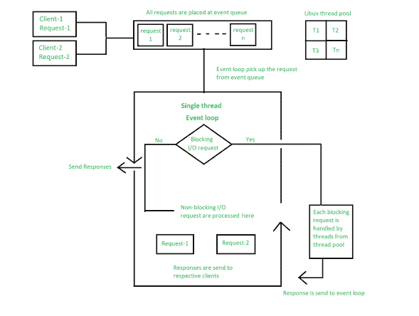

# 说明 Node.js

的工作原理

> 原文:[https://www . geesforgeks . org/explain-节点的工作原理-js/](https://www.geeksforgeeks.org/explain-the-working-of-node-js/)

Node.js 是一个开源的后端 javascript 运行时环境。它被用作后端服务，javascript 在应用程序的服务器端工作。这种方式在前端和后端都使用 javascript。Node.js 运行在 chrome v8 引擎上，该引擎将 javascript 代码转换为机器代码，它具有高度可伸缩性、轻量级、快速性和数据密集型。

**Node.js 的工作方式:** Node.js 接受客户端的请求并发送响应，而与请求节点一起工作时，node . js 用单线程处理它们。为了操作输入输出操作或请求，node.js 使用了线程的概念。线程是服务器需要执行的一系列指令。它在服务器上并行运行，向多个客户端提供信息。Node.js 是一种事件循环单线程语言。它可以用一个线程处理并发请求，而不会阻塞一个请求。

Node.js 基本上基于两个概念

*   异步的
*   非阻塞输入输出

**非阻塞 I/o:** 非阻塞 I/o 意味着处理多个请求，而不会阻塞单个请求的线程。I/O 基本上与文件、数据库等外部系统交互。Node.js 不用于 CPU 密集型工作，意味着用于计算、视频处理，因为单个线程无法处理 CPU 工作。

**异步:**异步是执行一个回调函数。当我们从另一个服务器或数据库获得响应时，它将执行一个回调函数。一些工作一完成就调用回调函数，这是因为 node.js 使用事件驱动的架构。单线程不处理请求，而是将请求发送到另一个系统，该系统解析请求，并且可以被另一个请求访问。

为了实现系统处理请求节点的概念，js 使用了 Libuv 的概念。

Libuv 是一个内置 c++的开源库。它非常注重异步和输入/输出，这使节点能够访问底层计算机操作系统、文件系统和网络。

Libuv 实现了 node.js 的两个极其重要的特性

*   事件循环
*   线程池

**事件循环:**事件循环包含一个单线程，负责处理执行回调、网络 I/O 等简单任务，当程序要初始化时，执行所有顶层代码，代码不在回调函数中。回调函数中的所有应用程序代码都将在事件循环中运行。事件循环是 node.js 的核心。当我们启动节点应用程序时，事件循环会立即开始运行。大部分工作是在事件循环中完成的。

Nodejs 使用事件驱动架构。

*   事件被发出。
*   事件循环提取它们。
*   回调被调用。

**事件队列:**请求一发送，线程就将请求放入队列。它被称为事件队列。像应用程序接收 HTTP 请求或服务器或计时器这样的过程将在完成工作后立即发出事件，事件循环将提取这些事件并调用与每个事件相关联的回调函数，并将响应发送给客户端。

事件循环是一个无限循环，它持续接收请求并处理它们。它检查队列并无限期等待传入的请求。

**线程池:**虽然 node.js 是单线程的，但是它在内部维护一个线程池。当接受非阻塞请求时，会在事件循环中进行处理，但在接受阻塞请求时，它会检查线程池中的可用线程，为客户端的请求分配一个线程，然后处理该线程并将其发送回事件循环，并将响应发送给相应的客户端。

线程池大小可以改变:

process . env . uv _ thread pool _ SIZE = 1；

Node.js 的工作方式