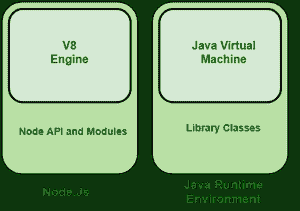

# 在 Node.js

中讲解 V8 引擎

> 原文:[https://www.geeksforgeeks.org/explain-v8-engine-in-node-js/](https://www.geeksforgeeks.org/explain-v8-engine-in-node-js/)

**什么是 V8 发动机？**

V8 是谷歌开发的基于 C++的开源 JavaScript 引擎。它最初是在 2008 年为谷歌 Chrome 和基于 Chrome 的浏览器(如 Brave)设计的，但后来被用来创建用于服务器端编码的 Node.js。实际上，基于 JSON 的无 SQL 数据库，如 Couchbase 和广泛使用的 MongoDB，都使用 V8 引擎。V8 还为著名的桌面应用框架 electronic 和最新的服务器端运行时环境 Demo 提供了动力。

众所周知，V8 是一个 JavaScript 引擎，因为它接受 JavaScript 代码，并在 Chrome 中浏览时执行。它为 JavaScript 代码的执行提供了一个运行时环境。最好的部分是 JavaScript 引擎完全独立于它运行的浏览器。这是导致 Node.js 设计师选择 V8 引擎为框架提供动力的特性，剩下的就是历史了。V8 引擎也被用来构建桌面框架和数据库作为节点。JS 越来越受欢迎。

**V8 发动机是如何工作的？**

JavaScript 引擎是解释和运行 JavaScript 代码的解释器。开发 JavaScript 引擎的第一种方法是将其实现为标准解释器，正如 Mozilla 的 SpiderMonkey 所做的那样。另一种选择是采用即时编译，它像 V8 一样将本机 JavaScript 代码转换为机器代码。V8 代码与其他编程语言的区别在于它不生成中间代码。

当开发人员或程序在 V8 上运行时(即在浏览器或节点环境中)，点火解释器编译 JavaScript 代码并生成非优化的机器代码。V8 的涡轮风扇和曲轴组件在运行时检查并重新编译机器代码，以获得最佳性能。

**节点。Js 和 V8**

Node.js 被称为运行时环境，因为它包含了运行 JavaScript 程序所需的一切。

这个 V8 引擎是 Node.js 的核心。该图比较了用于驱动 Java 运行时环境的 Java 虚拟机(JVM)和 V8 引擎。除了 V8 引擎之外，Node.js 运行时环境还包括几个 Node APIs 来驱动 Node.js 环境。我们可以通过安装额外的 npm 包来增强节点代码的功能。

节点之间的关系。Js 和 V8

需要记住的一点是，V8 本质上是一个独立的 C++库，被 Node 或 Chromium 用来运行 JavaScript 代码。V8 公开了一个其他应用程序可以利用的应用编程接口，因此您可以将 V8 嵌入到您的 C++程序中，并从中运行一个 JavaScript 程序。节点和 Chrome 以这种方式工作。

假设我们希望在 JavaScript 代码中除了 console.log('Hello World ')之外，还能够添加像 print('hello world ')这样的语句。在已经开源的 V8 中，我们可以添加自己的打印函数的 C++实现。

**节点 js 中 V8 的内存限制**

目前，默认情况下，V8 在 32 位计算机上的内存限制为 512MB，在 64 位平台上为 1GB。通过将最大旧空间大小设置为 32 位系统的最大 1gb 和 64 位系统的最大 1.7gb，可以增加该限制。如果你的内存快用完了，最好将你的单个流程分解成许多工作人员。

**node . js 没有 V8 还能工作吗？**

当前的 Node.js 引擎需要 V8 才能运行。在没有 V8 的情况下，它不会有一个 JavaScript 引擎，因此无法运行 JavaScript 代码。C++和 JavaScript 之间的 V8 接口由 Node.js 附带的本机代码绑定使用，例如 fs(文件系统)模块和 Net 模块。

尽管在科技世界里一切皆有可能，而且微软在 2016 年 7 月试图用 Chakra JavaScript 引擎(当时用在 Edge 上)取代 Node.js 中的 V8 引擎，但那个项目始终没有起飞，微软 Edge 最近改用了 Chromium，使用的是 V8 JavaScript 引擎。

DENO 是服务器端编程领域引入的最新技术。许多人认为它将在未来 2-3 年内成为 Node.js 的替代品，并且它还由 V8 JavaScript 引擎提供动力。