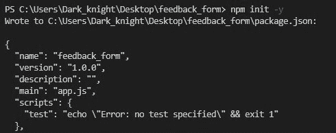
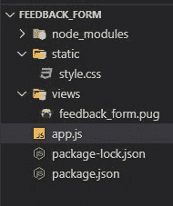
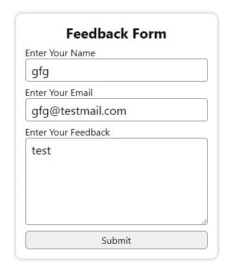
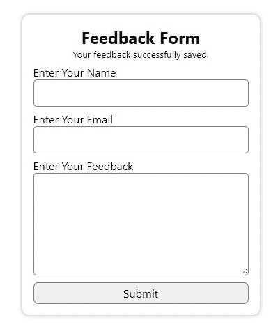
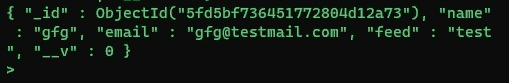

# 使用 Pugjs、Node.js、MongoDB、Express 的反馈表

> 原文:[https://www . geesforgeks . org/feedback-form-use-pugjs-node-js-MongoDB-express/](https://www.geeksforgeeks.org/feedback-form-using-pugjs-node-js-mongodb-express/)

我们可以使用 PugJs、NodeJS、MongoDB、Express 创建一个反馈表单，步骤如下。反馈表单接受用户的输入，并将数据发送到服务器进行处理，并相应地将其存储到数据库中。

**步骤 1:** 在任意目录下创建一个**反馈 _ 表单**命名文件夹。你可以取任何名字。

**步骤 2:** 使用以下命令初始化 NodeJS 项目。

```html
npm init  –y
```



**步骤 3:** 从终端/cmd 使用以下命令安装所需的模块。

```html
// Express middleware
npm install express  --save 

// Database setup
npm install mongoose  --save 

// pugjs for client site rendering
npm install pug  --save 

// OR you can install all command
// using single command
npm install express pug mongoose
```

**第 4 步:**目录结构如下。



目录结构

*   **node_modules:** 它包含了我们所有安装的节点模块。
*   **静态:**它包含你的服务器的静态文件。
*   **视图:**它包含要渲染到客户端的 PugJS 文件。
*   **app.js:** 包含运行这个应用的服务器代码。

**步骤 5:** 安装模块后，写下以下代码，以创建反馈表。

**文件名:app.js**

## java 描述语言

```html
// Require express to make easy
// routing on server side.
const express = require("express");

// Creating express object
const app = express();

// Require path module
const path = require('path');

// Require pug template engine
const pug = require("pug");

// Require mongoose to use mongoDb
// in a easier way
const mongoose = require("mongoose");

// Define a port number
const port = 3000;

// Make a static route to use your
// static files in client side
app.use('/static', express.static('static'));

// Middleware for parsing
app.use(express.urlencoded());

// Define and use pug engine so also
// declare path on rendering
app.set('view engine', 'pug');
app.set('views', path.join(__dirname, 'views'));

// Database Connection 
mongoose.connect(
    "mongodb://localhost:27017/feedback",
    { useUnifiedTopology: true }
);

// Create schema
const feedSchecma = mongoose.Schema({
    name: String,
    email: String,
    feed: String
});

// Making a modal on our already
// defined schema
const feedModal = mongoose
    .model('feeds', feedSchecma);

// Handling get request
app.get('/', function (req, res) {
    // Rendering your form
    res.render('feedback_form');
});

// Handling data after submission of form
app.post("/feedback_form", function (req, res) {
    const feedData = new feedModal({
        name: req.body.name,
        email: req.body.email,
        feed: req.body.feedback
    });
    feedData.save()
        .then(data => {
            res.render('feedback_form',
{ msg: "Your feedback successfully saved." });
        })
        .catch(err => {
            res.render('feedback_form', 
                { msg: "Check Details." });
        });
})

// Server setup
app.listen(port, () => {
    console.log("server is running");
});
```

**文件名:feedback_form.pug**

## 超文本标记语言

```html
<!DOCTYPE html>
html(lang="en")
    head
        meta(charset="UTF-8")
        meta(name="viewport", content=
            "width=device-width, initial-scale=1.0")

        title Feedback Form
        //- we are directly use static files because
        // already use static serve
        link(rel="stylesheet", href="/static/style.css")
    body
        .form
            h2 Feedback Form
            if(msg)
                small=msg
            //- feedback_form POST route
            form(action="/feedback_form",method="POST")
                label(for="name") Enter Your Name
                input#name(type="text", name="name")
                label(for="email") Enter Your Email
                input#email(type="email", name="email")
                label(for="feedback") Enter Your Feedback
                textarea#feedback(
                    name="feedback", 
                    cols="30", rows="5"
                )
                button(type="submit") Submit
```

**文件名:style.css**

## 半铸钢ˌ钢性铸铁(Cast Semi-Steel)

```html
* {
    margin: 0;
    padding:0;
    font-family: system-ui;
}

body {
    display: flex;
    justify-content: center;
    align-items: center;
    height: 100vh;
}

.form {
    display: flex;
    flex-direction: column;
    justify-content: center;
    align-items: center;
    background: white;
    padding: 1rem;
    box-shadow: 0px 0px 6px 0px #808080b3;
    border-radius: 10px;
}

.form form {
    display: flex;
    flex-direction: column;
    justify-content: center;
}

.form form input, .form form textarea {
    border: 1px solid gray;
    border-radius: 5px;
    padding: 5px 10px;
    font-size: 20px;
    outline: none;
}

.form form label {
    margin-top: 7px;
}

.form button {
    margin-top: 10px;
    padding: 4px 10px;
    font-size: 1rem;
    border: 1px solid gray;
    border-radius: 7px;
    outline: none;
    cursor: pointer;
}
```

**第 6 步:**使用以下命令运行 **app.js** 文件:

```html
node app.js
```

**设计预览:**


我们的外形设计

**填表:**



填好的表格

**提交后:**



成功提交的表单

**MongoDB 命令:**使用这些命令查看您的数据库记录:

```html
mongo // Start mongo shell
show dbs // See database cluster
use feedback // Use table name
show collections // See collections in cluster 
db.feeds.find() // See records with table name
```

**输出:**



数据记录