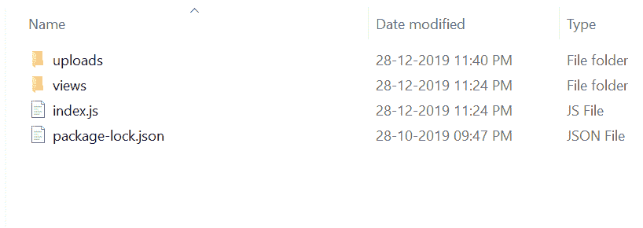
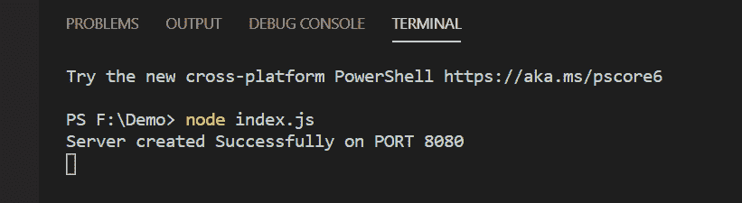
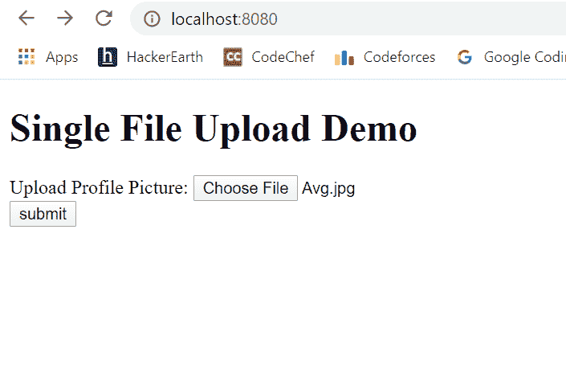
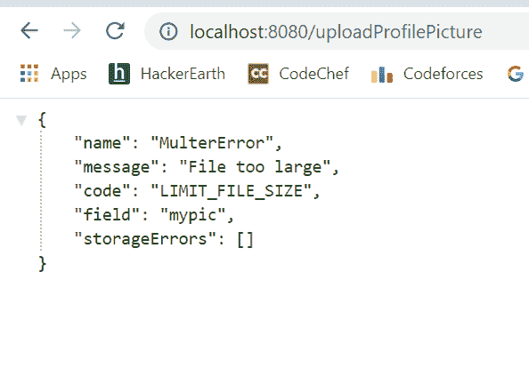
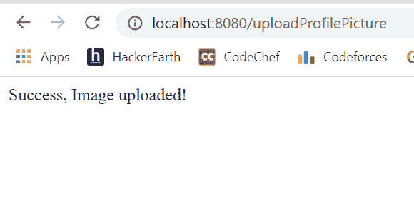
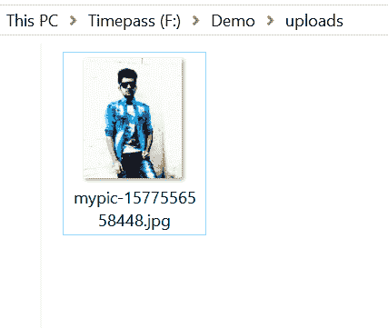

# node . js 中的文件上传

> 原文:[https://www.geeksforgeeks.org/file-uploading-in-node-js/](https://www.geeksforgeeks.org/file-uploading-in-node-js/)

**简介:**文件上传是指用户从客户端机器请求上传文件到服务器。比如用户可以在脸书、Instagram 等上传图片、视频等。

**Multer 模块的特点:**文件可以使用 Multer 模块上传到服务器。市场上还有其他模块，但是 multer 在文件上传方面非常受欢迎。Multer 是一个 node.js 中间件，用于处理多部分/表单数据，多用于上传文件的库。

**注意:** Multer 将只处理那些多部分的表单(多部分/表单数据)。所以无论何时你使用 multer，确保你把 multipart 放在表单中。

**简介:**

1.  上手简单，使用方便。
2.  它是广泛使用和流行的文件上传模块。
3.  用户可以一次上传一个或多个文件。

**多模块安装:**

1.  您可以访问链接[安装多模块](https://www.npmjs.com/package/multer)。您可以使用此命令安装此软件包。

    ```js
    npm install multer
    ```

2.  安装 multer 后，您可以使用命令在命令提示符下检查 multer 版本。

    ```js
    npm version multer
    ```

3.  之后，您可以创建一个文件夹并添加一个文件，例如 index.js。

    ```js
    node index.js
    ```

4.  **要求模块:**您需要使用这些行在您的文件中包含多个模块。

    ```js
    var multer = require('multer');
    ```

5.  So Multer basically adds a file object or files object and a body object to the request object. The file/files object contains all the files which are uploaded through the form and all the values of the text fields of the form are contained in the body object. This is how multer binds the data whenever a form is submitted.

    **文件名:签名，例如**

    ```js
    <!DOCTYPE html>
    <html>

    <head>
        <title>FILE UPLOAD DEMO</title>
    </head>

    <body>
        <h1>Single File Upload Demo</h1>

        <form action="/uploadProfilePicture" 
          enctype="multipart/form-data" method="POST">

            <span>Upload Profile Picture:</span>  
            <input type="file" name="mypic" required/> <br>
            <input type="submit" value="submit"> 
        </form>
    </body>

    </html>
    ```

    **文件名:index.js**

    ```js
    const express = require("express")
    const path = require("path")
    const multer = require("multer")
    const app = express()

    // View Engine Setup
    app.set("views",path.join(__dirname,"views"))
    app.set("view engine","ejs")

    // var upload = multer({ dest: "Upload_folder_name" })
    // If you do not want to use diskStorage then uncomment it

    var storage = multer.diskStorage({
        destination: function (req, file, cb) {

            // Uploads is the Upload_folder_name
            cb(null, "uploads")
        },
        filename: function (req, file, cb) {
          cb(null, file.fieldname + "-" + Date.now()+".jpg")
        }
      })

    // Define the maximum size for uploading
    // picture i.e. 1 MB. it is optional
    const maxSize = 1 * 1000 * 1000;

    var upload = multer({ 
        storage: storage,
        limits: { fileSize: maxSize },
        fileFilter: function (req, file, cb){

            // Set the filetypes, it is optional
            var filetypes = /jpeg|jpg|png/;
            var mimetype = filetypes.test(file.mimetype);

            var extname = filetypes.test(path.extname(
                        file.originalname).toLowerCase());

            if (mimetype && extname) {
                return cb(null, true);
            }

            cb("Error: File upload only supports the "
                    + "following filetypes - " + filetypes);
          } 

    // mypic is the name of file attribute
    }).single("mypic");       

    app.get("/",function(req,res){
        res.render("Signup");
    })

    app.post("/uploadProfilePicture",function (req, res, next) {

        // Error MiddleWare for multer file upload, so if any
        // error occurs, the image would not be uploaded!
        upload(req,res,function(err) {

            if(err) {

                // ERROR occured (here it can be occured due
                // to uploading image of size greater than
                // 1MB or uploading different file type)
                res.send(err)
            }
            else {

                // SUCCESS, image successfully uploaded
                res.send("Success, Image uploaded!")
            }
        })
    })

    // Take any port number of your choice which
    // is not taken by any other process
    app.listen(8080,function(error) {
        if(error) throw error
            console.log("Server created Successfully on PORT 8080")
    })
    ```

    **运行程序的步骤:**

    1.  项目结构会是这样的:
        
        这里的“上传”是我们的文件将要上传的文件夹，目前是空的。“Singup.ejs”保存在视图文件夹中。
    2.  确保你有“查看引擎”，就像我使用“ejs”一样，并使用以下命令安装 express 和 multer:

        ```js
        npm install ejs
        ```

        ```js
        npm install express
        ```

        ```js
        npm install multer
        ```

    3.  Run index.js file using below command:

        ```js
        node index.js
        ```

        

    4.  打开浏览器，输入该网址:

        ```js
        http://localhost:8080/
        ```

    5.  然后会看到如下所示的 Singup 表单:
        
    6.  然后选择一个要上传的文件，点击提交按钮。
        如果出现错误，则显示以下消息:
        
        如果没有出现错误，则显示以下消息:
        
    7.  如果文件上传成功，那么你可以进入上传文件夹，看到你上传的图片如下所示:
        

这就是如何使用 multer 模块在 Node.js 中上传文件。市场上还有其他的文件上传模块，如**文件上传、快递-文件上传**等。