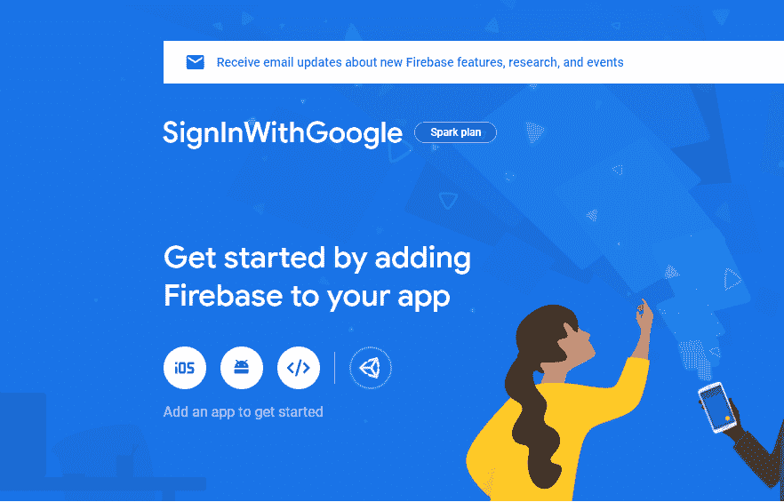
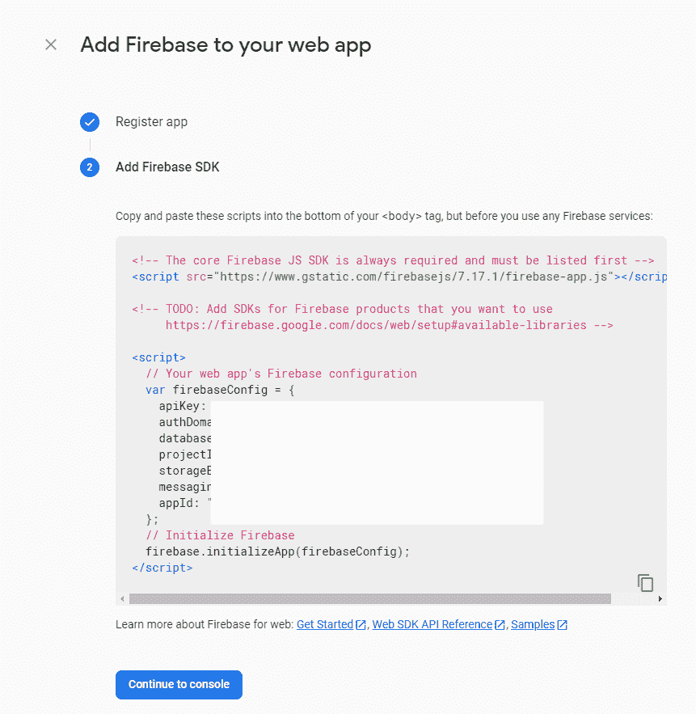
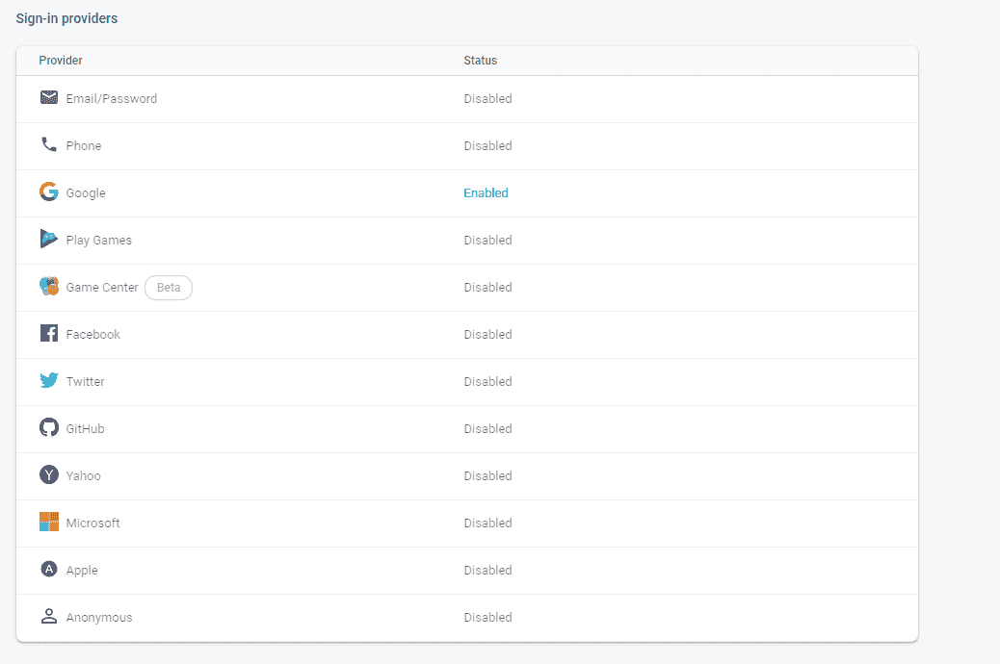

# Firebase(使用 Google 登录)使用 Firebase UI 和 Cookie 会话在 Node.js 中进行身份验证

> 原文:[https://www . geeksforgeeks . org/firebase-用 google 登录-节点中身份验证-js-使用-firebase-ui-和-cookie-sessions/](https://www.geeksforgeeks.org/firebase-sign-in-with-google-authentication-in-node-js-using-firebase-ui-and-cookie-sessions/)

Firebase 身份验证提供易于使用的 SDK 和现成的用户界面库后端服务，以向您的应用程序验证用户。

**先决条件:**节点、JavaScript、firebase 基础知识。

**设置:**首先我们需要创建一个火基地项目，前往[火基地控制台](https://console.firebase.google.com/)并创建一个新项目。

> *我打算用谷歌把它命名为 sign in*
> 
> 

点击网页创建一个网络应用程序。

> 

转到 Firebase 设置>服务帐户>生成新密钥。该密钥应保持为*私有*，建议将其保存在环境变量中。

现在进入认证选项卡，打开 ***使用谷歌登录。**T3】*

> 

现在创建一个新项目，其中 success.html(*<u>)带有一个简单的锚点标签，指向“/”根</u>* )和 login.html**【留下一个 id 为“firebasei-auth-container”的空白区域，firebaseui 将被初始化的地方】**

使用控制台中的以下命令，将控制台目录更改为项目类型的根目录

```js
$npm init
$npm install express firebase-admin cookie-parser https fs

```

**注意:**只有当你想在本地主机中保存 cookies 时，才需要最后两个包，但是，如果你将在 https 上运行后端，那么就没有必要了。

```js
const express = require("express");
const admin = require("firebase-admin");
const cookieParser = require("cookie-parser");
const https = require('https');
const fs = require('fs');

const app = express();
app.use(cookieParser());

var key="--BEGIN PRIVATE KEY--\nMIIEvgIBADANBgk"
    + "qhkiG9w0BAQE--your key here--+1d4\n--END"
    + " PRIVATE KEY-\n";

admin.initializeApp({
    credential: admin.credential.cert({
        "private_key": key.replace(/\\n/g, '\n'),
        "client_email": "YOUR CLIENT EMAIL HERE",
        "project_id": "YOUR PROJECT ID "
    })
});

app.get('/', (req, res) => {
   res.sendFile(__dirname +'/login.html');  
});

app.get('/logout', (req, res) => {
    res.clearCookie('__session');
    res.redirect('/');
});

app.get('/success', checkCookie, (req, res) => {
    res.sendFile(__dirname + '/success.html');
    console.log("UID of Signed in User is" 
            + req.decodedClaims.uid);
    // You will reach here only if session
    // is working Fine
});

app.get('savecookie', (req, res) => {
    const Idtoken=req.query.token;
    setCookie(Idtoken, res);
});

// Saving cookies and verify cookies
// Reference : 
//https://firebase.google.com/docs/auth/admin/manage-cookies

function savecookie(idtoken, res) {

    const expiresIn = 60 * 60 * 24 * 5 * 1000;
    admin.auth().createSessionCookie(idtoken, {expiresIn})
    .then((sessionCookie) => {
       const options = {maxAge: expiresIn, 
                httpOnly: true, secure: true};

       admin.auth().verifyIdToken(idtoken)
        .then(function(decodedClaims) {
           res.redirect('/success');
       });
    }, error => {
        res.status(401).send("UnAuthorised Request");
    });
}

function checkCookie(req, res, next) {

    const sessionCookie = req.cookies.__session || '';
    admin.auth().verifySessionCookie(
        sessionCookie, true).then((decodedClaims) => {
            req.decodedClaims = decodedClaims;
            next();
        })
        .catch(error => {

           // Session cookie is unavailable or invalid. 
           // Force user to login.
           res.redirect('/');
        });
}
```

这是 app.js 文件，仔细看会发现没有端口在监听我们的请求。这就是我们需要这两个节点模块的地方。

大多数浏览器不允许您将 cookies 保存在本地主机中，这就是为什么我们将为本地主机设置 HTTPS 连接。

> 确保您在项目的根目录中。
> 
> 打开 bash 并键入
> 
> $ OpenSSL req-nodes-new-x509-key out server . key-out server . cert
> 
> 将生成两个文件(server.key 和 server.cert)。

将以下代码添加到 app.js 文件-

```js
https.createServer({
    key: fs.readFileSync('server.key'),
    cert: fs.readFileSync('server.cert')
  }, app)
  .listen(3000, function () {
    console.log('listening on port 3000!'
      + ' Go to https://localhost:3000/')
  });
```

在登录页面的正文标记之前加载此脚本

```js

<!-- Firebase Package-->
<script src=
"https://www.gstatic.com/firebasejs/5.8.5/firebase.js">
</script>

<!-- Loads the login UI elements-->
<script src=
"https://cdn.firebase.com/libs/firebaseui/3.5.2/firebaseui.js">
</script>
<link type="text/css" rel="stylesheet" href=
"https://cdn.firebase.com/libs/firebaseui/3.5.2/firebaseui.css" />
```

在登录页面的 body 标签后加载这个脚本(填充从 firebase 控制台获得的配置数据)。

```js
var config = {
    apiKey: "YOUR_KEY",
    authDomain: "YOUR_DOMAIN",
    databaseURL: "YOURURL",
    projectId: "--",
    storageBucket: "",
    messagingSenderId: "",
    appId: ""
};

firebase.initializeApp(config);
firebase.auth().setPersistence(
    firebase.auth.Auth.Persistence.NONE);

// FirebaseUI config.
var uiConfig = {
    signInOptions: [
        // Google sign in option
        firebase.auth.GoogleAuthProvider.PROVIDER_ID,
    ],

    // Terms of service url/callback.
    tosUrl: '<your-tos-url>',

    // Privacy policy url/callback.
    privacyPolicyUrl: function () {
        window.location.assign(
                '<your-privacy-policy-url>');
    },

    callbacks: {
        signInSuccess: function (user, 
            credential, redirectUrl) {

                // User successfully signed in.
                user.getIdToken().then(function (idToken) {
                    window.location.href = 
                        '/savecookie?idToken=' + idToken;
                }).catch(error => {
                    console.log(error);
                });
            }
    }
};

// Initialize the FirebaseUI Widget using Firebase.
var ui = new firebaseui.auth.AuthUI(firebase.auth());

// The start method will wait until the DOM is loaded.
ui.start('#firebaseui-auth-container', uiConfig);
```

现在点击保存并运行命令$node app.js

现在转到 https://localhost:3000/并登录，然后关闭选项卡或浏览器并键入 https://localhost:3000/success，您将看到您不会再次被重定向到登录页面，而是被带到成功页面。

> 注意:这里它没有要求我选择使用哪个帐户登录应用程序，因为我只使用一个帐户登录，如果您使用多个帐户登录，它会要求您选择一个帐户继续。
> 
> <video class="wp-video-shortcode" id="video-469458-1" width="640" height="360" preload="metadata" controls=""><source type="video/mp4" src="https://media.geeksforgeeks.org/wp-content/uploads/20200813165115/finalResult.mp4?_=1">[https://media.geeksforgeeks.org/wp-content/uploads/20200813165115/finalResult.mp4](https://media.geeksforgeeks.org/wp-content/uploads/20200813165115/finalResult.mp4)</video>

下载我已完成的[项目](https://drive.google.com/drive/folders/1VoqNM_JKMh-PpfbCXWifMxYWssIXt7t_?usp=sharing)如果你遇到任何错误或写在评论里

**参考:**T2】https://firebase.google.com/docs/auth/admin/manage-cookies