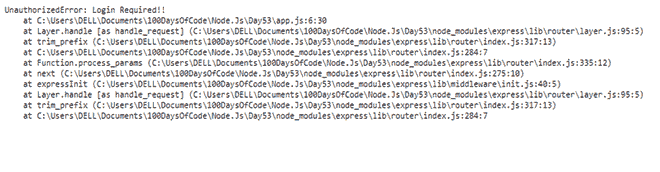

# 使用 Node.js

中的 HTTP-errors 模块生成错误

> 原文:[https://www . geesforgeks . org/generating-errors-use-http-errors-module-in-node-js/](https://www.geeksforgeeks.org/generating-errors-using-http-errors-module-in-node-js/)

**HTTP-errors** 模块用于为 Node.js 应用程序生成错误。它非常容易使用。我们可以和快递、Koa 等一起使用。应用程序。我们将在一个快速应用程序中实现这个模块。

**安装设置:**首先用 **package.json** 文件初始化应用，命令如下:

```
npm init
```

然后，通过以下命令安装模块:

```
npm install http-errors --save
```

另外，我们正在使用一个快速应用程序，因此，通过以下命令安装**快速**模块:

```
npm install express --save
```

现在，创建一个文件并命名它 **app.js.** 你可以给你的文件命名任何你想要的。

要在应用程序中导入模块，请在 app.js 文件中编写以下代码:

## java 描述语言

```
const createError = require('http-errors');
const express = require('express');
const app = express();
```

**实现:**这里，来了我们应用的主要部分。要使用该模块，请在 app.js 文件中编写以下代码:

## java 描述语言

```
var createError = require('http-errors');
var express = require('express');
var app = express();

app.use((req, res, next) => {
  if (!req.user) return next(
    createError(401, 'Login Required!!'));
  next();
});

app.listen(8080, (err) => {
    if (err) console.log(err);
    console.log(
`Server Running at http://localhost:8080`);
});
```

这里，我们导入 **http-errors** 模块，并将其存储在名为 **createError 的变量中。**接下来，在 **app.use()，**如果用户没有通过身份验证，那么我们的应用程序将创建一个 **401 错误**称**需要登录！！。**创建错误**用于在应用程序中生成错误。**

要运行代码，请在终端中运行以下命令:

```
node app.js
```

并导航至 [http://localhost:8080。](http://localhost:8080)上述代码的输出将是:



**列出所有状态代码及其错误信息:**

```
Status
Code    Error Message

400    BadRequest
401    Unauthorized
402    PaymentRequired
403    Forbidden
404    NotFound
405    MethodNotAllowed
406    NotAcceptable
407    ProxyAuthenticationRequired
408    RequestTimeout
409    Conflict
410    Gone
411    LengthRequired
412    PreconditionFailed
413    PayloadTooLarge
414    URITooLong
415    UnsupportedMediaType
416    RangeNotSatisfiable
417    ExpectationFailed
418    ImATeapot
421    MisdirectedRequest
422    UnprocessableEntity
423    Locked
424    FailedDependency
425    UnorderedCollection
426    UpgradeRequired
428    PreconditionRequired
429    TooManyRequests
431    RequestHeaderFieldsTooLarge
451    UnavailableForLegalReasons
500    InternalServerError
501    NotImplemented
502    BadGateway
503    ServiceUnavailable
504    GatewayTimeout
505    HTTPVersionNotSupported
506    VariantAlsoNegotiates
507    InsufficientStorage
508    LoopDetected
509    BandwidthLimitExceeded
510    NotExtended
511    NetworkAuthenticationRequired
```

**结论:****http-errors**模块对于开发人员快速生成带有消息的错误非常有用。在本文中，我们了解了 Node.js 的 **http-errors** 模块，也看到了它的安装和实现。