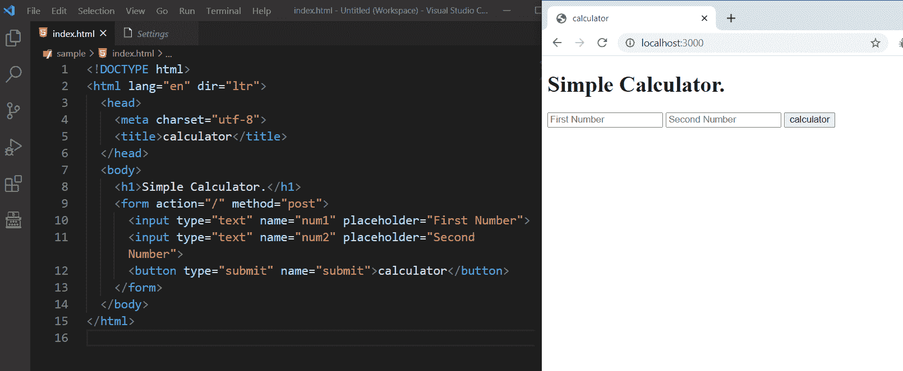
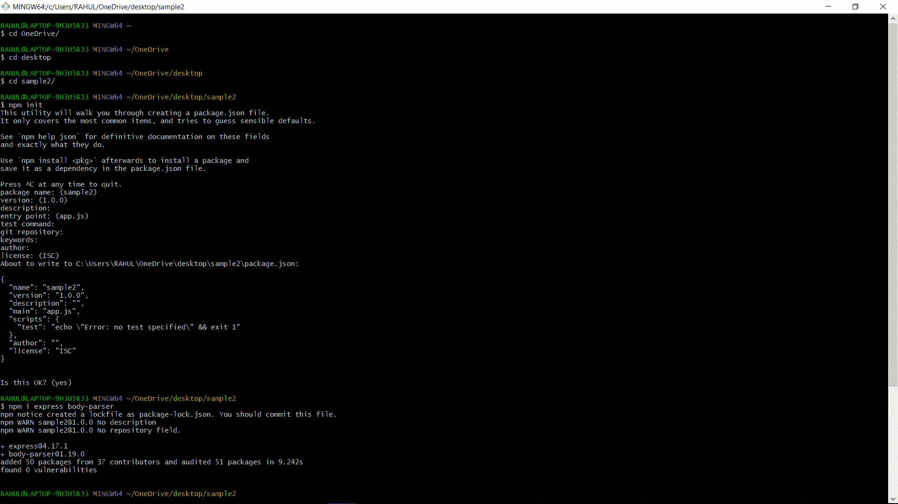

# 【HTTP POST 请求在 Node.js 中是如何工作的？

> 原文:[https://www . geesforgeks . org/how-http-post-request-work-in-node-js/](https://www.geeksforgeeks.org/how-http-post-request-work-in-node-js/)

POST 是万维网使用的 HTTP 支持的一种请求方法。HTTP POST 方法向服务器发送数据。请求正文的类型由内容类型头指示。我们使用 Express.js 来创建一个服务器并发出请求(GET、POST 等)。

```js
npm i express
```

**注意:**上面命令中的 **npm** 代表节点包管理器，我们从这里安装所有的依赖项。

所以为了使用 Express 来处理我们服务器上的 POST 请求，我们使用 app.post 方法，然后我们指定路由，我们有一个回调。

```js
app.post(route, function(req, res){
    //this is a callback function
})
```

**注意:**如果要在 NodeJS 中频繁发出 GET、POST 请求，那么就使用[邮递员](https://www.postman.com/)，简化构建 API 的每一步。

在这个语法中，路径是你必须发布从 HTML 中获取的数据的地方。获取数据可以使用 *bodyparser* 包。

**Web 服务器:**在根文件夹中创建 app.js。如下例所示创建您的服务器。

## java 描述语言

```js
const express = require("express");
const app = express();

// Define routes here ...

app.listen(3000, function(){
  console.log("server is running on port 3000");
})
```

**处理 Post 请求:**这里将学习如何处理 HTTP POST 请求，并从提交的表单中获取数据。

在应用程序的根文件夹中创建 index.html，并在其中编写以下 HTML 代码。

**文件名:index.html**

## 超文本标记语言

```js
<!DOCTYPE html>
<html lang="en" dir="ltr">

<head>
    <meta charset="utf-8">
    <title>Calculator</title>
</head>

<body>
    <h1>Simple Calculator.</h1>
    <form action="/" method="post">
        <input type="text" name="num1" 
            placeholder="First Number">
        <input type="text" name="num2" 
            placeholder="Second Number">

        <button type="submit" name="submit">
            calculator
        </button>
    </form>
</body>

</html>
```

**输出:**



**处理快递中的 POST 路线:**
**文件名:app.js**

## java 描述语言

```js
const express = require("express");
const bodyParser = require("body-parser")

// New app using express module
const app = express();
app.use(bodyParser.urlencoded({
    extended:true
}));

app.get("/", function(req, res) {
  res.sendFile(__dirname + "/index.html");
});

app.post("/", function(req, res) {
  var num1 = Number(req.body.num1);
  var num2 = Number(req.body.num2);

  var result = num1 + num2 ;

  res.send("Addition - " + result);
});

app.listen(3000, function(){
  console.log("server is running on port 3000");
})
```

**运行步骤:**

*   **npm init**
*   **npm 快速安装**
*   **npm 安装正文解析器**
*   **节点 app.js**
*   **在浏览器中转到 http://localhost:3000。**



**输出:**

