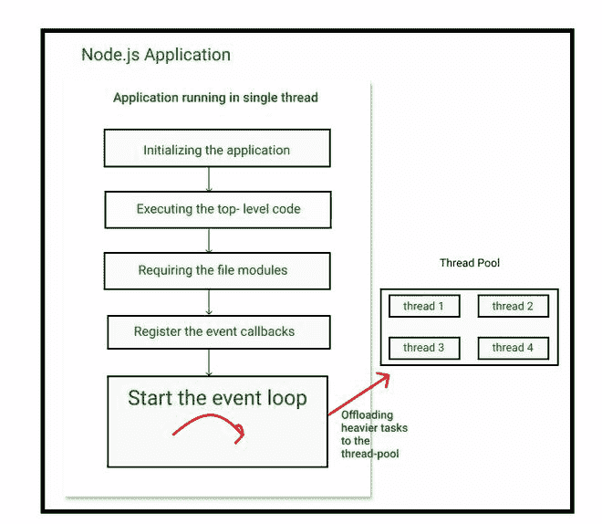
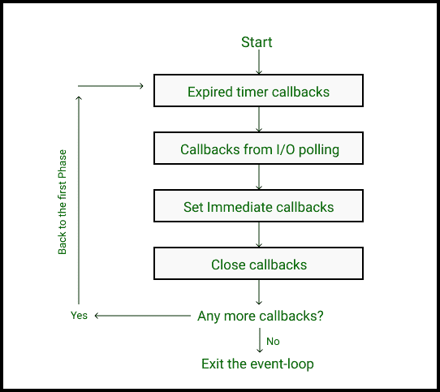

# node . js 在场景背后是如何工作的？

> 原文:[https://www . geesforgeks . org/how-node-js-work-幕后/](https://www.geeksforgeeks.org/how-node-js-works-behind-the-scene/)

Node.js 是基于谷歌 V8 Engine 的 JavaScript 运行时环境，即在 Node.js 的帮助下，我们可以在浏览器之外运行 JavaScript。关于 Node.js 你可能读过也可能没读过的其他东西是它**是单线程的，基于事件驱动的架构，基于 I/O 模型的非阻塞。**

**1) Node.js 架构:** Node.js 由用 C++编写的 **Chrome V8 引擎**和为基于事件循环和线程循环的异步 I/O 事件提供支持的多平台 C 库 **Libuv** 组成。不要担心，这将在后面最后解释。我们需要记住的一件重要的事情是，即使 Node.js 是使用用 C 或 C++编写的 V8 引擎和 Libuv 制作的，我们仍然可以在纯 JavaScript 中使用 Node.js。

**2) Node.js 应用程序:**既然我们已经了解了 Node.js 架构，那么是时候了解 Node.js 应用程序是如何运行的了，这一部分包括了 Node.js 单线程的概念以及它的非阻塞特性。那么，首先，什么是线程？简单来说，线程基本上是一组可以在计算机处理器中独立运行的编程指令，我们想要运行的每个进程都有自己的线程来运行编程指令，并且该进程可以有多个线程。但是，要记住的一点是， **Node.js 应用程序只在一个线程**上运行，这意味着无论 Node.js 应用程序被 5 个用户还是 500 万用户使用，它都只在一个线程**上运行，这使得 Node.js 应用程序可以被阻止(这意味着一行代码可以阻止整个应用程序，因为只有一个线程在使用)。**因此，为了保持 Node.js 应用程序的运行，**异步代码必须在任何有回调函数的地方使用**因为我们知道异步代码在后台继续运行，一旦承诺得到解决，回调就会被执行，而不是同步代码阻塞整个应用程序，直到它完成执行。但是，我们仍然可以在应用程序的某个地方使用同步代码，这个地方是在我们的应用程序进入**事件循环**之前。事件循环允许 Node.js 应用程序运行基于非阻塞异步 I/O 的操作，即所有异步代码都在事件循环内管理和执行，在此之前，我们可以使用我们的同步代码，在这种情况下称为**顶级代码**。因此，试着只为那些在我们的应用程序开始时只执行一次而不是每次的操作编写同步代码，例如:从您的计算机内存中读取一些数据，这些数据以后可以由某些用户以异步代码的形式请求(多次)。

下图是**图表可视化** :

因此，正如您所看到的，每当 Node.js 应用程序在一个线程中启动时，第一步是初始化应用程序并执行**顶层代码**，正如我们前面所说，这是我们应用程序中唯一应该有的同步代码。下一步是需要我们在代码中指定的模块(通常写在最上面)。

下一步是**注册我们代码中的所有事件回调**，然后这些事件回调将被发送到事件循环中执行，节点应用程序中的大部分代码都在这里执行。但是有些时候，有些任务太重，无法在我们的事件循环中由单个线程执行，所以这些任务被发送到线程池(由 Libuv 提供)是 4 个额外的线程，可以在不阻塞主线程的情况下执行更重的任务。线程的数量可以增加，用户不必指定必须卸载的任务，因为事件循环自己完成所有任务，但是我们可以指定线程的数量。

**3)事件循环:**所以，你需要记住这一点，事件循环是我们所有异步代码被执行的地方。有一会儿，你为什么不在第一段再读一遍，因为我们将讨论 Node.js 的第三点，它基于**事件驱动架构。**事件循环背后的整个思想是它在如下所示的这个架构或这三个步骤上工作:

1.  事件被发出，这些事件可以从任何异步函数发出，比如获取一个 HTTP 请求，文件系统模块完成读取文件，或者定时器已经完成。这些事件可能因我们的代码而异。
2.  之后，事件循环会将它们捡起来。
3.  回调函数被执行(基于你的代码)。

除此之外，事件循环将较重的任务卸载到线程池。

**注意:**事件循环确实遵循一个序列来运行回调。

通常，事件循环有 4 个阶段，对于每个阶段，它设置一个回调队列，该队列包含来自发出事件的回调函数。

1.  第一个阶段是**过期超时回调**，这是 setTimeout()函数等的回调函数。
2.  第二阶段是来自**输入/输出轮询**的回调，就像读取文件或任何 HTTP 请求的事件。
3.  第三个阶段是来自 **setImmediate()** 函数的回调，它们是用户在 I/O 轮询之后想要执行的回调函数。这些类型的函数可能只在某些特定情况下是特定的。
4.  最后一个是**关闭回调**，回调是从关闭网络服务器等事件中发出的。

**注意:** **首先执行某个阶段所有可用的回调，然后进入下一个阶段。**同样，在事件循环结束时，它检查是否还有任何其他事件正在进行，如果是，则返回到第一阶段，以此类推，否则程序退出事件循环。