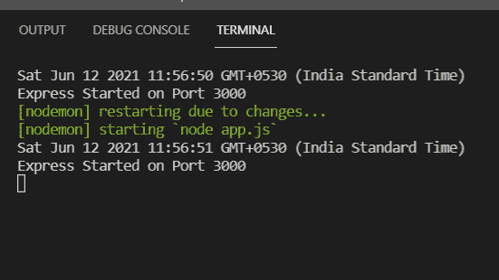
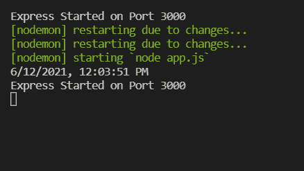
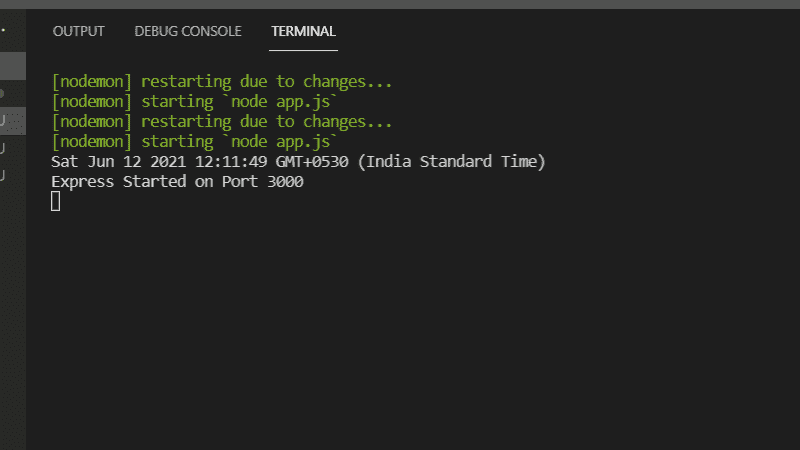

# 如何在 Node.js 中为 Windows 设置默认时区？

> 原文:[https://www . geesforgeks . org/how-set-default-time zone-in-node-js-for-windows/](https://www.geeksforgeeks.org/how-set-default-timezone-in-node-js-for-windows/)

**NodeJS** 由于其单线程特性，主要用于非阻塞、事件驱动的服务器。它用于传统网站和后端应用编程接口服务，但设计时考虑了实时、基于推送的架构。

在本文中，我们将看到如何在 Node.js 中为窗口设置默认时区。可以从[这里](https://www.geeksforgeeks.org/installation-of-node-js-on-windows/)学习如何安装 Nodejs。

**安装模块:**使用以下命令安装快速模块。

```
npm install express
```

**项目结构:**我们的项目结构会是这样的。


有很多方法我们可以尝试在 Nodejs 中为 Windows 设置默认时区。

**1。使用下面的 process.env.tz 示例在代码中设置–**

```
process.env.TZ = "Asia/Calcutta";
console.log(new Date().toString());
```

**2。使用 newDate 设置变量。**

```
const nDate = new Date().toLocaleString('en-US', {
timeZone: 'Asia/Calcutta'
});
```

**3。我们可以在代码中用库 tzdata 配置全局时区:**

```
npm install tzdata -yN
```

现在在 app.js 中设置 TZ 的值。

```
TZ = 'Asia/Calcutta'
console.log(new Date().toString());
```

**例 1:**

## app.js

```
var express = require('express'),
app = express();

// Method 1
const nDate = new Date().toLocaleString('en-US', {
  timeZone: 'Asia/Calcutta'
});

console.log(nDate);

app.listen(3000,function(){
    console.log("Express Started on Port 3000");
});
```

使用以下命令运行 **app.js** 文件:

```
node app.js
```

**输出:**



**例 2:**

## app.js

```
var express = require('express'),
app = express();

// Method 2
process.env.TZ = "Asia/Calcutta";
console.log(new Date().toString());

app.listen(3000,function(){
    console.log("Express Started on Port 3000");
});
```

使用以下命令运行 **app.js** 文件:

```
node app.js
```

**输出:**



**例 3:**

## app.js

```
var express = require('express'),

app = express();

// Methpd 3
TZ = 'Asia/Calcutta'
console.log(new Date().toString());

app.listen(3000,function(){
    console.log("Express Started on Port 3000");
});
```

使用以下命令运行 **app.js** 文件:

```
node app.js
```

**输出:**

