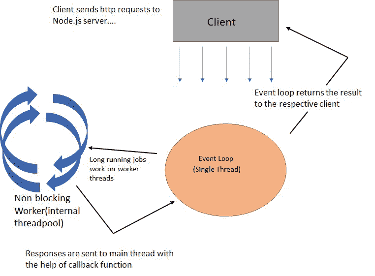

# 单线程非阻塞 IO 模型在 NodeJS 中是如何工作的？

> 原文:[https://www . geesforgeks . org/如何-单线程-非阻塞-io-model-work-in-nodejs/](https://www.geeksforgeeks.org/how-the-single-threaded-non-blocking-io-model-works-in-nodejs/)

**Node.js** 是一个运行在 Chrome V8 引擎上的 JavaScript 运行时环境，用于服务器端脚本编写。它接受用户的请求，处理这些请求，并将响应返回给相应的用户。

**一些重要的 Node.js 特性有:**

*   **它基于单线程架构:**由于 node.js 从多个用户获得多个请求，所以它一次执行一个命令。因此，它可以非常有效地处理并发客户端请求，并具有良好的性能。
*   **它使用事件驱动的基于非阻塞的 IO 模型:**每当节点服务器启动时，它都会启动某些变量和函数，然后等待事件发生，每当检测到事件时，就会为该特定事件分配一个回调函数。事件驱动的架构使服务器具有高度的可伸缩性，它不等待应用编程接口返回数据，而是立即移动到下一个应用编程接口，等待下一个请求。非阻塞操作意味着服务器不会为一个请求阻塞自己。非阻塞调用只启动操作，稍后提供响应，同时可以继续处理其他客户端请求。

**示例:**如果我们从两个用户 A 和 B 获得请求。使用非阻塞 IO，我们可以为 A 发起请求，然后立即为 B 发起请求，而无需等待对 A 请求的响应。因此，我们可以说，借助非阻塞 IO，我们可以消除多线程的使用，因为节点服务器可以同时处理多个请求。

**单线程无阻塞 IO 工作:**

*   当客户端向服务器发送请求时，该请求被称为事件。所有这些请求都存储在一个事件队列中。事件循环中的单个线程将此请求分配给内部线程池中的一个线程。
*   该线程读取客户端请求，处理请求，如果需要，执行任何阻塞 IO 操作，并准备最终响应发送回服务器。事件循环将此响应发送回相应的客户端。
*   事件循环无限地接收请求并处理它们。
*   由于事件循环，不需要多线程。由于这个事件循环和单线程的概念，node.js 使用较少的资源和内存。

**参考:**T2】https://www.geeksforgeeks.org/introduction-to-nodejs/