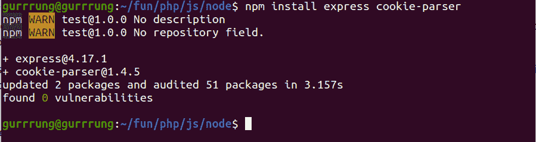
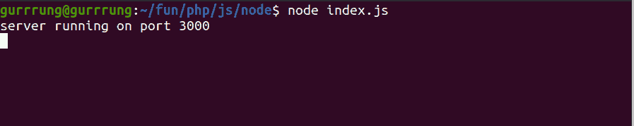
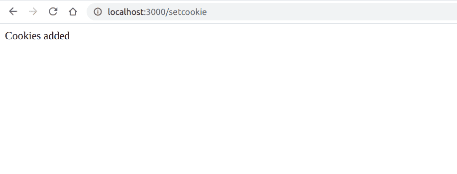
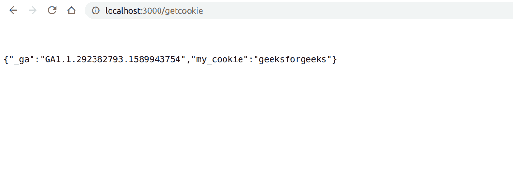

# 如何在 Node.js 中访问 HTTP Cookie？

> 原文:[https://www . geesforgeks . org/如何访问-http-cookie-in-node-js/](https://www.geeksforgeeks.org/how-to-access-http-cookie-in-node-js/)

Cookies 是存储在客户端的小数据，与服务器请求一起发送给客户端。借助[cookie 解析器](https://github.com/expressjs/cookie-parser)模块，我们既可以设置 cookie，也可以获取 cookie。

创建一个项目文件夹，并从项目的根目录运行以下命令:

```
npm init -y
```


该命令将询问模块的名称。一直按回车，直到选项结束。这将创建一个空的 npm 模块，其中包含一个 ***包*** 文件。我们现在将使用以下命令安装所有必需的依赖项:

```
npm install express cookie-parser
```



我们正在使用 *express* 创建一个服务器， *cookie 解析器*是帮助我们轻松处理 cookie 的库。让我们创建一个名为 *index.js* 的文件，并编写代码来创建一个服务器，该服务器有两条路由来设置和获取 cookies，如下面的代码所示:

**文件名:index.js**

## java 描述语言

```
// Requiring modules
var express = require('express');
var cookieParser = require('cookie-parser');
var app = express();

// cookieParser middleware
app.use(cookieParser());

// Route for setting the cookies
app.get('/setcookie', function (req, res) {

  // Setting a cookie with key 'my_cookie' 
  // and value 'geeksforgeeks'
  res.cookie('my_cookie', 'geeksforgeeks');
  res.send('Cookies added');
})

// Route for getting all the cookies
app.get('/getcookie', function (req, res) {
    res.send(req.cookies);
})

// Server listens to port 3000 
app.listen(3000, (err) => {
    if (err) throw err;
    console.log('server running on port 3000');
});
```

这里我们有一个路线 ***/setcookie*** ，用来设置一个带有密钥 *my_cookie* 的 cookie，值为 *geeksforgeeks* 。我们可以根据需要将这些键和值更改为任何值。另一条路线是 ***/getcookie*** ，用于获取所有 cookie 并在网页上显示。在代码的最后，我们正在监听 3000 端口，以便我们的服务器能够运行。

使用以下命令运行 **index.js 文件**:

```
node index.js
```



这将运行服务器，如上图所示。我们可以通过访问***localhost:3000/setcookie 来查看 cookie。**T3】*



这将在添加 cookies 时显示一条消息。我们可以通过访问***localhost:3000/getcookie 来查看 cookie。**T3】*



现在我们可以看到我们的 cookie 被添加到如上所示的 cookie 对象中。