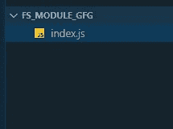
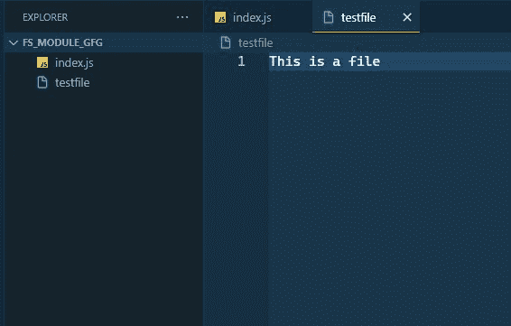
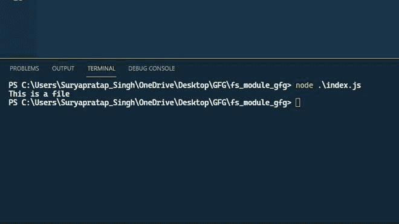

# 如何访问 Node.js 中的文件系统？

> 原文:[https://www . geesforgeks . org/如何访问节点中的文件系统-js/](https://www.geeksforgeeks.org/how-to-access-the-file-system-in-node-js/)

在本文中，我们研究了如何在 NodeJS 中访问文件系统，以及如何对文件执行一些有用的操作。

**先决条件:**

*   [ES6](https://www.geeksforgeeks.org/introduction-to-es6/) 基础知识
*   [节点基本知识](https://www.geeksforgeeks.org/introduction-to-nodejs/)

NodeJS 是运行在 JavaScript V8 引擎上的最流行的服务器端编程框架之一，它使用单线程无阻塞 I/O 模型。我们可以使用一些内置模块来访问 NodeJS 中的文件系统。

**文件系统:**文件是存储在辅助存储器中的相关信息的集合，或者文件是处理文件并管理它的类似类型的实体的集合，也称为文件系统。

如果你想了解更多关于文件系统的信息，请参考[这篇文章](https://www.geeksforgeeks.org/node-js-file-system/)。

**文件系统模块(fs 模块):**在 NodeJS 中使用文件系统的流行内置模块之一是文件系统模块，简称“fs”模块。fs 模块非常强大，可以在 NodeJS 中执行任何与文件系统相关的任务。

访问节点 JS 中的文件系统意味着对文件执行一些基本操作。这也称为 CRUD 操作。

**积垢操作:**

*   C = >创建文件
*   R = >读取文件
*   U = >更新文件
*   D = >删除文件

**使用“fs”模块对文件进行基本操作:**

**步骤 1:** 用“”创建文件。js "扩展。



**步骤 2:** 将“fs”模块添加到代码库中。

**语法:**

```
const fs = require('fs');
```

在需要 fs 模块后，您可以对文件执行以下操作:

**操作 1:** 创建文件

**语法:**

```
const fs = require('fs');
fs.writeFileSync('./{file_name}', 'Content_For_Writing');
```

**fs.writeFileSync** 方法用于向文件中写入内容，但是如果文件不存在，它会在写入内容的同时创建新文件。



**操作 2:** 读取文件

**语法:**

```
const fs = require('fs');
const file_content = fs.readFileSync('./{file_name}', 
    '{content_formate}').toString();

// For show the data on console
console.log(file_content);
```

fs.readFileSync 方法用于从文件中读取数据，readFileSync 的第一个参数是文件的路径，第二个参数采用选项{format，flag 等}并返回流的 buffer 对象。因此，我们可以使用 toString()方法将缓冲区字符串分配给一个名为 file_content 的变量，在将数据分配给 file_content 后，数据将使用 console.log()方法显示在控制台上。



**操作 3:** 更新文件

**语法:**

```
const fs = require('fs');
fs.appendFileSync('./{file_name}', " {Updated_Data}");

const file_content = fs.readFileSync(
    './{file_name}', '{file_formate}').toString();

console.log(file_content);
```

fs.appendFileSync 方法用于更新文件的数据。


**操作 4:** 删除文件

```
const fs = require('fs');
fs.unlinkSync('./{file_name}');
```

fs.unlinkSync()方法用于通过传递文件名来删除文件。


下面是上述操作的代码实现:

**示例:**
**文件名为 index.js**

## java 描述语言

```
const fs = require('fs');

/* The fs.writeFileSync method is used
to write something to the file, but if
the file does not exist, it creates new
files along with writing the contents */
fs.writeFileSync('./testfile', 'This is a file');
var file_content = fs.readFileSync(
        './testfile', 'utf8').toString();

console.log(file_content);

/* The fs.appendFileSync method is used
for updating the data of a file */
fs.appendFileSync('./testfile', " Updated Data");
file_content = fs.readFileSync(
    './testfile', 'utf8').toString();
console.log(file_content);

/* The fs.unlinkSync method are used to delete
the file. With passing the file name */
fs.unlinkSync('./testfile');
```

通过使用以下命令，使用 node.js 测试代码并运行它:

```
node index.js
```

最后，我们看到了如何访问文件系统，并尝试了许多操作。