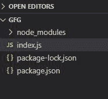
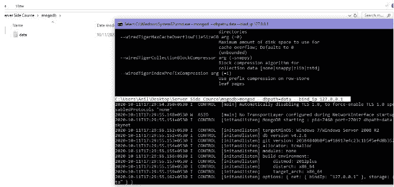
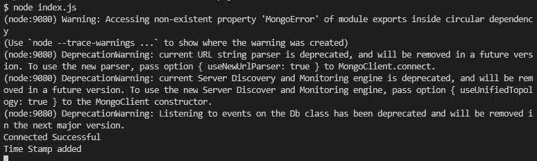

# 如何使用 Node.js 在 Mongodb Collection 中添加时间戳？

> 原文:[https://www . geesforgeks . org/how-add-timestamp-in-MongoDB-collection-use-node-js/](https://www.geeksforgeeks.org/how-to-add-timestamp-in-mongodb-collection-using-node-js/)

**时间戳:**借助时间戳文档在 MongoDB 的集合中可以根据时间进行区分。我们可以使用以下方法在 Node.js 的 Mongodb 集合中添加时间戳:

**安装模块:**使用以下命令安装猫鼬模块:

```
npm install mongoose
```

**项目结构:**我们的项目结构会是这样的。



**在本地 IP 上运行服务器:**数据是 MongoDB 服务器所在的目录。

```
mongod --dbpath=data --bind_ip 127.0.0.1
```



**例:**插入超出限值。

**文件名:**

## index.js

```
// Importing mongoose module
const mongoose = require("mongoose");

// Database Address
const url = "mongodb://localhost:27017/GFG";

// Connecting to database
mongoose
  .connect(url)
  .then((ans) => {
    console.log("Connected Successful");
  })
  .catch((err) => {
    console.log("Error in the Connection");
  });

// Calling Schema class
const Schema = mongoose.Schema;

// Creating Structure of the collection
const collection_structure = new Schema({
  name: {
    type: String,
    required: true,
  },
  marks: {
    type: Number,
    min: 10,
    max: 100,
  },
});

// Creating collection
const collections = mongoose.model("GFG2", collection_structure);

// Inserting one document
collections
  .create({

    // Inserting value of only one key
    name: "GFG",
    marks: 1001,
  })
  .then((ans) => {
    console.log(ans);
  })
  .catch((err) => {
    console.log(err.message);
  });
```

使用以下命令运行 **index.js** 文件:

```
node index.js
```

**输出:**

