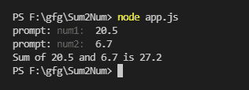

# 如何使用 Node.js 在控制台中添加两个数字？

> 原文:[https://www . geeksforgeeks . org/如何在使用节点的控制台中添加两个数字-js/](https://www.geeksforgeeks.org/how-to-add-two-numbers-in-console-using-node-js/)

在本文中，我们将看到如何使用 NodeJS 在控制台中添加两个数字。为此，我们需要了解一个名为**提示的节点包。**它有助于从控制台获取用户输入。我们将使用它的方法 **prompt.get()** 来获取用户输入。

**创建节点应用程序:**使用以下命令初始化节点应用程序:

```js
npm init
```

**模块安装:**使用以下命令安装*提示*模块。

```js
npm install prompt
```

**实现:**创建一个 *app.js* 文件，并在其中写下以下代码。

## app.js

```js
// Require would make the prompt
// package available to use
const prompt = require("prompt");

// An utility function to add
// two numbers
function add() {
  // Start the prompt
  prompt.start();

  // Get two numbers/properties
  // from user num1 and num2
  prompt.get(["num1", "num2"], 
  function (err, res) {
    // To handle any error if occurred
    if (err) {
      console.log(err);
    } else {
      // By default get methods takes
      // input in string So parseFloat
      // is used to convert String
      // into Float
      var sum = parseFloat(res.num1) 
        + parseFloat(res.num2);

      // Print the sum
      console.log("Sum of " + res.num1 
        + " and " + res.num2 + " is " + sum);
    }
  });
}

// Calling add function
add();
```

**运行应用程序的步骤:**使用以下命令运行 *app.js* 文件。

```js
node app.js
```

**输出:**现在进入用户输入，在控制台查看输出。



输出

这就是如何在控制台中使用 nodeJs 添加两个数字。提示帮助我们接受用户的输入。它还支持输入的验证和默认值。