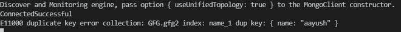

# 如何使用 Node.js 在 MongoDB 的集合中添加唯一约束？

> 原文:[https://www . geesforgeks . org/how-add-unique-constraint-in-collection-of-MongoDB-using-node-js/](https://www.geeksforgeeks.org/how-to-add-unique-constraint-in-collection-of-mongodb-using-node-js/)

Mongoose 模块是 node.js . mongose 最强大的外部模块之一，是一个 MongoDB ODM(即 Object database Modelling)，用于将代码及其表示从 MongoDB 翻译到 node . js 服务器。Mongoose 模块提供了几个功能来操作 MongoDB 数据库集合中的文档。

**唯一约束:**我们可以在 MongoDB 中为文档集合的值添加一个唯一的约束，这样就可以轻松区分所有的文档。在 Node.js 中创建集合结构的过程中添加了一个唯一的约束

**安装模块:**

```
npm install mongoose
```

**项目结构:**


**在本地 IP 上运行服务器:**数据是 MongoDB 服务器所在的目录。

```
mongod --dbpath=data --bind_ip 127.0.0.1
```


**文件名- index.js:**

## java 描述语言

```
// Importing mongoose module
const mongoose = require("mongoose");

// Database Address
const url = "mongodb://localhost:27017/GFG";

// Connecting to database
mongoose
  .connect(url)
  .then((ans) => {
    console.log("ConnectedSuccessful");
  })
  .catch((err) => {
    console.log("Error in the Connection");
  });

// Calling Schema class
const Schema = mongoose.Schema;

// Creating Structure of the collection
const collection_structure = new Schema({
  name: {
    type: String,
    require: true,
  },
  marks: {
    type: Number,
    default: 0,
  },
});

// Creating collection
const collections = 
    mongoose.model("GFG2", collection_structure);

// Inserting one document
collections
  .create({
    name: "aayush",
  })
  .then((ans) => {
    console.log("Document inserted");

    // Inserting invalid document
    collections
      .create({
        name: "saini",
        marks: "#234",
        phone: 981,
      })
      .then((ans) => {
        console.log(ans);
      })
      .catch((err) => {

        // Printing the documents
        collections.find().then((ans) => {
          console.log(ans);
        });

        // Printing the Error Message
        console.log(err.message);
      });
  })
  .catch((err) => {

    // Printing Error Message
    console.log(err.message);
  });
```

使用以下命令运行 **index.js** 文件:

```
node index.js
```

**输出:**集合中已经存在的记录(控制台)。

