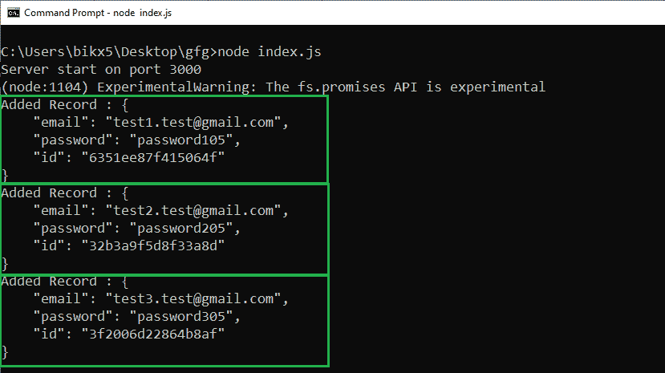
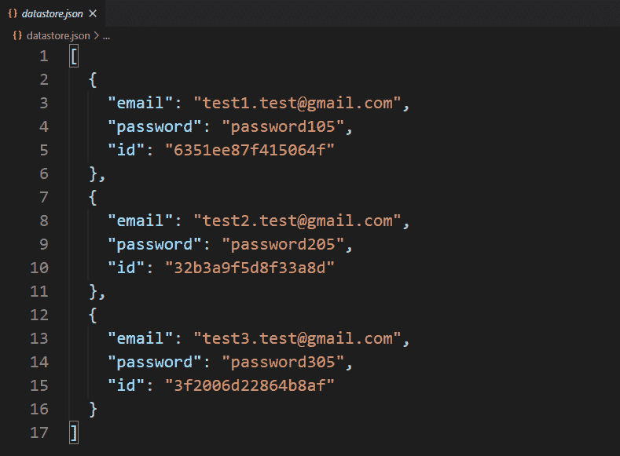

# 如何在 Node.js 中为本地/自定义数据库中的每条记录添加唯一 Id？

> 原文:[https://www . geesforgeks . org/如何向本地定制数据库节点中的每个记录添加唯一 id-js/](https://www.geeksforgeeks.org/how-to-add-unique-id-to-each-record-in-your-local-custom-database-in-node-js/)

自定义数据库表示文件系统中的本地数据库。有两种类型的数据库“SQL”和“NoSQL”。在 SQL 数据库中，数据以表的方式存储，而在 Nosql 数据库中，数据以某种特定的方式独立存储，以独立标识每条记录。我们还可以用 Nosql 方式在本地创建自己的数据库或数据存储。为了以 NoSQL 的方式存储信息，我们必须为每条记录添加一个唯一的 Id，这样每条记录都可以被独立识别。

创建本地数据库并向其中添加具有唯一标识的记录需要一些步骤。这些步骤如下:

*   在项目目录的根目录下创建 package.json 文件。
    **命令创建包文件**

    ```js
    npm init -y
    ```

*   安装 express 和 body-parser 包。
    **命令安装软件包**

    ```js
    npm install express body-parser
    ```

*   创建一个显示表单的 GET 路径(将信息提交给数据库的 HTML 表单)。
*   创建后续的帖子路由来处理表单提交请求。
*   将服务器设置为在特定端口(开发者端口–3000)上运行。
*   创建一个存储库文件，并添加与创建本地数据库相关的所有逻辑。
*   在存储库文件中创建一个方法，为每个记录添加一个唯一的字母数字 id。
*   在存储库文件中创建一个方法，以 json 格式将每个唯一的记录添加到数据库中。

这个例子说明了如何创建一个本地数据库，并用一个唯一的 id 向其中添加记录。

**文件名:index.js**

```js
const express = require('express')
const bodyParser = require('body-parser')
const repo = require('./repository')

const app = express()

const port = process.env.PORT || 3000

// The body-parser middleware 
// to parse form data
app.use(bodyParser.urlencoded({extended : true}))

// Get route to display HTML form
app.get('/signup', (req, res) => {
  res.send(`
    <div>
     <form method='POST'>
       <div>
         <div>
           <label id='email'>Username</label>
         </div> 
         <input type='text' name='email' 
               placeholder='Email' 
               for='email'>
       </div>

       <div>
         <div>
           <label id='password'>Password</label>
         </div>
         <input type='password' name='password'
                   placeholder='Password' 
         for='password'>
       </div>

       <div>
         <button>Sign Up</button>
       </div>
     </form>
    </div> 
   `)
});

// Post route to handle form submission
// logic and add data to the database
app.post('/signup', async (req, res) => {
  const {email, password} = req.body

  const addedRecord = await 
    repo.createNewRecord({email, password})

  console.log(`Added Record : 
    ${JSON.stringify(addedRecord, null, 4)}`)

  res.send("Information added to the "
        + "database successfully.")
})

// Server setup
app.listen(port, () => {
  console.log(`Server start on port ${port}`)
})
```

**文件名:repository.js**

```js
// Importing node.js file system, crypto module 
const fs = require('fs')
const crypto = require('crypto')

class Repository {

  constructor(filename) {

    // Filename where datas are going to store
    if(!filename) {
      throw new Error(
'Filename is required to create a datastore!')
    }

    this.filename = filename

    try {
      fs.accessSync(this.filename)
    } catch (err) {

      // If file not exist
      // it is created with empty array
      fs.writeFileSync(this.filename, '[]')
    }
  }

  // Logic to add data or record
  async createNewRecord(attributes) {

    // Assign unique Id to each record
    attributes.id = this.generateUniqueID()

    // Read filecontents of the datastore
    const jsonRecords = await 
      fs.promises.readFile(this.filename, {
      encoding : 'utf8'
    })

    // Parsing JSON records in JavaScript
    // object type records
    const objRecord = JSON.parse(jsonRecords)

    // Adding new record
    objRecord.push(attributes)

    // Writing all records back to the file
    await fs.promises.writeFile(
      this.filename,
      JSON.stringify(objRecord, null, 2)   
    )

    return attributes;
  }

  // Method to generate unique ID 
  generateUniqueID() {
    return crypto.randomBytes(8).toString('hex')
  }
}

// The 'datastore.json' file created at runtime 
// and all the information provided via signup
// form store in this file in JSON format.
module.exports = new Repository('datastore.json')
```

**包联文件:**


**运行该程序的步骤**
使用以下命令运行 index.js 文件:

```js
node index.js
```

**提交回复的表单:**
**注意:**这里三个回复一个接一个提交，所有回复都存储在 datastore.json 文件中。


**提交请求后重定向页面:**


**输出:**


**数据库:**


**注意:**第一次运行的程序数据库(datastore.json)文件在项目目录中不存在，它在运行程序后动态创建并存储提交的响应。之后，所有提交的回复都被逐一添加到数据库中。