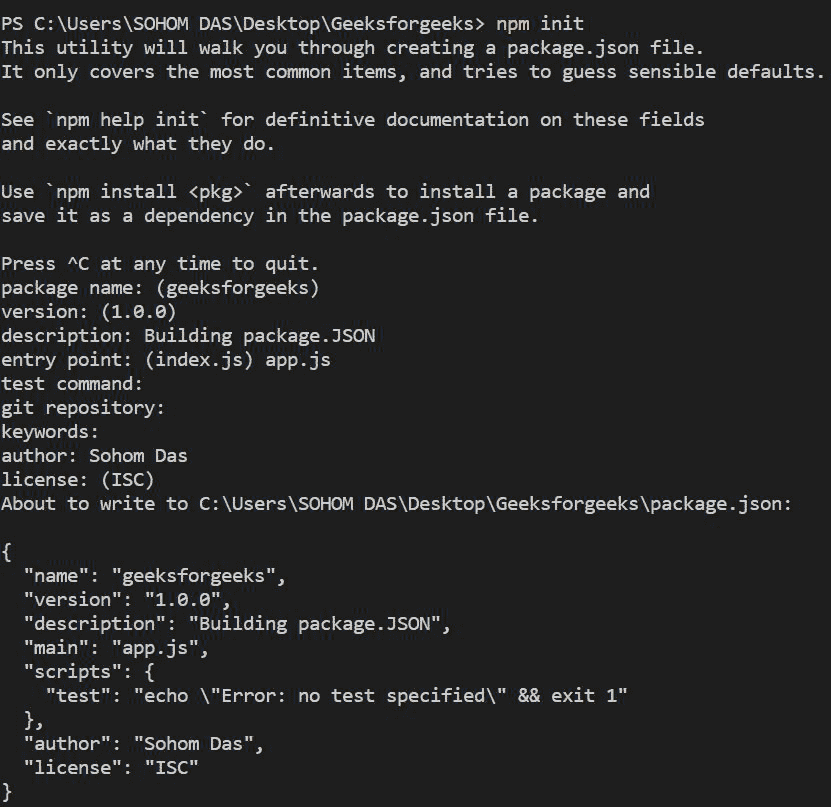
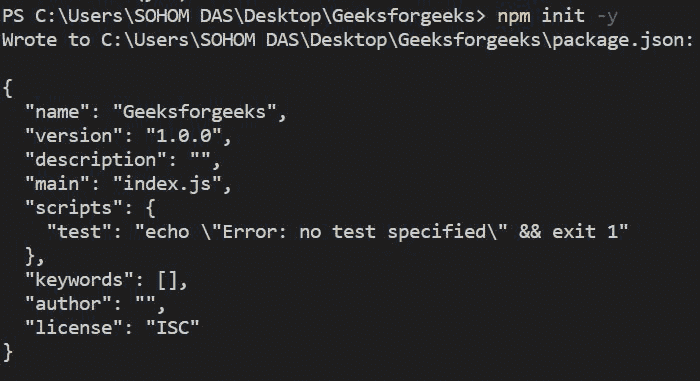

# 如何为 Node.js 项目自动构建 package.json 文件？

> 原文:[https://www . geesforgeks . org/如何自动构建包-JSON-file-for-node-js-project/](https://www.geeksforgeeks.org/how-to-automatically-build-the-package-json-file-for-node-js-projects/)

在本文中，我们将讨论如何为 Node.js 项目构建一个 package.json 文件。首先，我们需要为 node.js 项目使用一个代码编辑器。有各种代码编辑器可用，如崇高的文本，Visual Studio 等。我们可以在项目中使用其中的任何一个。

***什么是 package.json 文件？**T3】*

package.json 文件是一个 json 文件，它包含项目中所需的所有依赖关系的信息。除此之外，它还包含项目的基本信息。综上所述，它包含了整个项目的元数据。非常重要的是，每个 NodeJS 项目必须包含一个 package.json 文件，以便跟踪正在安装和删除的依赖项以及其他数据。

*现在我们将在一个* NodeJS *应用程序中构建我们的 package.json 文件。对于这篇文章，我们将使用 Visual Studio 作为我们的代码编辑器，因为它包含一个内置终端。我们也可以使用崇高的文本，但在这种情况下，我们需要使用 Windows Powershell 来创建我们的 package.json 文件。*

首先，我们将学习如何在 NodeJS 中手动构建 ur package.json 文件。现在，只要我们在 Visual Studio 代码编辑器中打开一个文件夹，当我们键入以下代码时，就可以打开终端:

```js
npm init
```

按回车键后，将会询问我们一系列关于项目文件夹的问题。在这些地方，我们需要为创建适当的元数据提供所有必要的信息。如果我们不想更改默认数据或键入任何新数据，在这种情况下，我们可以按回车键。下面是上述方法的实现示例。



*结果会创建一个 package.json 文件，可以从文件结构打开，打开文件会是这样的:*

```js
{
  "name": "geeksforgeeks",
  "version": "1.0.0",
  "description": "Building package.JSON",
  "main": "app.js",
  "scripts": {
    "test": "echo \"Error: no test specified\" && exit 1"
  },
  "author": "Sohom Das",
  "license": "ISC"
}
```

**方法二:**

我们可以用一行代码直接插入默认值的所有数据，而不是手动将所有数据放入终端:

```js
npm init -y
```

*按回车键将直接创建一个包含所有默认值的 package.json 文件。*



将创建 Package.json 文件，现在将使用默认元数据设置所有内容。

```js
{
  "name": "geeksforgeeks",
  "version": "1.0.0",
  "description": "",
  "main": "index.js",
  "scripts": {
    "test": "echo \"Error: no test specified\" && exit 1"
  },
  "keywords": [],
  "author": "",
  "license": "ISC"
}
```