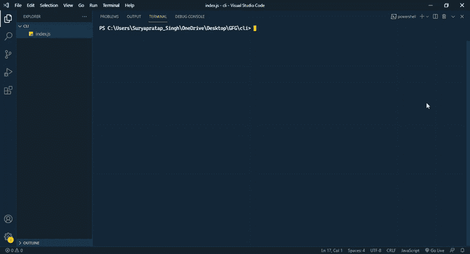
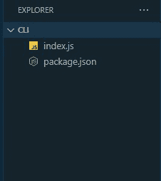
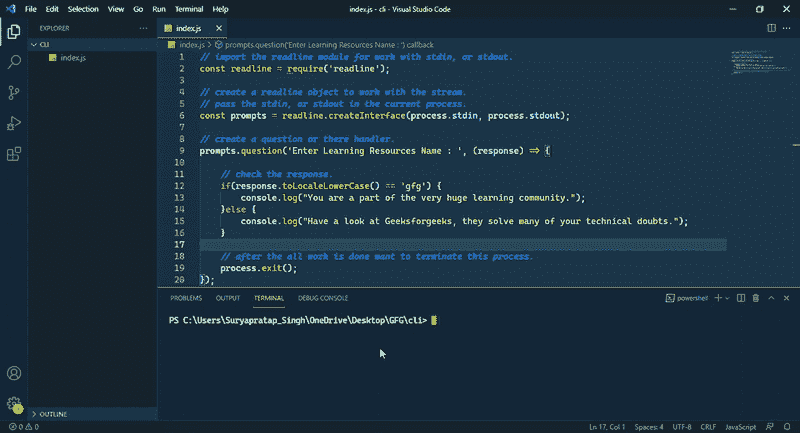

# 如何用 Node.js 构建 JavaScript 命令行界面

> 原文:[https://www . geesforgeks . org/how-build-a-JavaScript-命令行-interface-CLI-with-node-js/](https://www.geeksforgeeks.org/how-to-build-a-javascript-command-line-interface-cli-with-node-js/)

在本文中，我们将看到如何在 NodeJs 的帮助下创建一个 JavaScript CLI。

JavaScript 作为一种解释语言，它是一种非常动态的语言，由于它为我们提供了许多设施，由于它，许多任务变得非常容易，任何人都可以非常容易地理解它们，所以在当今时代，JavaScript 它是世界上最流行的编程语言之一，这就是为什么今天许多工具都内置在其中。

在本文中，我们将借助 JavaScript 构建一个 CLI 应用程序。我们需要 NodeJs 来直接运行 JavaScript。如果你没有在电脑上安装 NodeJs 或者在 NodeJs 中遇到任何问题，那么参考[这篇文章。](https://www.geeksforgeeks.org/installation-of-node-js-on-windows/)

**方法:**我们想用 JavaScript 做一个 CLI 应用程序，但是 JavaScript 只在浏览器上运行，但是如果我们想在浏览器之外使用它，那么我们需要 NodeJs 提供的运行时，所以我们必须使用 NodeJS。然后我们将能够在 JavaScript 的帮助下创建一个命令行界面应用程序。我们将使用 nodejs 的 readline 模块。

#### 逐步实施:

**第一步:**第一步，我们设置一个 NodeJs 项目环境。如果您没有安装 NPM 或 NodeJs，请参考[这篇文章。](https://www.geeksforgeeks.org/installation-of-node-js-on-windows/project.)

*   运行下面的命令并启动 node.js 项目

```
npm init -y
```

使用“-y”保留所有问题的默认答案。



**项目结构:**做了上面的事情之后，移动创建一个 index.js 文件来编写我们的代码，目录如下。



。**步骤 2:** 现在我们将看到 NodeJs readline 模块的工作情况。

[读取线](https://www.geeksforgeeks.org/node-js-readline-module/)模块允许一次读取一行数据流。它可以用 require()方法包含在代码中。我们可以在 readline 模块中输入我们想要的任何数据流，这允许我们使用标准的输入和输出流。或者，读线模块提供一个接口，用于一次一行地从可读流(如 process.stdin)中读取数据。可以使用访问它。readline 的 question 方法提供了一个查询-响应机制，我们使用 question 方法并传递两个参数，第一个是查询，第二个是自定义处理程序，将一个参数作为处理程序函数的输入。

**语法:**

```
readline.question(query, callback);
```

接受要调用的显示查询字符串和回调函数，作为用户对查询输入的响应。readline 的 **createInterface** 方法提供了一个使用 readline 及其方法的接口对象。

**语法:**

```
readline.createInterface();
```

现在让我们看看上述方法的代码实现。下面的代码显示了如何使用 readline 模块作为命令行界面接受用户的输入。

## index.js

```
// import the readline module for work with stdin, or stdout.
const readline = require('readline');

// create a readline object to work with the stream.
// pass the stdin, or stdout in the current process.
const prompts = readline.createInterface(process.stdin, process.stdout);

// create a question or there handler.
prompts.question('Enter Learning Resources Name : ', (response) => {

    // check the response.
    if(response.toLocaleLowerCase() == 'gfg') {
        console.log("You are a part of the very huge learning community.");
    }else {
        console.log("Have a look at Geeksforgeeks, they solve many of your 
        technical doubts.");
    }

    // after the all work is done want to terminate this process.
    process.exit();
});
```

**运行应用程序的步骤:**

```
node index.js
```

**输出:**



**说明:**createInterface 方法用于创建一个接受用户输入的界面。它采用两个参数，当前进程的标准输入(stdin)和标准输出(stdout)。接下来，createInterface 对象的 question()方法用于向用户提示问题。第二个参数是回调函数，它将处理作为参数传递给它的用户输入。函数内部的逻辑将根据对用户输入值的评估显示适当的消息。process.exit()语句允许退出代码，否则接口将继续从标准输入中读取。