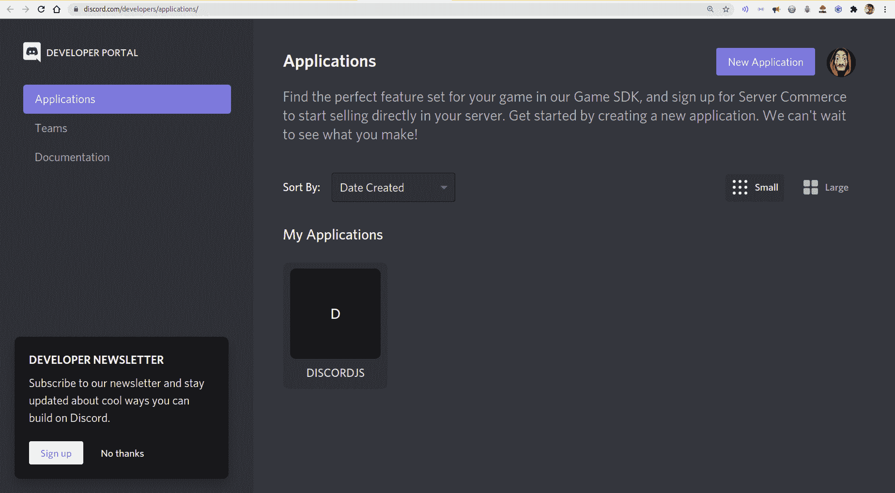
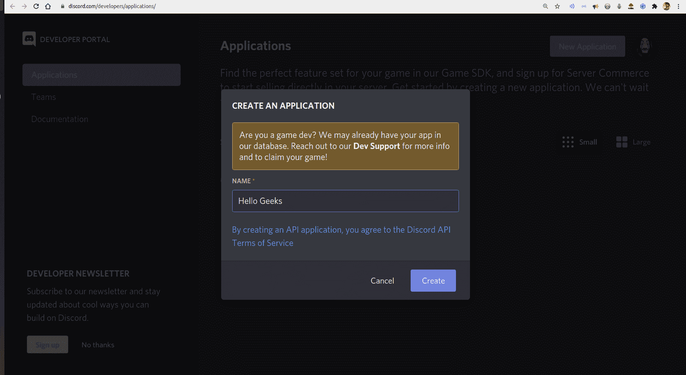
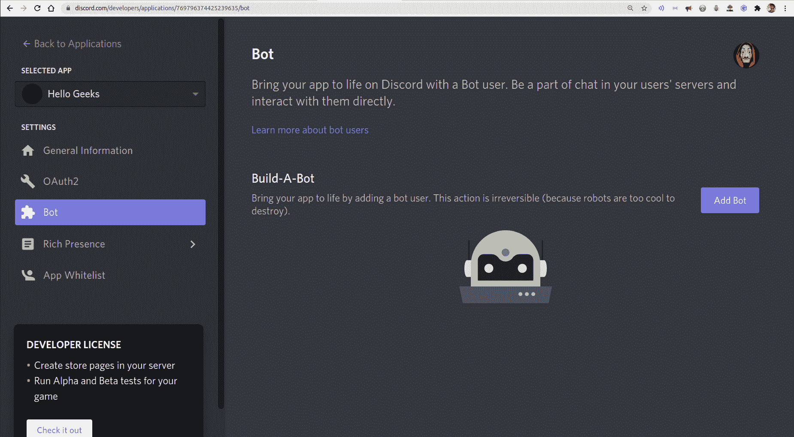
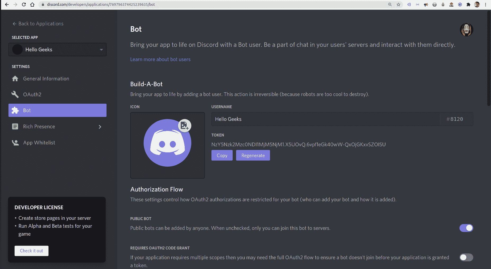
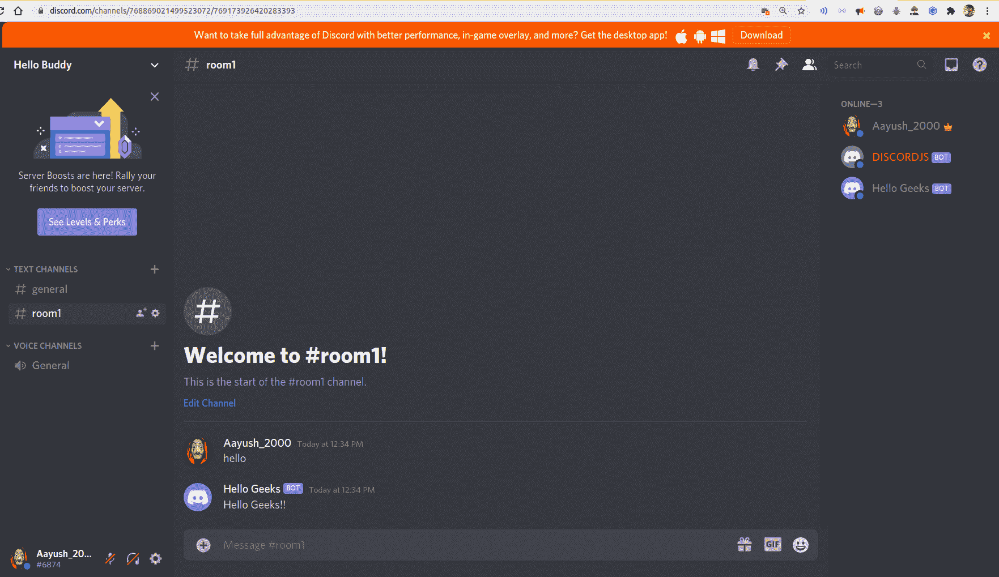

# 如何用 Node.js 搭建一个简单的 Discord 机器人？

> 原文:[https://www . geesforgeks . org/how-to-build-simple-discord-bot-using-node-js/](https://www.geeksforgeeks.org/how-to-build-a-simple-discord-bot-using-node-js/)

Discord 是一个即时消息应用程序，主要由开发者和游戏社区使用。许多不和谐服务器使用机器人来自动完成任务。僵尸工具是允许我们自动完成一些任务的程序，比如消息传递、维护我们的服务器等。不和为我们提供了许多内置的机器人。不和谐也让我们建立自己的机器人。

对于 javascript 开发人员来说，discord 提供了 **discord.js** 包，可以帮助他们为自己的服务器开发 bot。

**先决条件:**

*   不和谐帐户与您自己的不和谐服务器。
*   安装了 npm 的 Node.js。
*   Javascript 基础知识。

**建造不和机器人的步骤:**

1.  **创建您的机器人:**要注册您的机器人，请访问[https://discord.com/developers/applications/](https://discord.com/developers/applications/)并使用您的帐户登录。

    单击“新建应用程序”按钮，并为您的应用程序命名。然后，点击“创建”按钮，创建一个使用不和谐应用编程接口的应用程序。

     

    单击机器人选项卡，然后单击“添加机器人”按钮创建新的机器人。

    

    给你选择的机器人一个名字和头像。

2.  **添加机器人到你的服务器:**要添加机器人到你的服务器，你应该使用以下网址:
    T3】https://discord.com/oauth2/authorize?client_id=CLIENT_ID&范围=机器人

    在网址中，您应该用自己的客户端标识替换客户端标识，您可以在“一般信息”选项卡上找到该标识。访问该网址，选择要添加的服务器，然后点击“授权”按钮，这将把你的机器人放入你的服务器。

3.  **项目设置:**要开始构建项目，创建一个新文件夹，然后创建一个名为 index.js 的新文件，然后使用以下命令安装 discord.js 包:

    ```
    npm i discord.js
    ```

    然后使用以下代码在项目中导入 discord.js 包:

    ```
    const discord = require('discord.js');
    ```

    现在，我们希望我们的机器人发送一条信息“你好，极客们！!"每当服务器上有人发“你好”的时候。因此，要做到这一点，我们需要一个能够处理事件的不和谐客户。不和谐客户端允许您监听消息事件。这意味着机器人可以读取发送到通道的任何消息。

    **文件名:index.js**

    ```
    // Creates a discord client
    const client = new discord.Client(); 

    // Runs whenever a message is sent
    client.on("message", message => { 

        // Checks if the message says "hello"
        if (message.content === "hello") { 

            // Sending custom message to the channel
            message.channel.send("Hello Geeks!!"); 
        }
    });
    ```

    要启动 bot，我们必须在 index.js 文件中添加 client.login(YOUR_BOT_TOKEN)调用。

    ```
    client.login("YOUR_BOT_TOKEN"); // Starts the bot up
    ```

    用你能在机器人标签中找到的机器人令牌替换你的机器人令牌。

    

    因此，在完成上述步骤后，我们的最终 index.js 文件将如下所示:
    **文件名:index.js**

    ```
    // Requiring module
    const discord = require('discord.js');

    // Creates a discord client
    const client = new discord.Client(); 

    // Runs whenever a message is sent
    client.on("message", message => { 

        // Checks if the message says "hello"
        if (message.content === "hello") { 

            // Sending custom message to the channel
            message.channel.send("Hello Geeks!!"); 
        }
    });

    client.login("YOUR_BOT_TOKEN");
    ```

4.  **运行你的 index.js 文件来运行你的 bot:** 要运行 index.js 文件，在你的终端中使用以下命令:

    ```
    node index.js 
    ```

    

**注意:**每当我们的 index.js 停止运行时，我们的 bot 也会停止工作。如果你想让你的机器人全天候工作，你必须把它部署到某个服务器上。