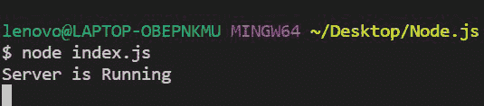
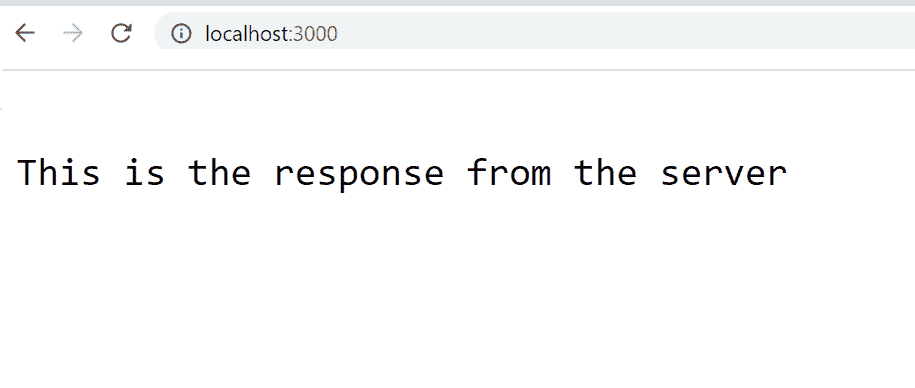
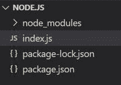
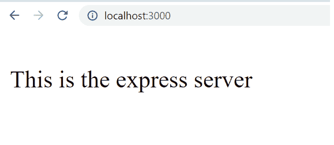

# 如何用 Node.js 搭建一个简单的 Web 服务器？

> 原文:[https://www . geesforgeks . org/如何构建一个简单的带有节点的 web 服务器-js/](https://www.geeksforgeeks.org/how-to-build-a-simple-web-server-with-node-js/)

**简介:** Node.js 是一个开源跨平台的运行时环境，用于在浏览器外执行[<u>JavaScript</u>](https://www.geeksforgeeks.org/JavaScript-tutorial/)代码。需要记住的是 **NodeJS 不是框架，也不是编程语言。** Node.js 多用于服务器端编程。在本文中，我们将讨论如何使用 node.js 制作 web 服务器。

**使用 NodeJS 创建 Web 服务器:**主要有以下两种方式。

1.  使用 [http i](https://www.geeksforgeeks.org/node-js-http-module/) 内置模块
2.  使用[表示](https://www.geeksforgeeks.org/working-of-express-js-middleware-and-its-benefits/)第三方模块

**使用 http 模块:** HTTP 和 HTTPS，这两个内置模块用来创建一个简单的服务器。HTTPS 模块借助该模块的安全层功能提供了通信加密功能。而 HTTP 模块不提供数据加密。

**项目结构:**会是这样的。


## index.js

```js
// Importing the http module
const http = require("http")

// Creating server 
const server = http.createServer((req, res) => {
    // Sending the response
    res.write("This is the response from the server")
    res.end();
})

// Server listening to port 3000
server.listen((3000), () => {
    console.log("Server is Running");
})
```

使用以下命令运行 **index.js** 文件:

```js
node index.js
```



**输出:**现在打开浏览器，转到***http://localhost:3000/***，会看到如下输出:



**使用 express 模块**:在 http 模块的上层工作的 *express.js* 是 node.js 最强大的框架之一。使用 *express.js* 服务器的主要优势是过滤客户端传入的请求。

**安装模块:**使用以下命令安装所需的模块。

```js
npm install express
```

**项目结构:**会是这样的。



## index.js

```js
// Importing express module
const express = require("express")
const app = express()

// Handling GET / request
app.use("/", (req, res, next) => {
    res.send("This is the express server")
})

// Handling GET /hello request
app.get("/hello", (req, res, next) => {
    res.send("This is the hello response");
})

// Server setup
app.listen(3000, () => {
    console.log("Server is Running")
})
```

使用以下命令运行**index . js**文件:

```js
node index.js
```

**输出:**现在打开浏览器，转到***http://localhost:3000/***，会看到如下输出:

