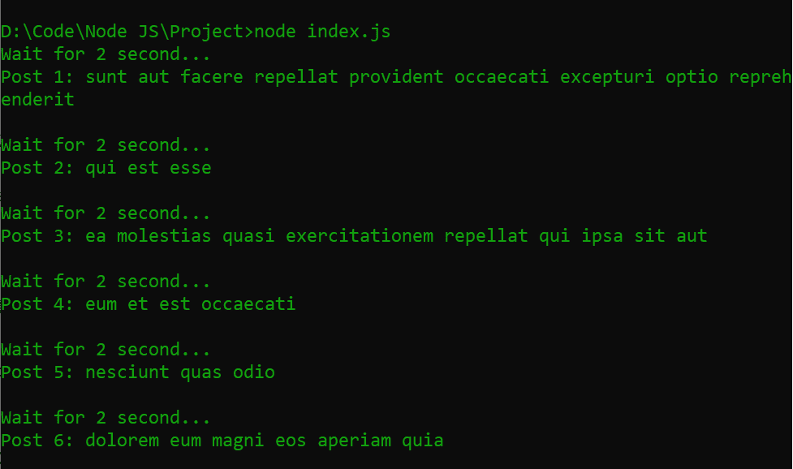
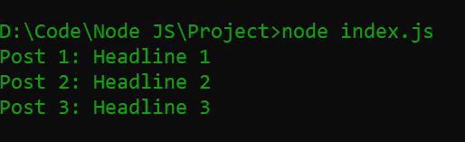

# 在 Node.js/Express.js 如何从服务器端自身连续调用一个 API？

> 原文:[https://www . geeksforgeeks . org/如何从服务器端连续调用 API-节点中的自身-js-express-js/](https://www.geeksforgeeks.org/how-to-call-an-api-continuously-from-server-side-itself-in-node-js-express-js/)

调用 API 端点是现代互联网技术的核心功能。通常，我们从浏览器调用 API。有时我们需要从服务器本身调用 API 端点来获取数据、加载依赖项等。

有许多方法可以从 NodeJS 服务器本身调用 API，这取决于您想要使用的抽象级别。从 NodeJS 服务器调用 API 最简单的方法是使用 Axios 库。

**项目设置:**创建一个 NodeJS 项目，并使用以下命令对其进行初始化。

```js
mkdir Project && cd Project
npm init -y
```

**模块安装:**使用以下命令安装所需模块，即 **ExpressJS** 和 **Axios** 。

```js
npm i express axios
```

现在在项目的根文件夹中创建一个 JS 文件，并将其命名为 **index.js**

**1。发出一个 HTTP GET 请求:**在你的 **index.js** 文件上写下下面的代码。

## index.js

```js
const express = require('express')
const axios = require('axios')

const app = express()

// Post ID tracker
var num = 0

setInterval(() => {

   // Increment post tracker
   num++
   console.log('Wait for 2 second...')

   // Make GET Request on every 2 second
   axios.get(
`https://jsonplaceholder.typicode.com/posts/${num}`)

      // Print data
      .then(response => {
         const { id, title } = response.data
         console.log(`Post ${id}: ${title}\n`)
      })

      // Print error message if occur
      .catch(error => console.log(
            'Error to fetch data\n'))
}, 2000)
```

**说明:**在上面的例子中，NodeJS 每隔 2 秒调用一次 API 来获取数据。如果承诺被解决，那么**块**将被执行并打印数据。如果承诺被拒绝，**捕捉** **块**将被执行并打印错误信息。

使用以下命令运行**服务器**:

```js
node index.js 
```

**输出:**



**2。发出 HTTP POST 请求:**在 **index.js** 文件中写下以下代码。

## index.js

```js
const express = require('express')
const axios = require('axios')

const app = express()

// Dummy database
const posts = [
   {
      title: 'Headline 1',
      id: 1,
      body: `sint suscipit perspiciatis velit dolorum 
            rerum ipsa laboriosam odio`,
      userId: 1
   },

   {
      title: 'Headline 2',
      id: 2,
      body: "fugit voluptas sed molestias voluptatem provident",
      userId: 1
   },

   {
      title: 'Headline 3',
      id: 3,
      body: "voluptate et itaque vero tempora molestiae",
      userId: 1
   }
]

// Loop over the posts
posts.forEach(post => {

   // Post data to API endpoint
   axios.post('https://jsonplaceholder.typicode.com/posts/', {
      body: post,
   })

      // Print response
      .then(response => {
         const { id, title } = response.data.body
         console.log(`Post ${id}: ${title}`)
      })

      // Print error message if occur
      .catch(error => console.log(error))
})
```

**说明:**在上面的例子中，我们已经创建了伪用户数据。NodeJS 发出 POST 请求，将这些数据发送到 API 端点，并打印响应的数据或错误消息。

使用以下命令运行**服务器**:

```js
node index.js 
```

**输出:**

