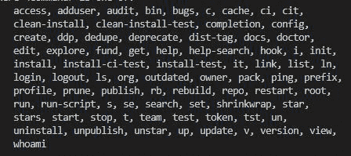

# 如何更改 node.js 的 npm 启动脚本？

> 原文:[https://www . geesforgeks . org/how-change-NPM-start-script-of-node-js/](https://www.geeksforgeeks.org/how-to-change-npm-start-script-of-node-js/)

该脚本是一个命令列表，用于执行它们被设计来执行的一些特定任务。在 Node.js 中，有很多在创建新项目时创建的预定义脚本，其中一些包含默认值，我们也可以根据特定任务的操作需要来更改它们。

[node.js](https://www.geeksforgeeks.org/nodejs-tutorials/) 中可用的脚本关键字如下所示 npm start 脚本是 node.js 和 react 中最常用的脚本之一。npm start: npm start 脚本用于执行其中定义的文件，而无需键入其执行命令。



**Package.json 文件**

```js
"scripts"{
"start":"node index.js"
}
```

## index.js

```js
// Importing http module
const http = require("http")

// Creating Server
const server = http.createServer((req,res)=>{
    req.statusCode=200;
    console.log("Server is Started")
    res.end();
});

// Executing the server
server.listen(3000,"localhost",()=>{
    console.log("Server is Running ")
})
```