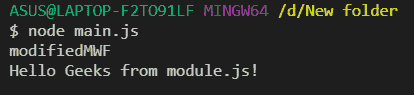

# 如何更改 Node.js 模块包装器？

> 原文:[https://www . geesforgeks . org/如何更改节点-js-module-wrapper/](https://www.geeksforgeeks.org/how-to-change-the-node-js-module-wrapper/)

**模块包装函数:**在引擎盖下，NodeJS 并不直接运行我们的代码，它在执行之前将整个代码包装在一个函数内部。这个函数被称为模块包装函数。官方文档参考 https://nodejs . org/API/modules . html # modules _ the _ module _ wrapper。

在执行模块代码之前，NodeJS 用具有以下结构的函数包装器包装它:

```js
(function (exports, require, module, __filename, __dirname) {
  //module code
});

```

**模块包装函数在 NodeJS 中的使用:**

1.  用 *var* 、 *const、*或*声明的顶级变量让*限定在模块范围内，而不是全局对象。
2.  它提供了一些特定于模块的全局变量，例如:
    *   *模块*和*导出*对象，该对象可用于从模块导出值。
    *   像*_ _ 文件名*和*_ _ 目录名*这样的变量告诉我们模块的绝对文件名及其目录路径。

**修改模块包装函数:**考虑我们有两个文件， *main.js* 和 *module.js* 。在 main.js 中，我们覆盖*模块，包装*功能，以便控制台. log(' modified wf ')；每次需要模块时。现在如果我们*需要* module.js，它会包含一条消息来确认我们的修改是否成功。

1.  这是第一个调用第二个的文件。

    ## 

    ```js
    var Module = require("module");

    (function (moduleWrapCopy) {
      Module.wrap = function (script) {
        script = "console.log('modifiedMWF');" + script;

        return moduleWrapCopy(script);
      };
    })(Module.wrap);

    require("./module.js");
    ```

2.  这是第二个文件。

    ## 

    ```js
    console.log("Hello Geeks from module.js!");
    ```

**输出:**运行 **main.js，**我们得到以下输出，确认我们在**模块包装函数中的成功修改。**

```js
node main.js
```



运行 main.js 时的输出窗口