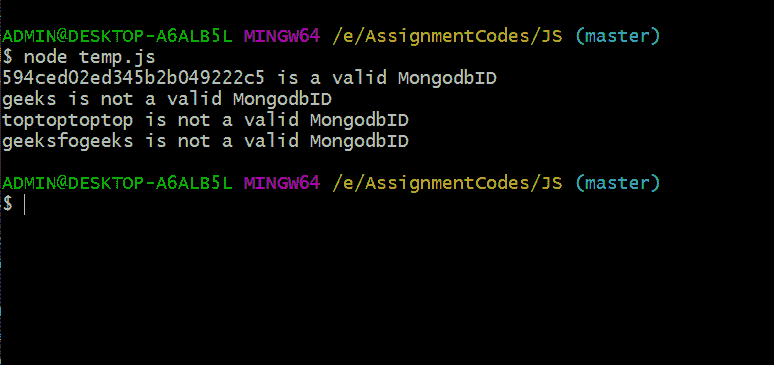

# 如何检查一个字符串在 Node.js 中是否是有效的 MongoDB ObjectId？

> 原文:[https://www . geesforgeks . org/如何检查字符串是否有效-MongoDB-objectid-in-node-js/](https://www.geeksforgeeks.org/how-to-check-if-a-string-is-valid-mongodb-objectid-in-node-js/)

**MongoDB ObjectId:** MongoDB 使用各自对象创建的时间戳为每个对象创建一个唯一的 12 字节 Id。
此 ObjectId 可用于唯一地定位数据库中的特定对象。

<structure>结构:</structure>

*   4 byte timestamp value
*   5-byte random value
*   3-byte increment counter, initialized to random value

看起来是这样的，**507 f 191 e 810 c 19729 de 860 ea**
在正常的后端工作流程中，可能会根据一些计算或用户操作接收到 ObjectId。这些可能会导致无效的 ObjectId，用错误的 ObjectId 查询数据库会产生异常，随后会进行处理。

在本文中，我们将学习如何检查一个字符串是否是有效的 MongoDB ObjectId。

**例:**

```js
594ced02ed345b2b049222c5 --> Valid MongoDB ObjectId
geeks --> Invalid MongoDB ObjectId
```

**先决条件:**

*   **T30】NodeJS** 你好**[【NPM】](https://www.geeksforgeeks.org/node-js-npm-node-package-manager/)**扬扎姆

T39】

Mongoose & MongoDB 在 ObjectId 中提供了一个非常有用的函数，即**<u>ObjectId . isvalid(“some _ ID”)</u>**来验证一个字符串是否有正确的 MongoDB ID。
ObjectId 可以从原生的*<u>獴</u>* 以及 *<u>獴</u>* 包中导入。

**从 mongodbb 或 mongod 包中导入 ObjectId:**

*   **使用 Monogdb:**

    ```js
    const ObjectId = require('mongodb').ObjectId;
    or
    const mongodb, {ObjectId} = require('mongodb');
    ```

*   **使用猫鼬:**

    ```js
    const ObjectId = require('mongoose').Types.ObjectId;
    or
    const mongoose = require('mongoose');
    ObjectId = mongoose.Types.ObjectId;Id;
    ```

但是，它 **ObjectId.isValid(id)** 即使对于长度为 12 的无效字符串也返回 true。
例如:

<figure class="table">T21】594 ced 02 ed 345 B2 b 04922 C5

| **String ID 【T1]** | **objectid。isvalid(ID)** | **Expected verification** |
| real | real |
| Geek [T30 |

</figure>

为了防止这种情况，可以在**默认 valida** tor 之后添加另一个检查，该检查将根据条件返回真或假，(从字符串创建的新 ObjectId)转换为字符串===字符串
即 ***(字符串)(新 ObjectId(id)) === id***

可以如下创建一个函数来检查字符串是否是有效的 ObjectId:

```js
const ObjectId = require('mongoose').Types.ObjectId;
function isValidObjectId(id){

    if(ObjectId.isValid(id)){
        if((String)(new ObjectId(id)) === id)
            return true;
        return false;
    }
    return false;
}
```

## java 描述语言

```js
// Requiring ObjectId from mongoose npm package
const ObjectId = require('mongoose').Types.ObjectId;

// Validator function
function isValidObjectId(id){

    if(ObjectId.isValid(id)){
        if((String)(new ObjectId(id)) === id)
            return true;        
        return false;
    }
    return false;
}

// Loading testcases into array
const testStrings = [ "594ced02ed345b2b049222c5","geeks",  
                      "toptoptoptop","geeksfogeeks"];

// Validating each test case
for(const testcase of testStrings){

    if(isValidObjectId(testcase))
        console.log(testcase + " is a valid MongodbID");
    else
        console.log(testcase + " is not a valid MongodbID");

}
```

**输出:**

**该功能的结果为:**

<figure class="table">T25】594 ced 02 ed 345 B2 b 04922 C5T29

| **String ID 【T1]** | **是有效的对象(标识)** | **Expected verification** |
| 真实的 |

</figure>