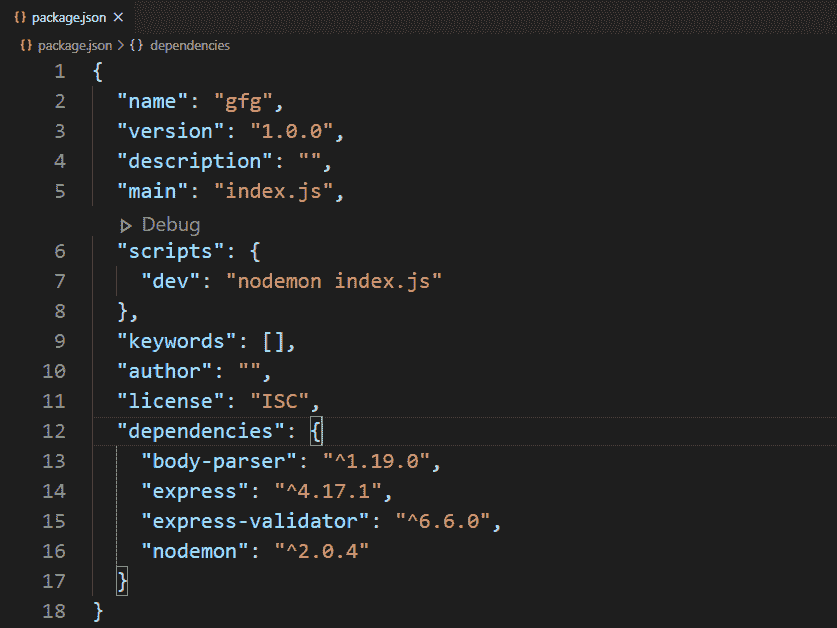
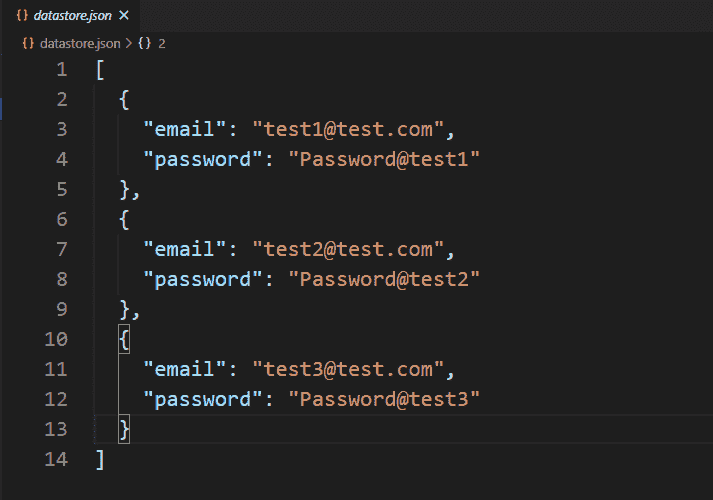
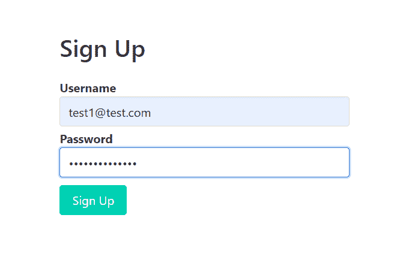
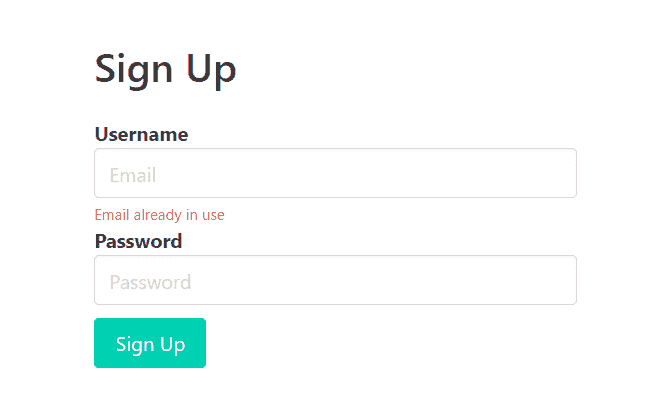
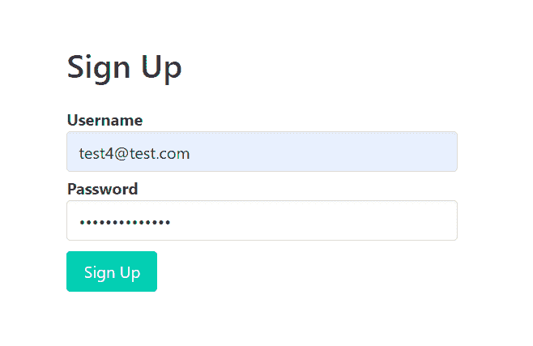
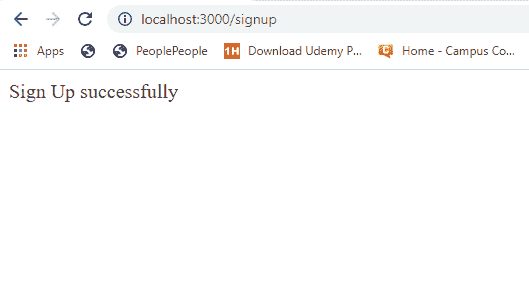
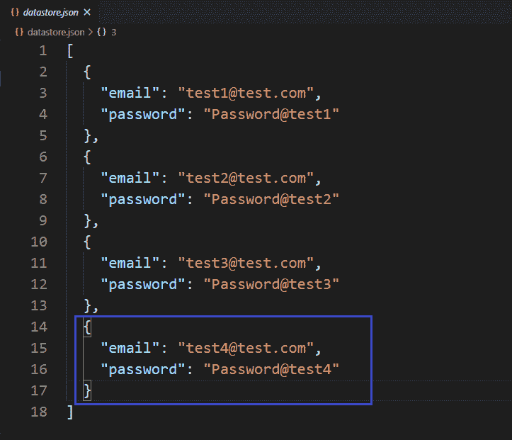

# 如何使用 Node.js 中的 express-validator 检查电子邮件地址是否已经被使用？

> 原文:[https://www . geesforgeks . org/如何检查电子邮件地址是否已被使用或未被使用-节点中的快速验证器-js/](https://www.geeksforgeeks.org/how-to-check-if-email-address-is-already-in-use-or-not-using-express-validator-in-node-js/)

任何网站的注册或注册都需要用户名。大多数时候，我们使用“电子邮件”在网站上注册。注册电子邮件总是唯一的，并且必须只引用一个用户，否则用户之间可能会发生冲突。为了解决这个冲突，每个网站都必须具有不接受网站上已经存在的电子邮件的功能。这个功能可以在我们的代码中的任何地方实现，比如在索引文件或路由文件中，但是这属于验证部分。所以我们通常更喜欢在编码所有其他验证的地方编码这个逻辑。在这里，我们使用“快速验证器”中间件来实现这一功能。

**安装快速验证器的命令:**

```
npm install express-validator
```

**使用快速验证器实现逻辑的步骤:**

*   安装快速验证中间件。
*   创建一个 validator.js 文件来编码所有的验证逻辑。
*   通过**验证电子邮件通过**验证电子邮件:**检查(【电子邮件】)**并用“**链接所有验证。**'
*   在路由中使用验证名称(验证电子邮件)作为一个中间件，作为一组验证。
*   从快速验证器中析构“验证结果”函数，用它来查找任何错误。
*   如果发生错误，重定向到传递错误信息的同一页。
*   如果错误列表为空，则允许用户访问后续请求。

**注意:**这里我们使用本地或自定义数据库来实现逻辑，同样的步骤也可以在 MongoDB 或 MySql 这样的常规数据库中实现逻辑。

**示例:**该示例说明了如何检查特定网站的电子邮件地址是否已经在使用中。

**文件名:index.js**

```
const express = require('express')
const bodyParser = require('body-parser')
const { validationResult } = require('express-validator')
const repo = require('./repository')
const { validateEmail } = require('./validator')
const signupTemplet = require('./signup')

const app = express()

const port = process.env.PORT || 3000

// The body-parser middleware to parse form data
app.use(bodyParser.urlencoded({ extended: true }))

// Get route to display HTML form to sign up
app.get('/signup', (req, res) => {
    res.send(signupTemplet({}))
})

// Post route to handle form submission logic and 
app.post(
    '/signup',
    [validateEmail],
    async (req, res) => {
        const errors = validationResult(req)
        if (!errors.isEmpty()) {
            return res.send(signupTemplet({ errors }))
        }
        const { email, password } = req.body
        await repo.create({ email, password })
        res.send('Sign Up successfully')
    })

// Server setup
app.listen(port, () => {
    console.log(`Server start on port ${port}`)
})
```

**Filename: repository.js** 这个文件包含了创建本地数据库和与之交互的所有逻辑。

```
// Importing node.js file system module 
const fs = require('fs')

class Repository {

    constructor(filename) {

        // The filename where datas are
        // going to store
        if (!filename) {
            throw new Error(
'Filename is required to create a datastore!')
        }

        this.filename = filename

        try {
            fs.accessSync(this.filename)
        } catch (err) {

            // If file not exist it is created
            // with empty array
            fs.writeFileSync(this.filename, '[]')
        }
    }

    // Get all existing records
    async getAll() {
        return JSON.parse(
            await fs.promises.readFile(this.filename, {
                encoding: 'utf8'
            })
        )
    }

    // Find record by properties
    async getOneBy(filters) {
        const records = await this.getAll()
        for (let record of records) {
            let found = true
            for (let key in filters) {
                if (record[key] !== filters[key]) {
                    found = false
                }
            }
            if (found) return record;
        }
    }

    // Create new record
    async create(attrs) {
        const records = await this.getAll()
        records.push(attrs)
        await fs.promises.writeFile(
            this.filename,
            JSON.stringify(records, null, 2)
        )
        return attrs
    }
}

// The 'datastore.json' file created at runtime 
// and all the information provided via signup form
// store in this file in JSON formet.
module.exports = new Repository('datastore.json')
```

**文件名:registration . js**该文件包含显示注册表单的逻辑。

```
const getError = (errors, prop) => {
    try {

        // Return error message if any error occurs
        return errors.mapped()[prop].msg
    } catch (error) {

        // Return empty string if no error
        return ''
    }
}

module.exports = ({ errors }) => {
    return `
      <!DOCTYPE html>
      <html>
        <head>
          <link rel='stylesheet'
href='https://cdnjs.cloudflare.com/ajax/libs/bulma/0.9.0/css/bulma.min.css'>
          <style>
            div.columns{
              margin-top: 100px;
            }
            .button{
              margin-top : 10px
            }
          </style>
        </head>
        <body>
          <div class='container'>
            <div class='columns is-centered'>
              <div class='column is-5'>
                <h1 class='title'>Sign Up<h1>
                <form method='POST'>             
                  <div>
                    <div>
                      <label class='label' 
                        id='email'>Username</label>
                    </div>
                    <input class='input' type='text' 
                        name='email' placeholder='Email'
                        for='email'>
                    <p class="help is-danger">
                        ${getError(errors, 'email')}
                    </p>
                  </div>
                  <div>
                    <div>
                        <label class='label' id='password'>
                            Password
                        </label>
                    </div>
                    <input class='input' type='password'
                    name='password' placeholder='Password'
                            for='password'>
                  </div>
                  <div>
                    <button class='button is-primary'>
                        Sign Up
                    </button>
                  </div>
                </form>
              </div>
            </div>
          </div>
        </body>
      </html>   
    `
}
```

**文件名:validator.js** 该文件包含所有的验证逻辑(查看电子邮件是否已经存在的逻辑)。

```
const { check } = require('express-validator')
const repo = require('./repository')

module.exports = {

    validateEmail: check('email')

        // To delete leading and triling space
        .trim()

        // Normalizing the email address
        .normalizeEmail()

        // Checking if follow the email 
        // address formet or not
        .isEmail()

        // Custom message
        .withMessage('Invalid email')

        // Custom validation
        // Validate email in use or not
        .custom(async (email) => {
            const existingUser = 
                await repo.getOneBy({ email })

            if (existingUser) {
                throw new Error('Email already in use')
            }
        })
}
```

使用以下命令运行 **index.js** 文件:

```
node index.js
```

**文件名:package.json**



package.json 文件

**数据库:**



数据库ˌ资料库

**输出:**



使用已在使用的电子邮件注册



使用已在使用的电子邮件注册时的响应



使用未使用的电子邮件注册



使用未使用的电子邮件注册时的响应

**成功注册后的数据库(使用未使用的电子邮件注册)**



成功注册后的数据库(使用未使用的电子邮件注册)

**注意:**我们在注册. js 文件中使用了一些布尔玛类(CSS 框架)来设计内容。