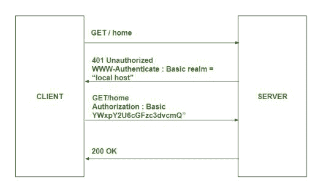
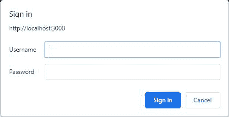
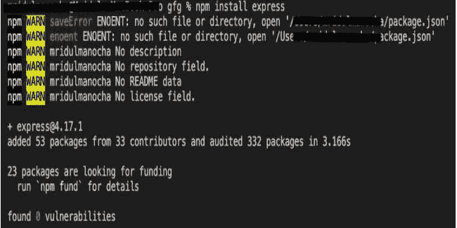
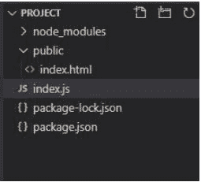
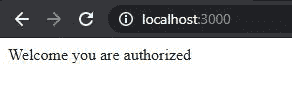

# 如何在使用 Node.js 的 GET 方法中检查用户认证？

> 原文:[https://www . geesforgeks . org/如何检查-用户-认证-获取-方法-使用-节点-js/](https://www.geeksforgeeks.org/how-to-check-user-authentication-in-get-method-using-node-js/)

像网络令牌认证、[基于 cookies 的认证](https://www.geeksforgeeks.org/session-cookies-in-nodejs/)、[T3 等认证方式还有很多。在本文中，我们将讨论在处理客户端期间使用 express.js 最简单的身份验证方法之一**借助**](https://www.geeksforgeeks.org/session-cookies-in-nodejs/)**[**HTTP 头在 node.js 中获取**请求。](https://www.geeksforgeeks.org/http-headers/)**

**方法:** HTTP 协议使用各种类型的报头进行身份验证客户端我们将使用 WWW-Authenticate 报头。 **HTTP WWW-Authenticate 头** 是一个响应类型的头，它支持各种身份验证机制，这些机制对于控制对页面和其他资源的访问也很重要。

**认证说明:**



当客户端的请求头不包含 WWW-Authenticate 头时，服务器的响应头设置
头为 RES . setheader(“WWW-Authenticate”，即“基本”)并设置状态代码 401，此后，客户端会弹出
进行有效身份验证。

**认证表:**



**模块安装:** 使用以下命令安装快速模块。

```js
npm install express
```



**项目结构:**



## index.js

```js
// Importing required modules
const { response } = require("express");
const express = require("express");
const app=express()

// Handling get request from the client side
app.get("/",(req,res,next)=>{

     // Checking the header of the authorization
    var authheader=req.headers.authorization;
    console.log(authheader)
    if(!authheader){

        var err=new Error("You are not authenticated")
        // Set the header for the response
        res.setHeader("WWW-Authenticate",'Basic')
        err.status=401
        return next(err)

    }
    console.log(authheader)

    // Decrypt the user name and the password
    var auth = new Buffer.from(authheader.split(' ')[1],
    'base64').toString().split(':');
    var user = auth[0];
    var pass = auth[1];

    // Checking the details
    if (user == 'admin' && pass == 'password') {
      res.send("Welcome you are authorized")
    } else {
        var err = new Error('You are not authenticated!');
        res.setHeader('WWW-Authenticate', 'Basic');
        err.status = 401;
        return next(err);
    }

})
app.listen(3000,()=>{
  console.log("Server is starting")
})
```

使用以下命令运行 **index.js** :

```js
node index.js
```

**输出:**

*   在私人窗口中打开任何带有***http://localhost:3000***位置的浏览器(以免保存密码和用户名)。地址栏附近会弹出一个窗口。填写代码中提到的用户名和密码。
*   如果输入的用户名和密码与提到的匹配，那么位置**index.html**将呈现在浏览器上。

**说明:**第一个中间件用于在服务器启动，客户端输入 localhost 地址时，检查客户端的认证情况。最初*req . headers . authorization*未定义，下一个()回调函数返回 401 未授权访问浏览器的状态代码。客户端填写凭据，凭据以 base64 格式加密。之后，它解密包含用户名和密码的 base64 格式数据，然后在检查用户名和密码是否正确后，next()方法调用下一个在认证中间件下面提到的中间件，否则认证表单会一次又一次弹出。

**请求标题详细信息:**

