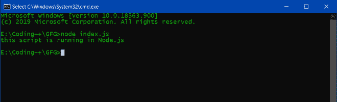
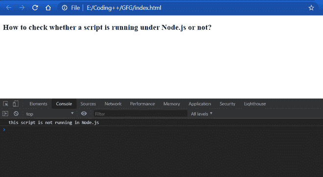

# 如何检查一个脚本是否在 Node.js 下运行？

> 原文:[https://www . geesforgeks . org/如何检查脚本是否在节点下运行-js-or-not/](https://www.geeksforgeeks.org/how-to-check-whether-a-script-is-running-under-node-js-or-not/)

在 JavaScript 中，没有任何特定的函数或方法来获取脚本运行的环境。但是我们可以做一些检查来识别脚本是在 Node.js 上运行还是在浏览器中运行。

**在 Node.js 中使用进程类:**每个 Node.js 进程都有一套内置的功能，可以通过全局**进程**模块进行访问。**进程**模块不需要被要求——它实际上是当前正在执行的进程的包装器，它公开的许多方法实际上是对核心 C 库调用的包装器。

**代码片段:**

```
if ((typeof process !== 'undefined') && 
(process.release.name.search(/node|io.js/) !== -1)) {
    console.log('this script is running in Node.js');
} else {
    console.log('this script is not running in Node.js');
}
```

在这段代码中，我们所做的只是检查**流程**模块是否存在。如果**流程**不是未定义的，那么我们必须检查流程类中 release 方法的 name 属性是 node 还是 io.js(对于节点的 io.js 版本)。

**在 Node.js 中使用模块:**这是一个普遍接受的解决方案，在下划线. js 库中也有使用。这种技术实际上对于服务器端来说是非常好的，因为当调用 **require** 函数时，它会将**这个**对象重置为空对象，并再次为您重新定义**模块**，这意味着您不必担心任何外部篡改。只要您的代码加载了 require，您就是安全的。

**代码片段:**

```
if (typeof module !== 'undefined' && module.exports) {
    console.log('this script is running in Node.js');
} else {
    console.log('this script is not running in Node.js');
}
```

然而，这在浏览器上分崩离析，因为任何人都可以轻松地定义一个**模块**，让它看起来像是你正在寻找的对象。一方面，这可能是您想要的行为，但它也规定了库用户可以在全局范围内使用哪些变量。也许有人想使用一个名为**的模块**的变量，它里面有导出供另一种用途。

**用 Node.js 运行代码的步骤:**

1.  用上面的代码创建一个文件 **index.js** 。
2.  Run the file on Terminal with the following command:

    ```
    node index.js
    ```

    **输出:**

    

    **node . js 中程序的输出**

**在浏览器中运行代码的步骤:**

1.  用上面的代码创建一个文件 **index.js** 。
2.  在同一目录下创建另一个文件**index.html**，代码如下:

    ```
    <!DOCTYPE html>
    <html>
    <head>
        <title>GFG</title>
        <script src="./index.js"></script>
    </head>
    <body>
        <h3>
            How to check whether a script is 
            running under Node.js or not?
        </h3>
    </body>
    </html>
    ```

3.  要运行代码，双击**index.html**，它将在浏览器中打开。
4.  Open browser console to check the output.

    **输出:**

    

    **浏览器中程序的输出**

**结论:**您可以使用上述任何一种方法来确定您的脚本是否在 Node 中运行。但是，试图找出代码运行的环境的问题是，任何对象都可以被修改和重新声明，这使得几乎不可能找出哪些对象是环境原生的，哪些对象已经被程序修改过。