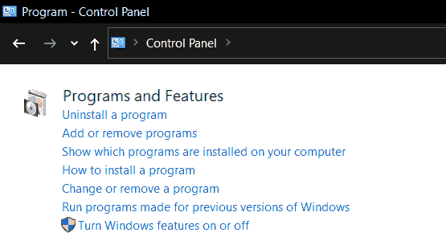
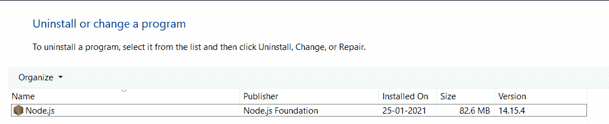
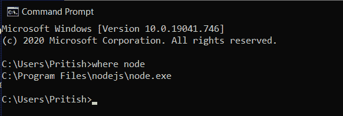

# 如何从 Windows 中完全移除 node.js？

> 原文:[https://www . geesforgeks . org/如何从 windows 中完全删除节点-js/](https://www.geeksforgeeks.org/how-to-completely-remove-node-js-from-windows/)

我们可以使用以下简单步骤从窗口中完全删除 Node.js:

**步骤 1:** 每当我们用命令 ***安装包时，npm 安装<包名>*** ，npm 将缓存存储在用户文件系统内部。Windows 上存储缓存数据的默认目录是***% AppData %/NPM-cache***。所以，我们需要先清理缓存。可以使用以下命令清理缓存。

```js
npm cache clean --force 
```

**步骤 2:** 之后，您可以使用以下命令验证缓存:

```js
npm cache verify
```

**第三步:**现在打开电脑中的控制面板。搜索程序和功能。在程序和功能下，单击卸载程序。现在搜索 Node.js 并卸载它。

 

**第 4 步:**重启计算机或从任务管理器中删除所有与节点相关的进程。

**第五步:**在你的电脑中寻找文件夹，如果它们存在，删除它们。这些文件夹可能存在于您的计算机中，也可能不存在，这取决于各种因素，如安装的版本或 CPU 体系结构。

*   c:\程序文件(x86)\节点
*   c:\程序文件\节点
*   c:\用户\ {用户} \ AppData \漫游\npm 或打开运行并键入 *appdata* 然后单击确定并打开漫游在那里您会找到 *npm* 。
*   c:\ User \ { User \ } \ AppData \ Roaming \ NPM-cache 或 open run 并键入 *appdata* 然后单击确定并在那里打开 Roaming，您会发现 *npm-cache* 。
*   c:\用户\ {用户\ }。npmrc
*   c:\用户\ {用户\ } \应用数据\本地\临时\npm-*

**步骤 6:** 之后检查环境路径变量，确保不存在对 npm 或 Node.js 的引用。

**第 7 步:**如果 Node.js 仍未卸载，则打开命令提示符并键入以下命令:

```js
where node
```

**第 8 步:**如果 Node.js 没有卸载，命令会输出 Node.js 的位置，到那个位置卸载目录。



**第九步:**重启电脑。Node.js 现已完全卸载。