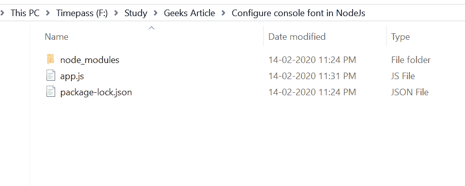
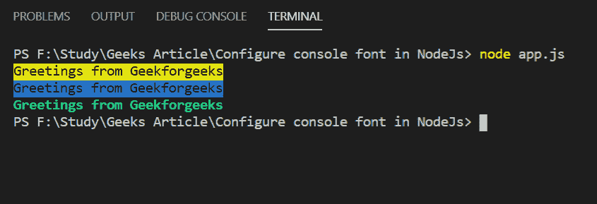

# 如何配置 node.js 控制台字体？

> 原文:[https://www . geesforgeks . org/如何配置-node-js-console-font/](https://www.geeksforgeeks.org/how-to-configure-node-js-console-font/)

您可以使用 CHALK 模块在 Node.js 中格式化控制台字体。粉笔模块可用于定制节点控制台。通过使用它，人们可以使用它的一些特性来改变控制台的外观，如加粗文本、加下划线、突出文本的背景颜色等。

**粉笔模块特点:**

*   上手简单，使用方便。
*   它是广泛使用和流行的文本格式化模块。
*   用户可以非常容易地格式化控制台文本。

**安装粉笔模块并使用:**

*   您可以访问链接[安装粉笔模块](https://www.npmjs.com/package/chalk)使用命令安装该软件包。

    ```js
    $ npm install --save chalk
    ```

*   安装粉笔模块后，您可以使用以下命令在命令提示符下检查您的粉笔版本。

    ```js
    npm version chalk
    ```

*   之后，您可以创建一个文件夹并添加一个文件，例如 app.js。

    ```js
    $ node app.js
    ```

*   **要求模块:**你需要在你的文件中包含粉笔模块使用这些线。

    ```js
    var chalk = require('chalk');
    ```

*   **文件名:app.js**

    ```js
    // Include chalk module
    var chalk = require('chalk')

    // Set background color to yellow
    console.log(chalk.black.bgYellow('Greetings from Geekforgeeks'));

    // Set background color to blue
    console.log(chalk.black.bgBlue('Greetings from Geekforgeeks'));

    // Modifiers can also be applied
    console.log(chalk.bold.green('Greetings from Geekforgeeks'));
    ```

**运行程序的步骤:**

*   项目结构会是这样的:
    
*   Run app.js file using following commands:

    ```js
    node app.js
    ```

    