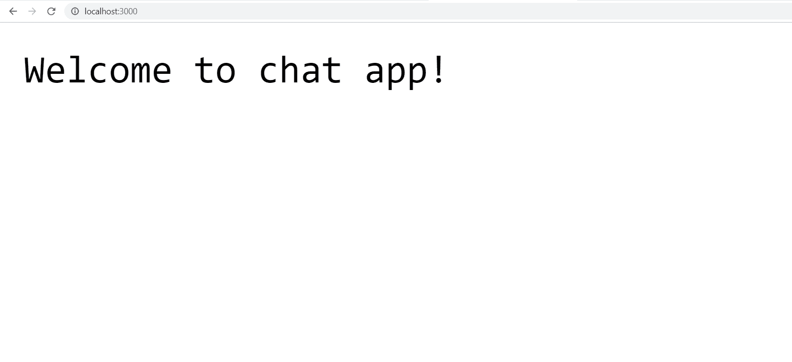
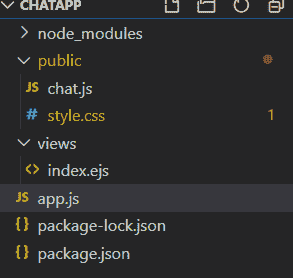
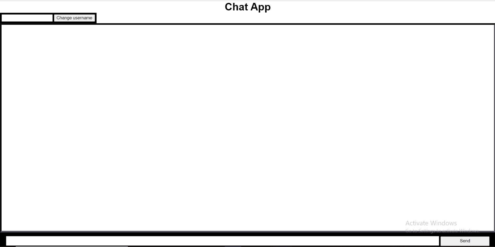
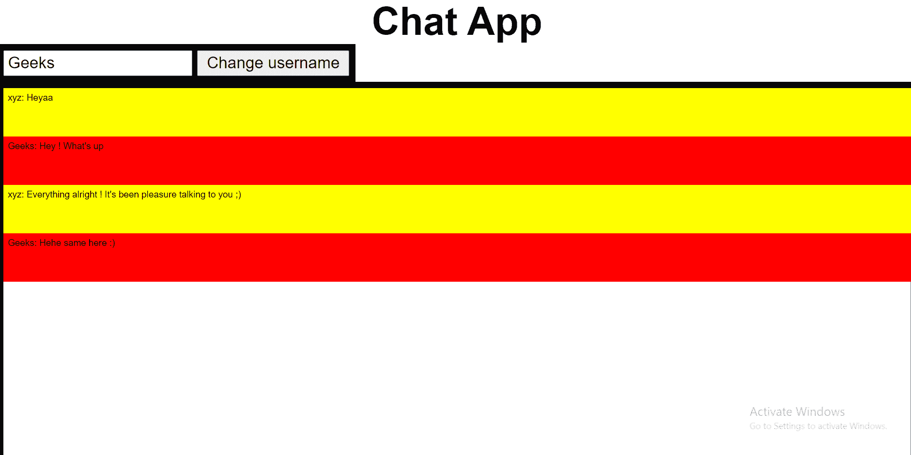

# 如何配置 Socket。Node.js 中带演示聊天应用的 IO？

> 原文:[https://www . geesforgeks . org/如何配置-socket-io-with-demo-chat-app-in-node-js/](https://www.geeksforgeeks.org/how-to-configure-socket-io-with-demo-chat-app-in-node-js/)

要制作一个聊天应用程序，需要服务器向客户端发送数据，但是客户端也应该向服务器回复。这可以通过使用网络套接字来实现。A **WebSocket** 是一种双向开通的通信管道。

**先决条件:**

1.  **Node.js:** 是由服务器执行的开源 JavaScript 后端技术。它有自己的软件包管理器 **npm** (节点软件包管理器)，可以轻松安装软件包。
2.  **Express.js:** 是基于 Node.js 的框架。
3.  **Socket.io:** 支持实时双向基于事件的通信。它适用于所有平台、浏览器或设备，同样注重可靠性和速度。插座。IO 建立在网络套接字应用编程接口(客户端)和 Node.js 之上，是 npm 最依赖的库之一。

**设置环境:**第一步是启动 npm。因此，创建一个新的存储库，并使用以下命令初始化 npm:

```js
$ mkdir chatApp
$ cd chatApp
$ npm init

```

现在，下一步是安装 npm 包，这将是构建我们的聊天应用程序所必需的。

*   **表达:**node . js 的 web 应用框架
*   **nodemon:** (可选)用于重启我们的服务器。如果不想安装，只需在终端写**节点 app.js** 重启服务器即可。
*   **ejs:** 一种简单的模板语言，允许您用普通的 JavaScript 生成 HTML 标记。
*   **socket.io:** 管理 Websocket 的包。

只需在您的终端中运行以下命令来安装上述软件包:

```js
$ npm install --save express
$ npm install --save socket.io
$ npm install --save ejs
$ npm install --save nodemon

```

**实现代码的步骤:**

**第一步:创建 app.js**

```js
const express = require('express');
const app = express();

app.set("view engine", "ejs");
app.use(express.static("public"));

app.get("/", function(req, res) {
    res.send("Welcome to chat app!");
});

server = app.listen(3000);
```

如果在浏览器中运行 *http://localhost:3000* ，可以看到屏幕上出现如下所示的消息:


现在要配置 socket.io，首先要在 **app.js** 文件中制作一个对象，如下图:

```js
const io = require("socket.io")(server);

io.on('connection', (socket) {
     console.log("New user connected");
});
```

在这里，io 对象将允许我们访问 **socket.io** 库。io 对象现在正在监听我们应用程序的每个连接。每次新用户连接时，它将打印以下输出:

```js
New user connected
```

现在为聊天应用程序建立一个窗口，我们将在视图文件夹中创建一个名为 **index.ejs** 的 html 文件(实际上是 ejs 文件)。另一方面，公共文件夹将包含 css 文件，即 **style.css** 和 js 文件 **chat.js** 。它看起来像这样:



我们现在将创建一个路线，它将呈现我们的 **index.ejs** 文件，打开我们聊天应用程序的窗口。

```js

app.get("/", function(req, res) {
    res.render("index.ejs");
});
```

现在如果你运行 *http://localhost:3000* 我们的聊天窗口会是这样的:


现在我们将在每个试图连接到我们服务器的客户机上安装 **socket.io** 。为此，我们必须在客户端导入 **socket.io** 库:

```js
<script src=
"https://cdnjs.cloudflare.com/ajax/libs/socket.io/2.0.4/socket.io.js">
</script>
```

在你身体的末端加上这些线条:

```js
<script src=
"http://code.jquery.com/jquery-latest.min.js">
</script>
<script src="chat.js"></script>
```

现在在公共文件夹中创建一个名为 **chat.js** 的 js 文件。

```js
$ (function() {
    var socket = io.connect('http://localhost:3000');
});
```

**第二步:发送和接收数据**现在，我们将编写一些代码，使我们能够发送数据以及从服务器接收数据。
**更改用户名:**首先，我们将设置一个默认用户名，比如说“Xyz”。为此，在 **app.js** 和 **chat.js** 文件中写下以下代码。

**文件名:app.js**

```js
const io = require("socket.io")(server);
io.on('connection', (socket) {
     console.log("New user connected");
     socket.username="xyz";
     socket.on('change_username', (data) {
        socket.username = data.username;
     });
});
```

**档案名称:chat.js**

```js
$ (function() {
     var socket = io.connect('http://localhost:3000');
     var message = $("#message");
     var username = $("#username");
     var send_message = $("#send_message");
     var send_username = $("#send_username");
     var chatroom = $("#chatroom");

     send_username.click(function() {
         console.log(username.val());
         socket.emit('change_username', 
           { username : username.val() });
     });
});
```

socket.emit()允许您在服务器和客户端上发出自定义事件。

**消息:**对于消息，我们修改我们的文件如下所示:
**文件名:chat.js**

```js
$ (function() {
 var socket = io.connect('http://localhost:3000');
 var message = $("#message");
 var username = $("#username");
 var send_message = $("#send_message");
 var send_username = $("#send_username");
 var chatroom = $("#chatroom");

 send_message.click(function() {
    socket.emit('new_message', { message : message.val() });
 });

 socket.on("new_message", (data) {
   console.log(data);
   chatroom.append("<p class='message'>"
     + data.username+";" + data.message+"</p>")
 });

 send_username.click(function() {
   console.log(username.val())
   socket.emit('change_username',
        {username : username.val()})
 });
});
```

**文件名:app.js**

```js
const io = require("socket.io")(server);
io.on('connection', (socket) {
 console.log("New user connected");    

 socket.username="xyz";

 socket.on('change_username', (data) {
   socket.username = data.username;
 });

 socket.on('new_message', (data) {
   io.socket.emit('new_message', {
       message : data.message,
       username : socket.username
   });
 });
});
```

我们的简单聊天应用的最终结果如下:


**一点进步:**我们可以做的更多一点是在*上添加一个 jQuery 事件监听器，输入*并发送一个名为 typing 的 socket 事件。

如果有人在*输入*信息，它会简单地显示出来。在 **chat.js** 和 **app.js** 中编写如下代码，如下所示:
**文件名:chat.js**

```js
message.bind("keypress", () {
    socket.emit('typing');
});

socket.on('typing', (data) {
  feedback.html("<p><i>" + data.username 
    + " is typing a message..." + "</i></p>");
});
```

**文件名:app.js**

```js
socket.on('typing', (data) {
    socket.broadcast.emit('typing', {username : socket.username});
});
```