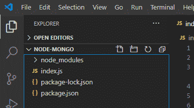

# 【mongodb Server 如何与 Node.js 连接？

> 原文:[https://www . geesforgeks . org/how-connect-MongoDB-server-with-node-js/](https://www.geeksforgeeks.org/how-to-connect-mongodb-server-with-node-js/)

**mongodb.connect()** 方法是 Node.js 的 mongodb 模块的方法，用于连接数据库和我们的 Node.js 应用程序。这是 MongoDB 模块的异步方法。

**语法:**

```js
mongodb.connect(path,callbackfunction)

```

**参数:**该方法接受两个参数，如上所述，如下所述:

1.  **路径/URL:** 在特定端口号上运行的 MongoDB 服务器的服务器路径。
2.  **callbackfunction:** 如果连接成功，它将返回 err 或 mongodb 数据库的实例以供进一步操作。

**安装模块:**

```js
npm install mongodb --save

```

**项目结构:**



**在特定 ip 上运行服务器的命令:**

```js
mongod --dbpath=data --bind_ip 127.0.0.1

```


**文件名索引. js**

## java 描述语言

```js
// Module calling
const MongoClient = require("mongodb");

// Server path
const url = 'mongodb://localhost:27017/';

// Name of the database
const dbname = "conFusion";

MongoClient.connect(url, (err,client)=>{
    if(!err) {
        console.log("successful connection with the server");  
    }
    else
        console.log("Error in the connectivity");
})
```

**运行命令:**

```js
node index.js

```

**输出:**

```js
node index.js
(node:7016) DeprecationWarning: current Server Discovery and Monitoring engine is deprecated, and will be removed in a future version. To use the new Server Discover and Monitoring engine, pass option { useUnifiedTopology: true } to the MongoClient constructor.
(Use `node --trace-deprecation ...` to show where the warning was created)
successful connection with the server

```